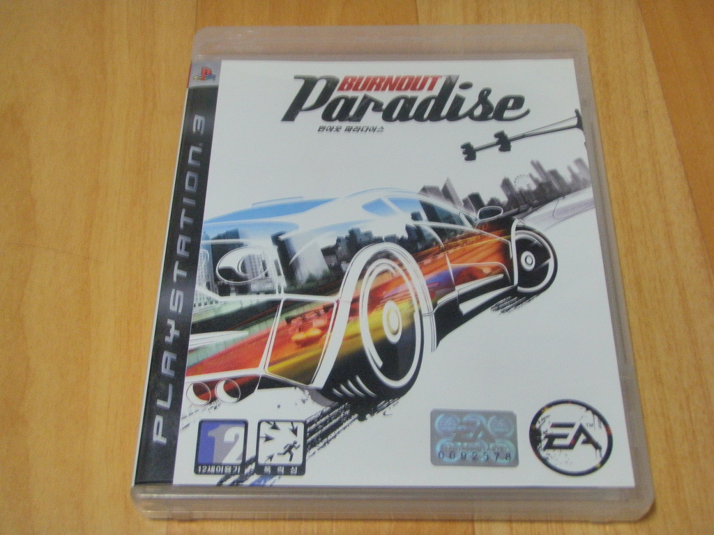
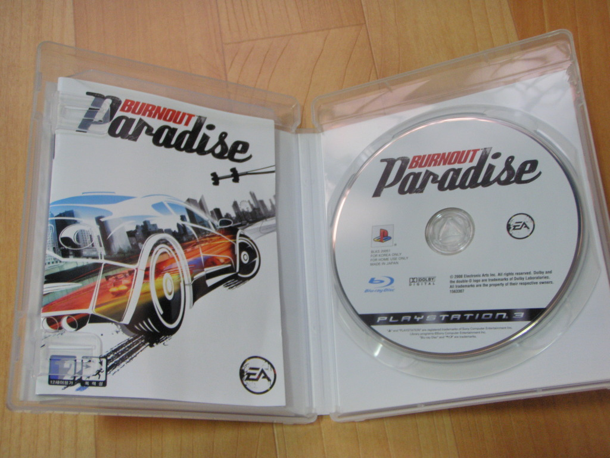

번아웃 시리즈는 3편인 테이크 다운부터 즐겼다. 엑스박스 버전을 즐겼는데, 친구랑 아주 재밌게 놀 수 있었던 타이틀이었다. 가장 신나게 즐겼던건 XBOX360 초창기에 발매된 번아웃 리벤지였다.

하지만 번들 내지는 빅히트는 안사고, 오리지널만 구입하는 저로썬 번아웃 리벤지를 다시 구하기가 꽤나 까다로웠다. 새거도 중고도...

그래서 구입한 것이 PS3용 번아웃 파라다이스였다. 오픈 월드로 구현되었다는 것이 궁금하기도 했고.

전작이 미션 단위로 진행되는 느낌이었다면, 번아웃 파라다이스는 도시를 자유롭게 돌아다니다, 해당 지역에서 진행할 수 있는 미션을 할당 받아 진행하는 방식으로 바뀌었다.

처음엔 좀 어색했는데, 진행하다보니 자연스럽게 게임이 이어지다보니 몰입도도 유지되고 더 좋았다.

미션을 플레이 하기 위해서 해당 미션 시작 지점으로 가야한다는게 단점이기도 하지만, 패치를 통해 미션 리스타트 기능이 생기기도 했고, (이게 없었을 땐.. 헐~) 이동 과정도 레이싱이기 때문에 적응하면 불만없이 플레이 할 수 있었다. 번거롭다는 점은 인정한다.

그보다도 아직 발견 못한것인지, 트래픽 모드를 플레이하지 못한점이 못내 아쉬웠다. 최대한 많은 차에 피해를 입히며 골드 메달을 획득할 때의 쾌감이 좋았는데.. 아직 못찾은 것이길 바란다.