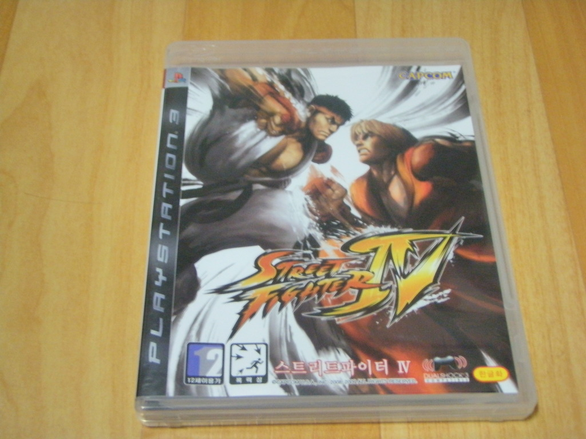
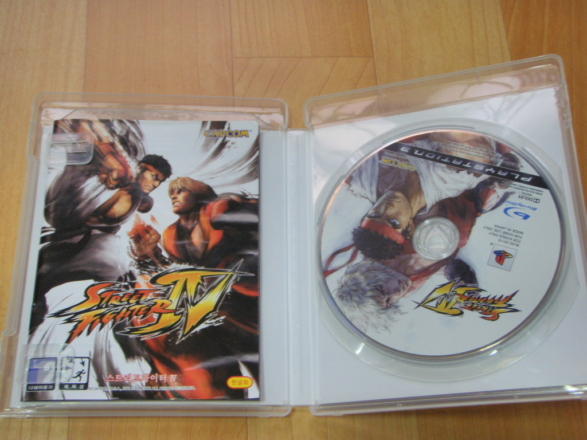

세기의 격투 게임 스트리트 파이터의 정통 후속작으로, 너무나도 뛰어난 그래픽과 스파2에서 크게 벗어나지 않으면서도 밸런스가 잘 잡힌 게임이다.

올해 초 대학로 오락실에서 처음 접했는데, 신작임에도 불구하고 스파2 하던 느낌으로 플레이가 가능하단 사실에 놀랍기도 하고, 즐겁게 플레이한 이후로 계속 즐기고 싶었지만 대학로까지의 거리가 좀 되다보니 집에서 즐기고 싶었던 게임이다.

스파2부터 15년여간 스파 팬이었던 데다가 난입을 통한 온라인 대전 지원, 또한 3D이면서도 2D 시절의 감각을 그대로 살린 점 등 장점 투성이인 스파4 는 기대 그 이상이었다.

셰이빙 어택의 존재가 파동-> 승룡 패턴을 무적의 자리에서 밀어냈고, Ex 어택 역시 축적계 캐릭터들의 숨통을 트이게 하는 데에 일조했다고 볼 수 있다.

현재 블랑카를 주 캐릭터로 온라인 대전을 하고 있는데, 150전 가량 플레이한 상황에서 47%의 승률을 거두며 선방하고 있어 더더욱 즐겁게 플레이 하고 있다. (대전 게임류를 좋아만 하고 못하는 편이라, 철권5 DR 온라인이나, DOA4는 승률 10%도 안되기에 47%면 내 기준에선 아주 높은 승률이다)

원래는 켄이 주 캐릭터였는데, 스파4의 블랑카가 내 플레이 패턴과 잘 맞는가보다. 슈퍼 콤보와 울트라 콤보를 맞추기 어렵다는거 빼곤 아주 좋다. 특히나 롤링어택이 Ex어택으로 사용시 장풍을 회피하는 판정이 있어 더이상 파동 승룡 패턴이 눈물짓지 않아도 되는 것도 장점! (세이빙 어택으로도 물론 파동권은 상쇄 가능. 하지만 역으로 데미지도 줄 수 있는 Ex 롤링 어택의 메리트는 더 가치가 크다.)

블랑카에 이어 보조 캐릭터로 바이슨(칙칙이)도 연습중인데, 추가된 기술들의 밸런스도 괜찮고 재밌었다. 블랑카보다 슈퍼콤보나 울트라 슈퍼콤보를 히트 시키기 쉽단 장점도 있고. 비주류 캐릭은 상대도 대처법을 잘 모르는 경우가 많다는 것이 장점인 것 같다.

내년 초에 발매된다는 슈퍼 스파4 역시 큰 기대감을 안고 있다.

3D지만 2D 격투 게임의 감성은 그대로이며, 먹선 느낌으로 효과낸 것이 너무나 훌륭한 게임
