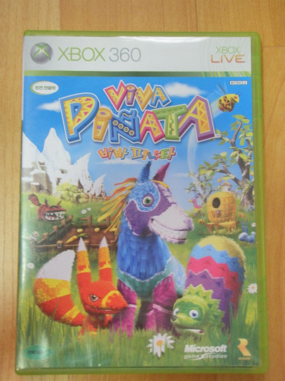

비바 피냐타는 진짜 전혀 기대 안한게임이었다. 

한창 인기 있을 당시 시큰둥했었고... 간만에 다시 360 사니까, 가격이 점심식사값(5000원)이더라. 

그래서 딴거 살때 걍 세트로 구입한게임인데... 이게 왠걸? 같이 산 다른 비싼 게임보다 이게 더 재밌었다.

게임의 목적은 심팜과 같은데... 게임 전체적으로 게이머에게 친절하고 레벨링이 잘 되어있었다!

패드로 조작하는데도 불편함은 느낄 수 없어, 역시 레어다라는 생각이 들었다.

비바 피냐타에서는 범위 지정 동작을 할 수 없어 (내가 모르는 걸지도 모르지만), 노가다 성이 좀 있는데, 이런 부분으로 인해 플레이타임이 길어지는 장점(?)도 있었다.

게임을 진행하다가 피냐타들에게 이름을 지을 수 있는데, 이름짓기가 너무 힘들어서 지인들 이름으로 만들었는데, 성별이 존재하지 않아 남남 또는 여여 커플의 짝짓기는 물론, 앙숙을 잡아먹는(...) 상황도 볼 수 있어 나름 재미요소가 되기도 했다.

위에서 말했다시피 범위 지정 동작이 없는지라 노가다 성이 좀 있고, 이것저것 할 거리가 많다보니 시간이 훌쩍가버려서 가볍게 즐기기는 어렵지만 기대 이상으로 재밌었고, 여러가지 면에서 레어스러움이 묻어나는 명작.
