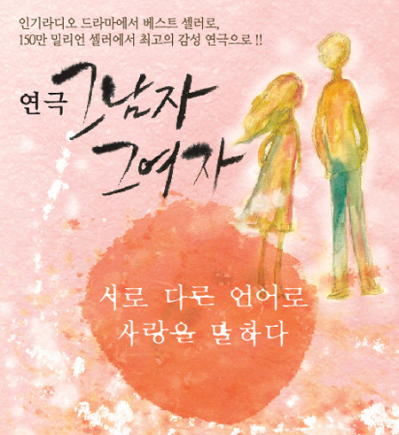

사실 나는 로맨틱 코미디를 꽤 좋아하는 편이다.

영화로 나온 로맨틱 코미디는 시간이 되면, 혹은 나중에 집에서라도 챙겨보는 편이니까.

근데 사실 연극은 직접 가서 볼 수 밖에 없고, 직접 가서 보는 맛도 있어 종종 보러 다니는 편이다.

그 중에서 기억에 남는 연극. 바로 그 남자 그 여자다.

첫 연애의 풋풋함을 아주 잘 살린, 그리고 코믹하게 살린 연극이라서일까?

20살 대학시절 겪는 첫연애의 설레임, 조급함, 오해를 아주 잘 녹여냈다.

또 연애 초반의 설레임, 사내 연애의 짜릿함 같은 느낌도 아주 잘 살렸다랄까?

하루 하루 나이를 먹고 시간이 자나면서, 잊고 살 수도 있는 감성을 떠올리게 했다랄까?

난 이런 느낌을 주는 것들이 좋다.

내가 잊고 사는 것들을 다시금 떠오르게 해주는 것들.

그래서 지금도 기억에 크게 남는 연극이 아닌가 싶다.