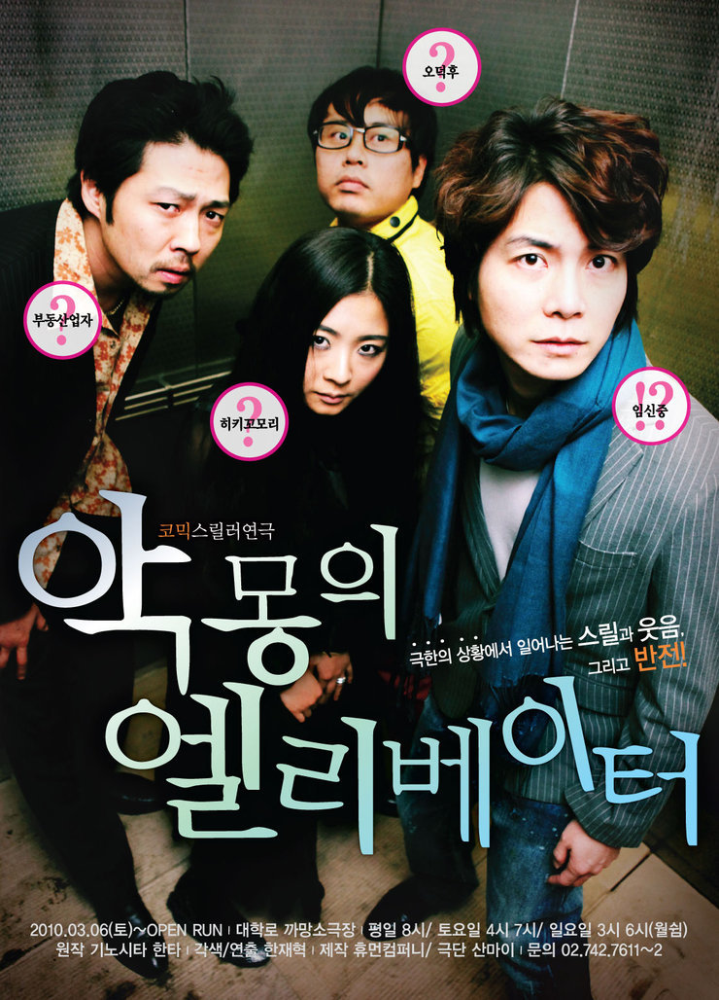

나는 공포 영화를 잘 안본다. 20살때부턴 왠지 모를 오기로, 26살때 까지 1년에 한편씩은 사명감(?)으로 봤지만 아직도 너무 무섭다. 

딱히 공포 영화가 아니더라도, 잔인한 영화도 기피하는 편이랄까?

그런 취향임에도 악몽이란 단어를 별 신경안쓰고 골랐버렸던 연극이 악몽의 엘리베이터다.

코믹이란 단어만 보고, 스릴러라는 단어를 신경안써서...클날뻔했다는 걸...  연극 보러 들어가면서야 깨닳았다. -_-;;

연극은 너무나도 다른 네 사람이 엘리베이터에 갇히게 되면서 시작된다.

아무 연관이 없을 것 같은 네 사람이 사실은 어떠한 연관관계가 있다는 것을 알게되고...

하나 하나 밝혀지는 사건들이 아주 흥미진진하게 전개 되더라.

반전에 반전을 거듭하지만, 그 과정이 뻔하다거나, 억지스럽지 않고 아주 잘 깔아둔 복선이 느껴졌다랄까?

이 작품 외에도 기노시타 한타의 악몽 시리즈가 있다는 것을 알고 보고 싶어 졌을 만큼 이 작품의 완성도는 꽤나 뛰어났다. (물론, 무서워서 아직도 못봤다)

중간 중간 너무 무겁고, 너무 공포스럽지 않게 유머스러운 전개가 섞여 있어 더 기억에 남는 작품이라고 할 수 있다.

내가 공포 영화를 잘 못보는건, 심리적인 공포가 아닌 시각적인 공포가 많기 때문이다. (물론 청각적인 것 포함)

그런 부분이 적어서 그런지, 보고 나서도 재밌다는 생각이 들었지 찝찝하다거나 무섭다거나 하는 생각이 많지 않았다.

여운도 큰 편이었고. 음.. 결말을 알게 된 후 느끼는 섬뜩함은 있었는데, 그 정도가 다른 공포영화보다 훨씬 적었던 것 같다.

내가 공포 영화중에 최고로 장화 홍련을 꼽는 것과 비슷한 이유에서라고 할 수 있다.

여튼 애초에 스릴러 연극은 그 수가 워낙에 적지만, 스릴러를 좋아 한다면, 또한 심리극에 관심이 많다면 추천한다. (아직도 하고 있는진 잘 모르겠다. 시즌1인 2010년에 본거라)