나는 축구팬이다.

야구는 경기장 한번 뿐이고 아는 야구 선수는 선동렬, 박찬호, 이승엽, 양준혁, 이종범 정도? 이외에는 아무도 모른다.

워낙 야구에 문외한이다보니 야구 게임도 당연히 안했고 야구의 룰도 잘 모른다.

그런 내가 야구 게임을 시작하게 됐으니 바로 '프로야구 매니저'다.

무엇보다 카드 게임이다보니 야구 룰을 잘 몰라도 된다는 점이 나에겐 장점이었다.

여전히 야구 게임으로써보단 카드 게임으로써 접근하고 있는 거도 사실이고.

초반에 워낙 선수가 잘 나왔고, 이후에도 꽤나 선수빨이 좋았던 편에 속하다보니 성적도 왠만큼 나와서 월드까지 진출했다가 지금은 메이저로 강등된 후 메이저 리그에서 잔류중인 상태다.

여러모로 현질 게임이냐는 비난도 있고, 게임 진행중에 플레이어가 직접적인 관여 불가능하다는 문제, PT를 모으기 너무 힘든 문제 등등 여러가지 난제도 있으나 하나씩 해결하고 있는 중이라고하니 믿고 기다려도 좋을거 같다.

개인적으로 다른 것은 몰라도 게임 진행중에 플레이어가 관여하는 것은 꼭 됐으면 좋겠다.

물론 그렇게 되면 코스트의 의미가 조금 퇴색 할 수도 있지만 말이다. (중계 1만 좋은 선수 두고 그 선수만 기용한다던지 하는 등의 코스트 관리 팁이 먹히게 되는 문제가 생길테지...) 

또한 커뮤니케이션이 힘들다. 같은 리그에 속한 유저끼리 소통하는 것이 사실상 불가능하다. 이로인해 유저가 느낄 수 있는건 자기 만족 선에서 그친다. 아쉬운 점이 아닐 수 없다.

이러쿵 말이 많았지만 어쩃거나 재밌다.

재밌기 때문에 아쉬운 점이 돋보이고 할말이 많아 지는 것이지.

이상 여담은 뒤로하고 내가 뽑은 선수들을 보여드리겠다. 짜잔~

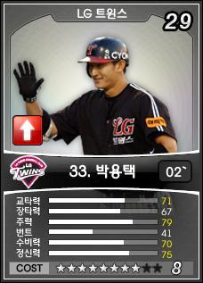
나의 유일한 8성 박용택이다. 코스트대비 매우 좋다 할순 없지만 유학을 보낼 수 있는 나이이고, 번트를 제외하곤 고른 능력치라는건 장점이다. 유학 다녀와서 써먹어 봐야 알거 같다.

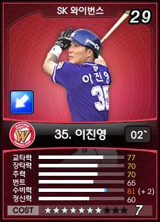
개념 만땅 7성이다. 개인적으로 박용택 선수보다 능력치가 뛰어난거 같아 맘에 든다. 아직 메이저에 있다보니 코스트 문제로 아직 많은 경기 소화시키진 못했다. 허나 3할이상의 좋은 성적을 보여준 좋은 선수다.

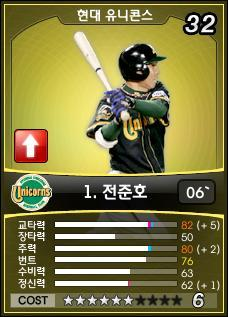
이 능력치가 6성이다. 장타 빼면 교타 + 도루형 개념 6성이라 할 수 있다.

워낙 평균적으로 좋다보니 6성중에서도 상위권에 속하는 듯 싶다.

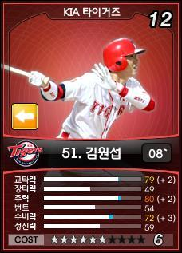
초반에 나온 선수다. 교타, 주력, 수비가 좋다보니 기본 이상은 해준 아주 고마운 선수다. 아쉬운 점은 교타자라서 지그재그타선을 쓰려할때는 빠져야 된다는게 옥의 티랄까?

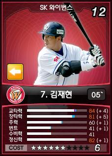
팀 창설하면 주는 기본 선수로 뽑았다. 이게 6성이다....수비와 번트가 매우 약하지만 클린업 역할에 이보다 더 좋을 수 있을까? 게다가 6성이다. 지명타자로 부족함이 없는 선수.

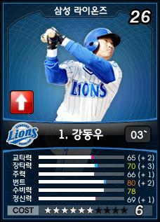
나쁘진 않은데...뭔가 특색이 부족하다. 애매한 능력치... 수비가 좋긴한데...희생타 위주 선수를 6성 쓰려면 메이저나 월드쯤 와야 괜찮지...여러모로 아쉬운 선수다.

두번째로 뽑았던 7성이다. 7성인데 비해 번트와 수비가 좋은 선수다보니 많이 아쉽더라.

유격수인데, 그래도 전반적으로 고른 능력치라서 기본은 해주더라. 역시나 상위권 리그 아니면 기용하기 힘들단 단점은 있다.

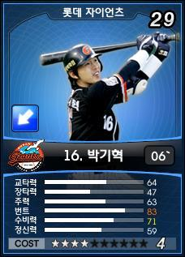
이 능력치가 4성이다. 하위권 리그에서 맹활약 해주는 능력치. 번트를전략적 사용할때 기용하기에 매우 적합한 선수다. 수비도 좋으니 말 다 했지.

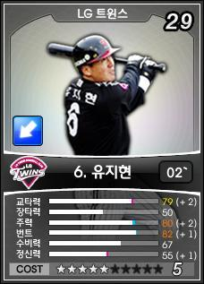
능력치 봐라. 엄청나지 않은가? 교타, 주력, 번트가 수준급이다. 수비도 괜찮고.

정신력이 좀 낫지만...카드와 재계약으로 커버하며 되리라~ 너무나도 잘해주는 5성급 선수.

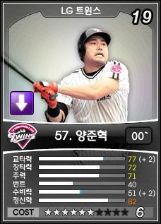
이 선수도 초반에 뽑은 선수로, 수비가 낮다는 단점만 제외하면 완전 개념 만땅의 선수다. 지명타자에 적합한 능력치로, 김재현과 번갈아 기용하고 있는 선수다.

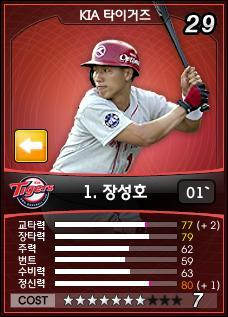
1루에서 양준혁을 밀어낸 선수. 전반적인 능력치는 양준혁이 더 좋은 편이지만, 수비가 좀 더 좋다는 점에서 양준혁을 제치고 주전으로 등극했다. 7성에 비해 좋은건 아니지만, 필요한 능력치는 수준급이니 이정도면 만족스럽다 할 수 있다.

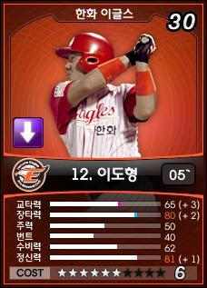
클린업 역할의 한 축을 맡고 있는 포수다. 진갑용이나 홍성흔이 안나와서 주전인 면도 조금 있긴한데, 그래도 주력 제외하면 매우 좋은 편이라 할 수 있다. 수비력은 조금 보강을 해야 되는데, 장타 위주로 커버하다보니 아직 수비가 C다. B로 올리면 좀 더 좋은 성과가 있지 않을까 싶다.

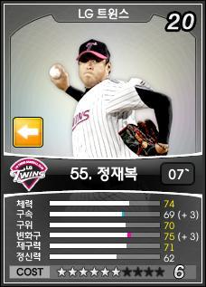
이 선수도 초반에 나온 개념 6성. 전체적으로 고른 능력치가 좋다. 체력도 좋아 중계 선수인데 선발로 쓴다.

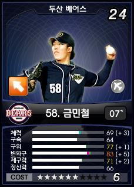
중계 투수인데 선발로 쓰는 또다른 선수다. 나이도 어려 유학도 다녀온 외국 물먹은 선수다.

변화구가 높아서 꽤나 잘해주는 선수다.

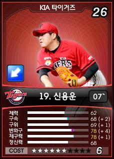
투수는 역시 제구력인가보다. 다른 선수들보다 능력치가 특출날게 없는데 수준급 성적을 매 시즌 내준 선수.

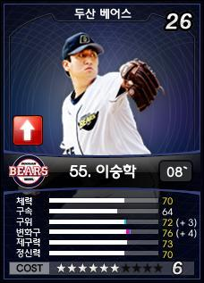
마찬가지로 선발의 기준은 고른 능력치로 꼽았다. 전반적으로 고르다보니 좋은 성적을 내주는 선수다.

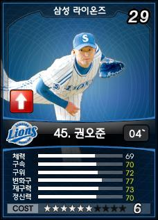
나온지 얼마 안됐고, 바로 유학보내서 아직 못써봤다.

게시판가보니까 빅3라고 하던데...어쨋거나 기대된다~

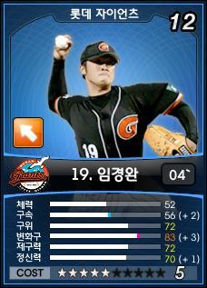
5성인데 구속 제외하곤 매우 높은 능력치를 보여준다. 체력은 중계니 덜 중요하고... 구속만 카드와 재계약으로 커버하면 괴물급 선수로 거듭날 선수다. 물론 지금도 괴물급 성적을 내줬지만 말이다.

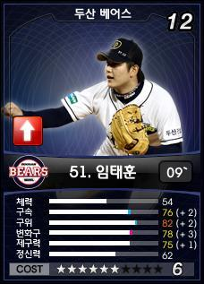
임태훈 선수 없이는 월드까지 절대 못갔다. 내 프로야구 매니저에서 최고의 성적은 임태훈 선수가 모두 거뒀다. 능력치도 중계가 갖춰야할 필수 요소는 모두 갖췄다. 격하게 애끼는 선수.

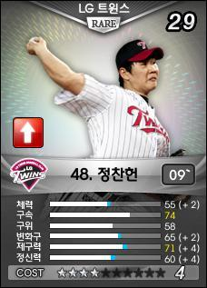
처음으로 뽑은 레어 카드다. 레어카드는 스킬 붙이면 능력치가 두배로 오르더라. 아직 스킬을 두개만 붙인 상탠데 이렇게 능력치가 좋아졌다. 구위 변화구, 제구력 위주로 커버하면 훨씬 좋은 능력치가 될 거 같다. 레어 카드 사기야~!!

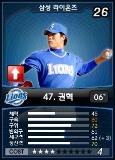
.개념 4성으로 알려진 권혁 선수다. 셋업 포지션인데, 빠른 구속과 준수한 능려치로 좋은 성적 내주고 있다.

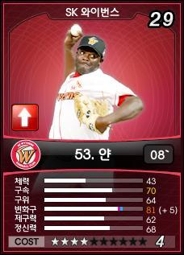
4성에선 좋은 능력치에 속하며, 변화구가 수준급이라 낮은 방어율을 유지해주는 선수다.

용병이란게 조금 아쉽다.

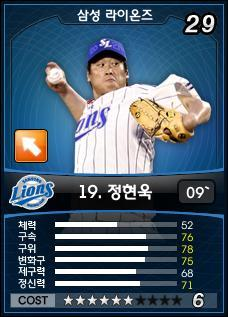
아직 못써본 선수. 그러나 고른 능력치인걸로봐서 제구력만 조금 높여주면 좋은 활약할 선수로 보인다.

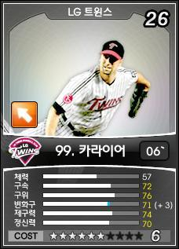
6성으로는 조금 부족한 면이 있는 능력치지만, 그래도 좋은 능력치임에는 분명하다.

뭐하나 정돈 80대였으면 하는 아쉬움이 보이지만, 기본 이상은 해주는 선수.

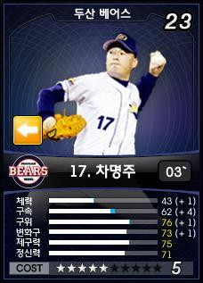
내 포수들과 배터리도 잘 맞는 편이고, 제구력 덕분이지 낮은 방어율을 보여줬다.

사실 능력치는 4성급인듯 ?

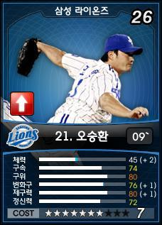
내 첫 7성 오승환이다. 7성에는 조금 부족한 면이 보이긴하는데,  체력 제외하곤 모든 능력치가 좋은 선수다.

다만 마무리 투수라는게 너무 아쉬운 부분이라 할 수있다.

월드에선 주전이었으나 메이저에선 한 경기도 못뛴 아쉬운 선수.

이상 내가 보유한 선수중 주전급 선수 위주로 소개 드렸다. 

요새 재밌게 하는 게임인 만큼 이후 업데이트 방향도 유저들을 실망시키지 않고 발전했으면 하는 바램이다.
