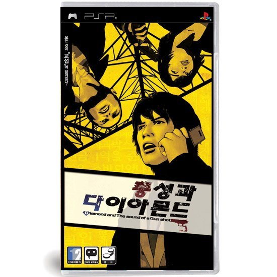

생각보다 평이 좋아, 나름 힘들게 구해서 플레이한 소프트.

그림체가 맘에 들진 않았으나, 진구지류 게임을 좋아한다면 필구해야 한다고 해서 구입해보았다.

실제로도 게임을 플레이하다보면 역전 재판이나 진구지 시리즈의 영향을 어느정도는 받은 것 같았다.

영향은 받았지만 어찌보면 진구지보단 만족한 면이 많다. 진구지는 수색모드가 너무 어렵고 불편한 조작으로 짜증을 유발했던 데에 비해서, 이 작품과 역전 재판은 그런 면이 적기 때문. 아이러니 하게도 게임 오버 횟수는 총성과 다이아몬드가 더 많았다.

다양한 엔딩과 리액션은 단조로울 수 있는 노벨류 게임의 단점을 어느정도 극복했다는 생각이 든다. 특히나, 체크 포인트 개념을 도입해 게임 오버시에 의미없이 부분을 줄여주었고, 혹 반복되는 대사일 경우 스킵기능이 있어 이점도 게임에 집중할 수 있게 해주었다.

클리어는 무난하게 진행됐지만, 진정한 엔딩을 보기 위해선 해당 미션의 등급을 모두 good을 봐야 하기 때문에 다시 플레이 해야 되는 부분이 많았다. 이 부분에 대해 옹호해보자면 진정한 엔딩을 보려 한다는 선택을 하는 것 자체가 코어 유저나 게임에 재미를 붙인 유저에 한해서 시도하는 것이기에 크게 문제가 되지 않는다고 생각한다.

중간 중간 시나리오에 복선을 깔아두었기에, 어느정도의 추리적인 요소도 가미하고 있어 아주 잘 짜여진 영화 한편을 본듯한 좋은 게임이었다.

애초에 전개나 시나리오 중 하나만 부족해도, 악평을 잔뜩 들을 수 밖에 없는 장르인지라 더더욱 신경을 쓴게 아닌가 싶다.
