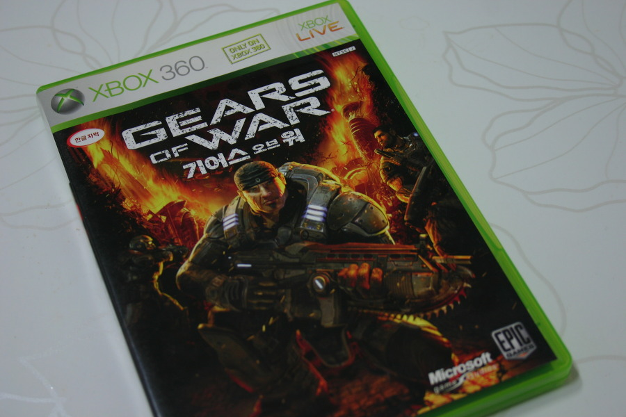

개인적으로 슈팅 게임을 잘 못하고, 잘 안한다.

친구들과 카운터 스크라이크를 할 때면 늘 민폐에 가까운 실력, 깍두기 같은 존재였다.

서든이나 스폐셜 포스도 마찬가지였다.

듀크 뉴켐 3D, 울펜 슈타인 3D, 퀘이크 등은 곧 잘 했었는데...느긋하게 하는 플레이 스타일의 문제일까?

어쨋거나 내 기억에 위에 게임들도 치트키 없이 클리어 하지는 못했던거 같다. 

내 게임 플레이 역사상 처음으로 치트키 없이 클리어한 게임이 바로 기어즈 오브 워였다.

우선 가장 처음 눈에 들어온 건 질감이 제대로 느껴지는, 그 당시 최고를 자랑한 그래픽이었다. 워낙에 그 느낌이 강렬했고, 지금봐도 좋은 편인 기어즈 오브 워의 그래픽은 게임 하는 내내 눈을 즐겁게 해주었다.

또한 레벨 디자인도 잘 되어있었는데 버서커를 피해 도망 다니는 미션이나, 해머 오브 던을 사용하는 미션, 라이트로 박쥐를 태워 버려야 하는 미션, 보스 전의 긴장감 등 전반적으로 다이나믹하고 생각하는 플레이를 자연스레 병행 할 수 있었다.

특히 엄폐시스템 덕분에 발컨에 느긋하게 플레이 하는 내 스타일에 매우 적합했다고 볼 수 있었고. (물론 엄폐 시스템이 있음에도 백번 넘게 게임 오버됐던거같지만...)

여전히 슈팅 게임을 잘한다 할 순 없지만, 나의 첫 클리어 FPS로써, 이런 명작을 할 수 있었던 것에 만족한다.

최고의 슈팅 게임.