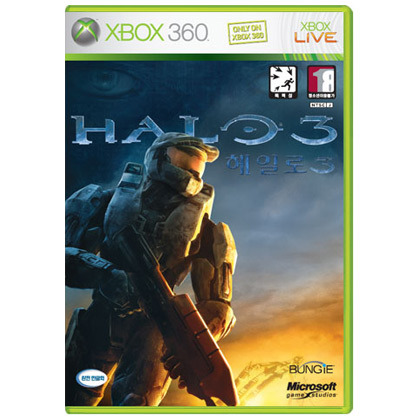

워낙에 유명한 게임이고, XBOX360 최고의 킬러 타이틀로 불리는 게임인지라, 기어즈 오브 워에 이어서 플레이 했던 타이틀이다.

헤일로 1, 2 모두 제대로 즐겼던 기억이 없던지라, 사실상 헤일로 시리즈의 첫 플레이 작이라 할 수 있었다.

플레이 해보면 여타 FPS랑 감각이 조금 다르다. 헤드샷 개념이 없는건지, 내가 못하는건지 헤드샷을 신경쓰지 않고 플레이하게 됐고, 듀얼 웨폰 시스템도 은근 적응이 어려웠으며, 엄폐가 없다보니 무브먼트가 많아 정신없는 전투가 게임 내내 벌어졌다.

일반적인 적들도 꽤나 쎄기 때문에, 진행 속도가 더뎌 흐름이 끊겼고, 난이도가 꽤 어렵다 보니 자주 게임 오버 당했는데, 이런 것들이 어려운 점이었다.

기대치가 컸기 때문일까? 기어즈 오브 워의 여운이 남은 상황에서 플레이 했기 때문일까?

괜찮은 게임이긴하지만, 그 이상은 아니었던 게임.

조만간 FPS를 해보고 싶어지면, 다른 게임은 차치하고 헤일로 3를 다시 한번 해봐야겠다. 

어쨋거나 기대에 못미친 게임.

평점 : ★★★☆
