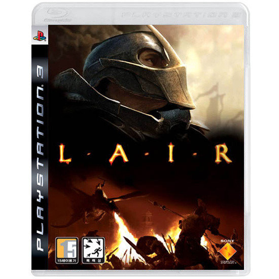

PS3용 블럭버스터 게임으로 알려져 기대가 컸던 게임이었다.

용을 타고 싸운다는 의미에선 팬저드래군과 비슷할 거 같지만, 실제론 조금 더 영화 스러운 (에라곤?) 느낌이 났다.

꽤나 적응이 필요한 조작법이나, (지금은 패치가 되어 육축 센서 없이 아날로그만으로도 조작이 가능하다) 직관적이지 않은 라이프 시스템, 섬세한 조작이 힘든데 빠르고 디테일한 조작을 원하는 미션, 근접 전투의 비직관 적인 판정, 근접 전투에서의 어설픈 애니메이션 등...

그래픽만 좋고 불편한 B급 게임의 전형을 보였지만, 한번 켜면 2시간은 패드를 놓지 못했다...

미션 실패하면 그 미션을 깨려고 눈에 불을 켜고 열심히했고...

어러운 조작과 어려운 미션이 몰입도를 높여준 것일까?

많은 단점에도 불구하고 재미있다는 점은 부인 할 수 없었다

용을 타고 전투를 벌인다는 점 만으로도 큰 매력 포인트를 가진 게임이고, 레어 특유의 분위기가 위에 나열한 단점들을 극복하고 즐겁게 플레이할 수 있게 도와주었다.

기대치를 조금만 낮춘다면, 즐겁게 플레이할 수 있는 게임. 레어다.