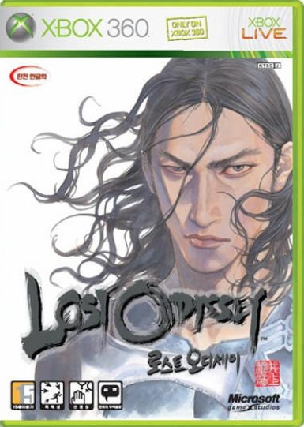

천년의 꿈..

불사신을 꿈꿔 본적 있는가?

영원히 사는 자들의 이야기..

로스트 오디세이다.

사카구치 히로노부와 타케히코 이노우에의 이름만으로도 커져 있던 기대치가, 어떤 결과물로 나올지 매우 궁금했던 게임이었다. (나는 파이널 판타지 팬까진 아니지만, 파판 7을 워낙에 재밌게 해서 기대치는 어느정도 있었다고 봐야할 것이다)

물론...표지에서 느껴지는 인도풍 주인공 캐릭터는 처음부터 끝까지 그리 호감이 가진 않았다. (카임과 얀센을 제외한 다른 캐릭터들은 맘에 들었지만) 

시점의 제약으로 인해 이 길에 숨겨진 요소가 있거나, 제대로 된 길인지 찾는 것이 힘든 것도 불편한 점이었고. (살펴보기 어려우니 뭔가를 숨겨놓는 의도에는 성공했으나, 그로 인해 길찾기가 너무나 힘들어졌으니... 결국엔 단점이라 봐야 되지 않을까 싶다.)

하지만 단점은 여기까지.
몇가지 단점만 제외하면 즐거운 요소가 가득했다.

시나리오의 이해를 돕는 '천년의 꿈'이 단연 최고. 그저 노벨이었지만, 스토리 보강에 적절한 보완재였고, 불사신으로 천년으로 사는 자들이 짧은 삶을 사는 인간을보며 어떤 감정을 갖게 되는 가에 대해 조금이나마 이해를 돕는 역할을 해주었다.

물론 노벨이다보니 상상에 그친단 점이 아쉽기도 했지만... 이렇게 짧은 노벨이 나쁘지만은 않더라.

또한, 불사신/ 인간 구조의 스킬링크, 악세사리를 통한 강화 및 스킬 습득 등 선호하는 캐릭터들 만으로 게임을 진행하게 되는 일본식 RPG의 단점을 극복하는 데에 일조 했다.

파이날 판타지7의 마테리얼 시스템이 생각나기도 한 이 시스템이 전투의 지루함을 덜어주는 데에는 꽤나 큰 역할을 하긴 하더라.

전반적으로 난이도가 높지 않아 레벨 노가다를 하지 않아도 되게끔 짜여져 있어, 자연스레 스토리 진행에 집중 할 수 있었던 점도 장점.

레벨 노가다 없이도 60시간 가까이 플레이 타임이 나왔다면, 볼륨이 얼마나 방대한가 알 수 있지 않을까?

대부분의 일본식 RPG가 그렇듯 지루한 버튼 연타가 반복되는 경우가 많은데, 로스트 오디세이는 전방과 후방 개념 (GC), 일반 공격시 타이밍 어택 (버튼 떼는 타이밍에 따른 강타 판정) 등으로 덜 지루하게 플레이할 수 있었다. (어디까지나 덜 지루한거다)

스토리도 세계관에 어긋나지 않는 일관성을 보여주었고, 스토리 전개나 연출이 좋다보니 감정 이입이 잘 되 간만에 즐겁게 플레이 할 수 있었다.

결과적으론 진 여신전생 3 : 녹턴 이후 5년여만에 클리어한 RPG였으니 말이다.

비슷한 시기에 발매된 또다른 RPG 블루드래곤도 플레이해보고 싶어지게 했고, 이후 차기작도 기대 되게끔 만든 수작. (아마 차기작이 없을것 같지만.... 나온다면...!!)