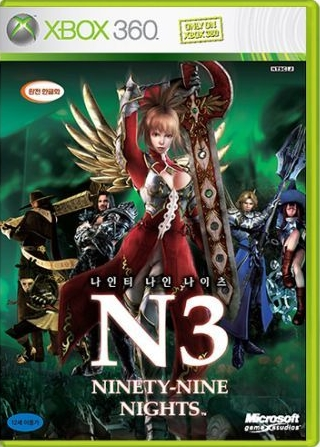

워낙에 악평이 많은 게임이었지만 발매 초기에 플레이 했던 기억에 너무 즐겁게 플레이했던 기억만 났다보니, 2009년 다시 플레이 하게 됐던 게임이다.

트롤, 마법사 등 몇몇 적을 제외하면 보스전에서만 집중해서 플레이 하면되고, 전반적인 캐릭터 움직임이 호쾌하고 화려하다보니 100인 베기의 원조 삼국 무쌍보다 화끈하고 즐겁게 플레이 할 수 있었다.

베는 맛이 묵직한 편은 아니지만 워낙에 스피디하다보니 화끈함에서는 따라올 게임이 없다고 생각한다.

개인적인 만족도에선 데빌 메이 크라이보다 화끈했다랄까?

스토리나 숨겨진 요소도 나름 충실해서, 왜 악평이 있는건지 고민할만큼 만족스러웠다.
뭣보다 스트레스 해소용으로 최고랄까?

물론 단점이 없는 것은 아니었다. 아니 꽤나 많았다는게 사실일 듯? 

애매한 레벨 디자인과, 어설픈 표정 연기, 느려짐 현상, S랭크 받는 조건의 모호함 등등..

하지만, 시원 시원한 액션만큼은 압권인 게임이라 할 수 있다.