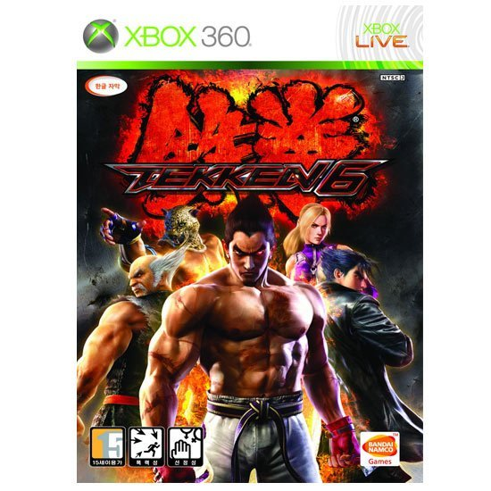

이제는 국민 격투 게임이라 할 수 있는 철권이 뒤늦게 PS3와 XBOX360으로 발매되었었다.

워낙에 늦은콘솔 발매인데다가 온라인 대전 문제로 큰 홍역을 치른 철권6.

그 중에서도 시나리오 모드로 자리 잡은 횡스크롤 액션 게임이 특히 구설수에 많이 올랐다.

사실 내 개인적으론 나쁘지 않았음에도 불구하고, 철권에 대한 기대치는 절대 나쁘지 않음으론 안된다는 것을 반증하듯 비난이 솓구쳤다.

서비스적인 요소로 들어갔던 모드라면 큰 문제가 없었겠지만, (철권5의 데빌 위드인 모드가 더 퀄리티가 떨어졌지만, 크게 비난 받지 않았던 것이 이 덕분 아닐까?) 사실상 포인트 획득과 스토리 진행을 위해선 반드시 플레이해야 되게끔 만들어놓은지라, 더더욱 비난이 심했던거 같다.

그럼에도 불구하고 워낙에 철권6가 잘만들어진 게임 (매니아들에겐)이라는 점에서 합격점인거 같다.

철권 크래쉬라는 대회가 적기에 치루어지면서 붐을 타기도했음은 물론이고.

기존의 초월이식으로 인해 철권 시리즈는 그저 아케이드 게임을 가정에서도 즐길 수 있다는 것만으로는 만족 할 수 없는 상황이다.

특히나 늦은 이식으로 인해 높아질만큼 높아진 기대치가 더더욱 악평을 불러왔는지도.

어쨋거나 나는 즐겁게 플레이했지만, 철권의 한방 콤보 스러움은 경악 스럽다.

뭐 그 자체가 철권의 게임성이란 점은 인정하지만 말이다.