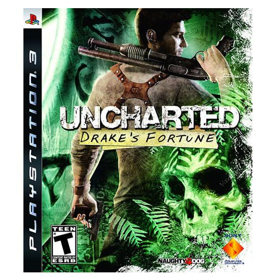

워낙에 PS3 유저들 사이에서 좋은 평가를 받고 있는 게임이다보니 나도 한번 해볼까 싶어 구매하게 된 게임이다.

FPS를 별로 좋아하지 않는 친구 녀석 왈, 결국 총질 게임이더라라는 악평에도 불구하고, 한번쯤 해보자 싶은 심정으로 구매한 언차티드. 나에게 있어선 너무나도 만족스러웠다.

결론부터 말하자면 인디아나 존스가 게임화 된다면 이런 느낌일 거 같다라고나 할까? 
그래픽도 뛰어나고, 어설픈 액션성보다는 서바이벌 액션이 게임 진행에 있어 어찌하면 이 난관을 극복할 수 있을까 싶은. '생각 하며 플레이 할 수 있게 만들어주는' 게임이다.

물론 슈팅적인 요소도 꽤나 강하다. 실제로 플레이타임에 있어, 총격전이 꽤나 많은 부분을 차지하고 있고.

허나 그게 주가 아닌 만큼 지루하지 않았다. 특히나, 다양한 장면 다양한 상황에서의 총격전이 많기에 부담은 덜했다.

자동차 추격전, 모터보트 미션 등... 다양한 미션이 진행되다보니 전혀 지루하지 않았다.

반전이 여러번 있는데, 이 반전들이 장단점이 있었다. (사실, 조금 짜증이 나기도한게...너무 쌩뚱맞기도 했고, 플레이 타임 늘리기용 어거지 스럽단 느낌이 들기도 했다.)

지금 리뷰 작성하면서 처음 봤는데, 북미판 제목은 '드레이크의 유산'이었는데, 한글판 부재 '엘도라도의 보물'이 더 적합한 것 같다.

이런 작은 부분들이 모인 것들이 좋은 현지화겠지?

오지의 보물섬을 탐험하는 느낌을 느끼고 싶다면 고민하지 말자. 

언차티드가 있다.
