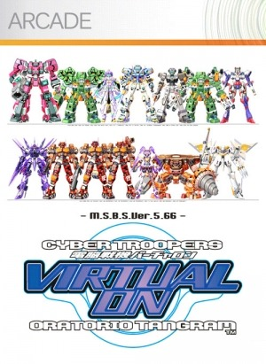

메카닉을 보는 것은 좋아하지만, 워낙에 육중한 무게감이라던지, 왠지 모를 거부감이 있어 사실 메카닉 게임을 제대로 해본건 손에 꼽는다.  

재밌게 했던 기동전사 건담 전기 PS2판의 경우에는 내가 건담 팬이라는 점이 거부감 없이 플레이 하는 데에 일조 했고.

실제로, 아머드 코어와 같은 게임도 그다지 즐겁게 플레이하지 못해왔는데 우연찮게도 내 눈에 버추어 온이 들어왔다.

XBLA 게임은 잘 사지 않는편인데 소울 칼리버를 구매하면서 데모 버전을 다운받아 플레이 해보니 재밌단 생각이 들어 구입까지 하게 됐다.

1200ms point로 싼 가격은 아니지만, 온라인 대전을 지원하고 그래픽도 나쁘지 않은 편이며 스피디한 게임 전개가 마음에 들었다.

오락실에서 플레이 해본적이 없는 만큼 트윈 스틱에 대한 열망 없이 엑박 기본 패드로만 플레이했는데, 트윈 스틱이 없이 조작하는 것도 그리 나쁘지 않았다. 물론 원하는 대로 자유자재로 조작은 불가능에 가깝긴했으나...트윈 스틱이 좀 비싸야 말이지...

색만 바꿀 수 있지만 어쨋거나 커스터 마이즈 모드도 있고, 기본적인 대전류 게임이 갖출 모드는 다 갖추고 있다보니 시간 때우기에 적절했다.

개인적으로 건담류도 이런 스타일로 스피디한 게임이 있었으면 싶은데 있을런지 모르겠다. 완성도도 중요하겠고. (이미 버추어온과 비슷한 스타일로 발매된 건담 게임이 있을지도 모르지만. 아! 건담 무쌍은 어느면으로 봐도 버추어온 스럽진 않으니 패스) 

버추어 온에 대한 추억이 있는분은 이미 구매하셨을테고, 메카닉은 좋아하면서도 육중한 무게감의 메카닉 게임은 힘겨워하는 나와 비슷한 성향의 유저들은 한번쯤 구입해볼만한 게임이 아닌가 싶다.