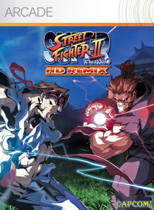

개인적으로 격투 게임중에서 스트리트 파이터 시리즈를 가장 좋아한다. 

스트리트 파이터 2가 준 충격은 나를 게임 업계로 이끌었기 때문이다.

기본적으로 단타 내지는 간단한 콤보 위주의 게임인 데다가, 스트리트 파이터 시리즈 자체가 갖고 있는 그 둔탁한 타격감은 두말할 여지 없이 맘에 드는 부분이고.

그런 스트리트 파이터 시리즈가 리메이크 됐다. 물론 기본적으로 그래픽만 다시 덮어쓴 정도지만, 스트리트 파이터인데 무슨말을 더 하랴?

물론 네트웍 대전시 프레임 저하 (줄여도 너무 줄였어...-_-)가 맘에 안들긴하지만, 로컬 대전만으로도 충분히 즐겁게 플레이 할 수 있고, 핑이 좋은 대전 상대와는 매끄러운 플레이를 보여주기도 하니 크게 불편함은 느낄 수 없었다.

물론 도전과제를 달성하기 위해선 랭킹 대전이 필수라, 랭킹 대전시 고통을 견뎌내야함은 감수해야 할 것.

하지만, 아케이드 모드와 네트웍 대전만 있는건 아무리 원래 슈퍼 스트리트 파이터 2가 그렇게 이식되어 왔다지만 너무한거 아닌가???

개인적으로 스트리트 파이터 시리즈의 팬이 아니라면 구입을 만류하고 싶은 느낌은 들지만.... 이미 살 사람은 다 샀을테고~

1200 ms point는 좀 비싼편이란 생각이 들지만 스트리트 파이터 시리즈가 그리울때 한두번쯤 플레이하기 좋은 소프트가 아닐까 싶다.