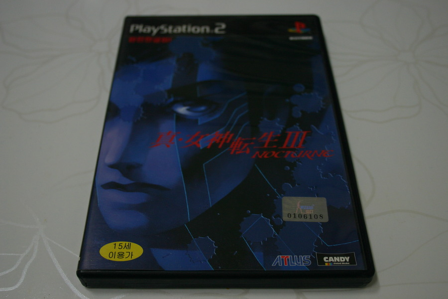
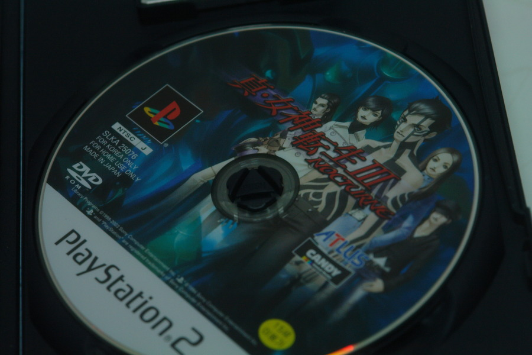

아무 것도 모르고 새 제품이 13000원이란 가격이라 하길래,  싼데~ 걍 함 해볼까하고 집어왔던 게임. (그게 아마 부천 스타 겜샵이었던거 같다)

게임 케이스 후면에 적혀 있는

'그 마음, 인간인가 혹은 악마인가 -'

라는 자극적인 문구는 게임의 분위기를 대략 짐작케 해주었다.

실제로 구동해보자 마자 흘러나오는 음악이나 오프닝, 그리고 게임 분위기가 음산한지라 공포 게임인줄 알았다.

옆에서 지켜보던 친구는 게임 초반부를 보고선 한다는 소리가, 

'어? 이거 여선생 나오네? 진 여선생전 아님???'

그리하야 그 이후로 나는 종종 이 게임을 진 여선생전이라 부른다 -_-;

어쨋거나 그렇게 가벼운 느낌으로 시작했던 이 게임이 그렇게 심오한 줄은 몰랐다. 

세계가 무너지고, 그 안에 살아남은 선택받은 자들만 살아남게 되고...

주인공은 악마가 된다. 악마로써 무너진 세상 속을 살아가며 새로운 세계를 창조하려는 목표를 이루는 것이 게임의 목표다.

멀티 엔딩 임에도 그 어떠한 선택도 부드러운 결말로 인도하지 않음은, 이 게임이 다른 RPG 게임들과 얼마나 차별화 되있는가를 말해준다. (실제로 게임 내내 충격적인 전개를 보여준다.)

150시간 가량의 플레이 기록이 있던 세이브 파일을 한번 날려먹었음에도 불구하고, 40시간을 다시 플레이 할 만큼 재밌는 게임이었음은 내 선택이 우연이지만 베스트했음을 의미했다.

몬스터 대 다수가 여러 국가 다수 문화에 영향을 받아 만들어졌고, 일부 국가에선 문제가 될 만큼 (몬스터 들 중 일부는 신화에 나오는 신이거나, 천사 등인 데다가, 그들을 통칭 악마라 부르기 때문) 강한 색채를 띄고 있다.

전투에서 마주친 악마를 100% 얻을 수 있는 것도 아니고, 스킬의 경우에도 원하는 순서대로 집어 넣는 것이 아니라 시스템 적인 확률에 따라 정해지는 것이 아니다보니, 특정 악마를 소유하고, 그 악마에 원하는 스킬을 달아주는 작업은 버튼 노가다 + 재료 노가다의 극한으로 유저를 인도하며, 그로 인해 플레이 시간의 급증 및 게임에 대한 집착 (혹은 애착)을 갖게 해주었다.

이 게임의 세계관이나, 다양한 몬스터, 또한 육성, 콜렉팅 이외에도 재미 요소는 더 있다.

대 다수의 RPG에서 지루함의 근원이 되는 전투가 워낙에 전략 적이다 보니, 그 어떠한 장소에서도 전투는 긴장해야 되고, 약점을 계속 노려지면 한방에 훅간다.

약점을 빼앗기면 상대에게 공격 기회를 한번 더 주고, 약점을 노리면 공격 기회를 한번 더 얻으며, 공격이 실패되거나 블럭(또는 흡수) 되면 공격 기회를 한번 더 잃는 시스템은 RPG에서의 핵심인 전투가 지루한 요소만은 아님을 몸소 느끼게 해 주었다.

게임 오버시에 등장하는 천사를 몇번 봤는지 세다가 지쳤을 만큼 극악의 난이도는 세이브 파일에 포함되지 않는 시간을 포함하면 실제로는 아마도 300시간 이상 플레이한 RPG로 기억되리라. (세이브 포인트가 꽤나 멀리 있어 그 횟수와, 그 여파는 다른 게임보다 큰편. 상대 몬스터보다 레벨이 높고 체력이 많다 해도, 즉사 스킬이나 약점을 공략 당하면 후반부 무적 상태가 아닌 이상 골로 가기 쉽상이다.)

게다가 퍼즐적인 요소도 많이 내포되어 있어, 플레이 하는 내내 머리를 쓰게 만든다. 물론 순발력보단 암기력, 추리력 등을 요구하는 느낌이 강하다보니 나처럼 컨트롤에 자신 없는 유저들도 클리어 하는 데에 큰 어려움은 없었다. (게임 전체적으로 어려웠기에 퍼즐 부분이 그렇게 큰 짜증이 아니었다고 할까? 녹턴을 켤때는 늘 마음의 준비를 해야 했기에 상대적인 효과 였을 것이다.)

지금도 두고 두고 플레이 하는 중이며, 준 깡패 3인방 (제천대성, 티타니아, 아마테라스)로 클리어까지 다가간 상태.

2주차 보너스나 숨겨진 요소도 충실해, 어째서 이 게임이 일본 3대 RPG에 포함되는지 알 수 있었다. (좀 울컥 하는 것은, 잭 랜턴 퍼즐... 너무 어려워 잭랜턴 퍼즐 깨는 데에만 50시간 이상 걸렸다는 분들이 수두룩하다.)

나에게 녹턴 이전에 최고로 꼽던 RPG, '파이날 판타지 7'이나 '용의 기사2'를 무색하게 할 정도로 재밌는 게임.

내 인생 최고의 RPG. **'진 여신전생 3 - 녹턴'** 이다.