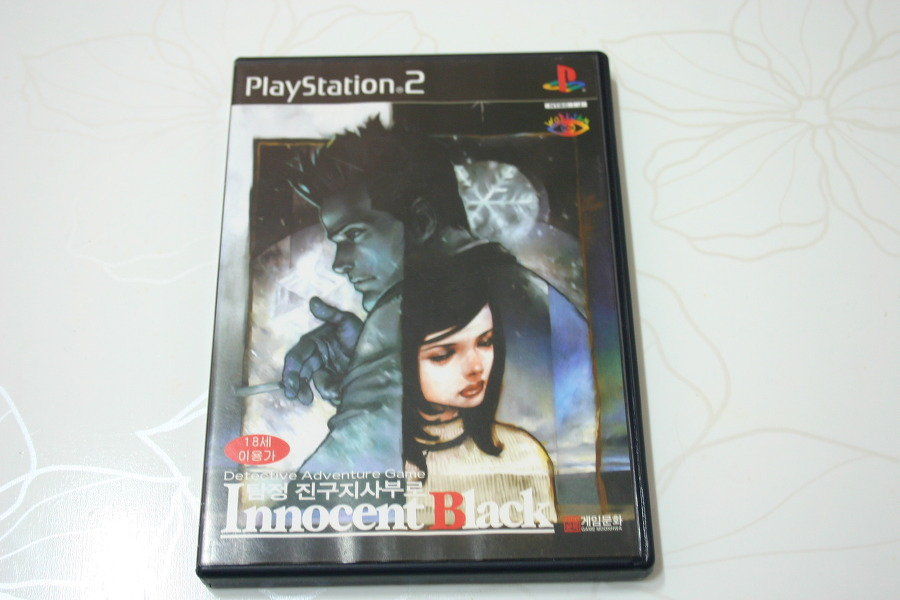

이 작품을 플레이했던 것이 아마 2004년 이었을 것이다.

유명한 작품이었다라곤 하지만, 나는 그 이야기를 들은 바 없었고, 진구지 시리즈 중에 처음으로 접하게 된 작품이다.

애초에 기대가 없었던 만큼, 가벼운 마음으로 플레이 하게 됐던 '작품'이다.

탐정 게임이라는 흔치 않은 장르를 완성도 높게 특유의 무거운 분위기를 거부감 없이 느껴지게끔 잘 만들어냈다는 평가를 받는 작품이란 이야기는 클리어 하고 난 이후에야 들었고.

게임은 전반적으로 직선형 진행이다. 게임 내에서 인도하는 대로 자연스럽게 플레이하면서 여러가지 이야기를 듣게 되고, 그 이야기를 바탕으로 추리해내가는 과정에 게임의 전부다.

전형적인 텍스트 어드벤쳐이지만, 이 게임이 각광 받는 이유는 뭘까?

게임이 풍기는 분위기 때문일까? 

나 역시 진구지 사부로 시리즈가 준 강한 임팩트는 플레이 이후 몇년이 지난 나에게 여전히 강하게 남아 있다.

나에게 있어 '나는 담배에 불을 붙였다' 라는 명언과 함께 카리스마가 강한 캐릭터인 진구지. 과묵한 남자의 전형인 진구지라는 캐릭터가 지루해 보일 수 있음에도 불구하고, 한물 간듯한 추리물임에 불구하고, 텍스트 어드벤쳐 역시 지루한 장르임에도 불구하고 왜 이 게임을 그 중에 베스트로 꼽는지는, 직접 플레이 해봐야 알 수 있다는 생각이 든다.

그런 분위기 연출에 음악 역시 절대 빼놓을 수 없는 요소이고.

실제로 많은 게임들이 음악에 신경을 쓰지만 (물론 아닌 게임도 많다는 것도 인정한다.) 음악만으로 어떤 게임을 떠올리기란 쉽지 않다.

때론 반복되는 음악이 게임을 질리게 하는 요소이기도 한데, 진구지에서 흘러 나오는 음악은 게임을 돋보이게 하는 데에 (게임의 색을 더 강하게 하는 데에) 큰 역할을 했다는 생각이 든다.

물론 단점이 없는 것은 아니다. 많은 유저들에게 짜증을 불러 일으킨 수색모드는 게임의 진행을 어렵게 만드는 요소였다.

불편한 조작이 가장 문제였는데, 불편한 조작으로 인해 고민을 더 많이 하게 된다거나 신중하게 생각한다거나 이런 긍정적 효과는 없었다는 것이 내 생각이다.

수색모드의 아쉬운 점은 걸리지만, 지금도 종종 기억이 나고 꺼내볼 정도로 즐겁게 플레이 한 게임이고, 한편의 소설을 읽은 듯한 강한 여운이 남는 좋은 게임이다.

진구지 사부로를 알게 해준 첫 작품인 이노센트 블랙을 한글화 발매해준 게임 문화의 마이너한 안목에 감사한다.