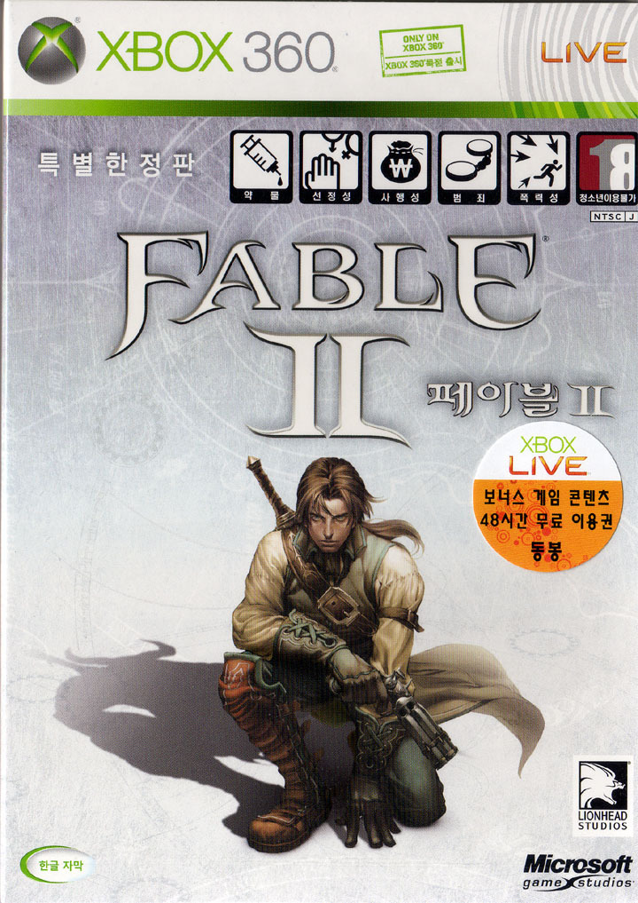

그저 한글화 RPG라는 이유로 별 생각없이 (...) 구매한 게임이다.

물론 시리즈 1편이 성공적이었다는 사실 정돈 알고 있었고, 블랙 앤 화이트 시리즈로 유명한 라이언 헤드의 작품이란 것도 알고 있었지만 말이다.

피터 몰리뉴가 갓 게임에 관심이 많다는 것은 익히 알고 있었으나, 그가 만든 RPG가 어떨지는 적어도 나에게 있어선 뻔해보이진 않았다. (물론 몇가지 상상은 됐지만)

게임 초반 시작되는 분위기는 낡은 집에 사는 오누이로부터 시작된다. 흘러나오는 음악도, 전체적인 분위기도 너무나 동화스러워서, '역시 동화같은 게임이었군~!'하는 생각을 하며 플레이를 시작해나갔다.

헌데...이건 왠걸... 주어지는 퀘스트중에 훈훈한 퀘스트는 거의 없고, 죄다 세계만 판타지 세계지 너무나 현실적인 퀘스트가 많고, 몇몇 퀘스트에선 부분적인 선택지를 두고 그에 따른 세상의 변화를 가져다주는 방식으로 진행 되더라.

이 부분에서 기대한 것과 많이 달라서 조금 실망스러웠다. (나는 아기자기하고 동화 같은 게임을 원했지만, 자세히 안알아보고 산만큼 내 책임도 있었으니..)

이 게임의 장점은 방대한 맵으로 인해 쓸데 없는 플레이 타임이 길어 질 수도 있었음에도 불구하고, 한번 탐험함 곳은 다시 갈 수있도록 (시간은 흐르지만) 만들어 주었고, 목적지 설정시 가이드라인을 표기해줌으로써, 길찾기로 헤메는 쓸데 없는 시간을 줄여 주었다.

대부분의 게임에서 길찾기는 재미의 요소보다는 짜증의 요소가 되기 일 쑤 인데 (특히나 시스템 차원에서의 강제로, 직선형 진행을 유도하는 일본식 RPG에 비해서 자유도 넘치는 미국식 RPG는 더 하다), 이에 대한 짜증을 줄여주고 오히려 몰입도를 높여주는 역할을 한다.

많은 게임이 하는 실수는 길찾는 과정에서의 시간 소모를 재미의 요소라고 생각한다. 물론 이 과정이 상상력을 자극하고, 재미있는 요소가 될 순 있다. 필드 이동에서 겪을 수 있는 다양한 이벤트가 있기때문이다. 하지만 무의미한 맵 이동을 너무 자주 반복하게 한다면 그로 인해 게임 자체를 그만두게 될 가능성이 높기 때문이다.

무언가 이벤트를 만들어 줄 수 없다면, 유저가 직접 선택하지 않는 노가다는 피해야 한다.

이런 점에서 클리어한지 일주일이 지난 나에게, 페이블 2가 가져다준 짜증 스러운 요소는 크지 않고, 많지 않았다.

글쎄...기대치가 없었기 때문인진 몰라도, 미국식 RPG 자체를 그다지 좋아하지 않는 (지나친 자유도가 가져다주는 몰입도 저하를 못견디는) 나로썬, 몇가지 힌트만으로도 몰입도 높게 플레이 할 수 있었던 것만으로도 높은 점수를 주고 싶다.

유치할 수 있는 그저 그런 영웅담에, 미국식 RPG 치곤 적은 퀘스트 수, 제한된 선에서의 상호작용등이 아쉬웠지만.... 그런 계산없이 가볍게 플레이하기에 나쁘지 않았다.

페이블 2를 클리어 해갈 때 즈음 페이블 3가 나왔는데, 쌓아둔 몇몇 게임들을 클리어하고나서 페이블3도 꼭 플레이해보고 싶다.

