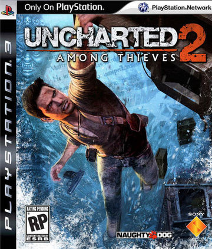

언차티드2가 나오고 나서야, 1편의 존재를 알게된 나로썬, 1편을 마치자마자 공백없이 바로 플레이 해볼 수 있었다.
1편이 준 느낌이 워낙에 좋았던지라 당연히 큰 기대치를 가졌는데, 2편은 조금 다른 방식의 스토리 텔링 방식을 취했다.

탈선된 열차 안에 주인공을 던져놓고 왜 그런 상황이 됐는지를 보여주는 방식이었는데, 이 방식이 유난히 새롭다거나 참신했던건 아니지만 적절한 연출이었던거 같다.

전체적으로 지난 작품보다는 챕터도 늘어났으며, 보스전이 지난작보다 센스 있어진 것도 좋았고, 게임을 같이 진행해주는 동료도 다양했다는 것도 마음에 들었다.

무엇보다 가장 마음에 든 것은 지난 작품에서 쌩뚱맞았던 레지스탕스 느낌의 스테이지가 없었다는것 이었다.

너무 지나친 반전이라, 억지스럽다는 느낌까지 들었던 요소가 빠진 것은 아주 마음에 들었다.

플레이 타임이 1편과 비슷했지만 조금 더 즐겁게 플레이 할 수 있던 것은 언차티드식 퍼즐을 푸는데에 익숙해졌기 때문임도 한몫 했겠지만 말이다.

전반적으로 여전히 모험의 느낌은 잃지 않았으며, 상황을 극복하기 위해 주위를 둘러보고 유추하는 능력을 요구하며, 적당한 힌트를 제시해 유저로 하여금 성취감을 느끼게 하는데에 부족함이 없었다.

게이머가 반드시 게임에서 제시하는 길로 가야만 함에도 불구하고 이 과정을 모험이라고 느끼는 데에는 분명 게이머가 찾아냈다는 느낌을 제대로 주고 있기 때문이란 생각이 든다.

언차티드2는 분명 개발 과정의 부담감으로 작용 할 수도 있는 명작의 후속작이 갖게 되는 높은 기대치를 만족해줬으며 모험의 느낌을 제대로 갖게 해준 명작이었다.

