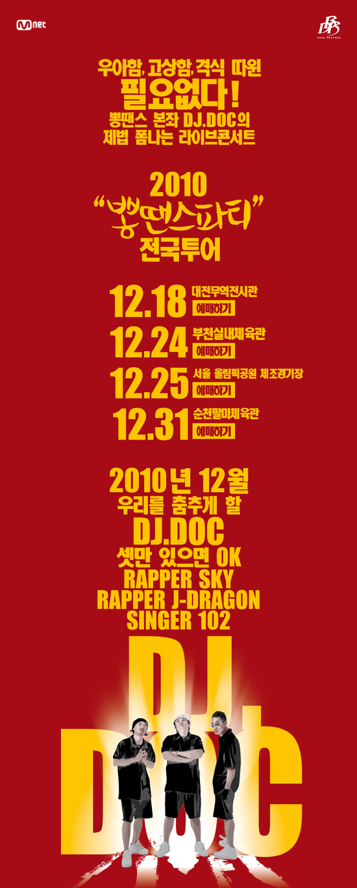

2010년 크리스마스~! 

당시 업무시간 3시간을 단축시켜주셔서 4시에 퇴근했고~

가산 디지털 단지역에서 회사를 다녔던지라 그리 멀지 않은 부천역에 꽤나 일찍 도착해서 저녁을 먹고 쫄래 쫄래 부천 실내 체육관을 방문하게 됐다.

사실 우리 또래치고 디제이덕 노래 한번 안따라 부른 애들이 없었을 정도로 디제이덕의 음악은 메이저 하다고 할 수 있다.

애초에 딱히 음악 장르 구분을 하지 않는지라 대중 가요를 즐겨듣는 나로썬 꼭 한번 보고 싶었던 공연이기도 했고.

또한 당시 ♬이런 사람이야~ 가 큰 인기를 끌었던지라 더더욱 선택에 중요한 요인이 됐다.

그 해 내내 바빴다보니 연말이 되서야 갔던 2010년 첫 콘서트였던지라... 큰 기대를 품고 가게 됐던 공연이었다.

연말 공연이 늘 그렇듯... 사람은 바글 바글~~

시작은  45RPM이 끊었었다. 45RPM이 두곡 부른 뒤 시작된 공연에서, Run to U, 이런 사람이야, Ok-Ok 등등 여러 신나는 노래도 좋았지만

특히 좋았던 곡은, Remember. 이 노래는 언제 들어도 참 좋더라. 몇안되는 DOC 노래중에 슬픈 노랜데 왜이리 좋을까...

Space A의 Again처럼 해당 그룹이나 가수의 이미지를 벗어나는 노래가 나에겐 좀 더 특별하게 좋은 느낌이 있다.

개인적으로 기대했던 부치지 못한 편지는 화해했다며 부르지 않더라. 췟~

전체적으로 적절히 신나고~ 내가 좋아하는 4minute도 나왔다보니 더더욱 맘에 든 공연이았다.

하지만 부천 체육관에서 집에 갈때 택시도 잘 안잡히고 너무 추웠다보니, 차가 꼭 있어야 겠단 생각이 들었고, 해가 지나서 차를 산 계기가 됐을 정도로 추웠다.

연말공연은 교통좀 좋은데서 해줌 안되나?

여하튼 연말 공연에 적합한 공연이었단 생각이 드는 괜찮은 공연이었다.