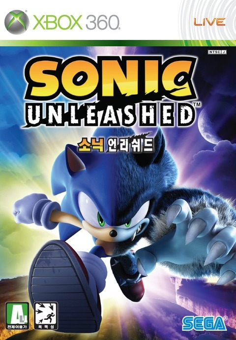

소닉 어드벤쳐 2를 너무 재미있게 했기에, 3D 소닉가 재미없다는 편견 따위는 진작 버렸다.

하지만, 아이러니 하게도 이후 발매된 소닉들이 너무나 허접한 (...) 퀄리티를 냈기에 그에 대한 안타까움을 가지며 매번 후속작을 플레이해보곤 했는데, 소닉 언리쉬드는 타이밍을 놓쳐 플레이 해보지 못하다가 얼마전에야 플레이 해보게 됐다.

게임은 헤지혹 모드와 웨어 혹 모드로 나뉘어서 진행됩니다.

헤지혹 모드는 스피디한 소닉으로 플레이 하는 모드이고, 웨어혹 모드는 액션성이 좀 더 가미된 모드라고 할 수 있다.

웨어혹 모드는 전투 방식이 스피드함 보다는 컨트롤을 중시하는 액션이 주가 되기에, 난이도가 헤지혹 모드보다 어려운 편이다.

웨어혹 모드에서 쌓인 스트레스를 헤지혹 모드에서 푼다는 느낌으로 플레이하긴 했지만, 웨어혹 모드가 너무 어려워 결국 엔딩은 보지 못했다.

전반적으로 소닉에게 기대하는 느낌은, 호쾌함인데 웨어혹 모드가 그 부분에서 페널티가 있었기에... 나에겐 좀 아쉬운 게임이 되고 말았다.

만약 웨어혹 모드와, 헤지혹 모드로 분리해 별도의 두개의 게임 느낌을 냈으면 어땠을까 하는 아쉬움이 있는 게임이었다.
