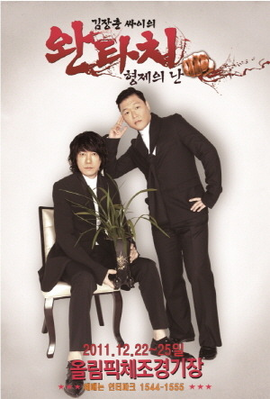

2011년 크리스마스~

꼭 한번은 봐야된다는 콘서트들중 하나인 싸이, 김장훈 콘서트를 가보고 싶었는데, 두분이 같이 공연한다는 얘길 듣고 부랴 부랴 예매했던 공연이다.

사실 김장훈 노래중에 나와같다면이나 난 남자다 등을 좋아하긴하지만, 팬이라 보기 어려운 수준이고, 싸이의 노래도 마찬가지. 

개인적으로 끝 외에는 딱히 좋아하는 노래가 없다.

하지만 무대매너가 좋다고 알려준 두분 무대라 큰 기대를 안고 갔던 공연!!

12시 공연이었던만큼 당연히 올나잇일거라 믿고 있었고, 기대대로 역시나 올나잇이었다.

무대는 싸이, 김장훈, 싸이-김장훈 순서로 이어졌는데, 개인적으로 싸이의 무대가 훨씬 좋았다.

김장훈 무대는 연내내 이어진 무대여서 그런지 좀 지쳐보이셨고, 에너지 넘치는 모습도 그다지 없어서...

게다가 중간 중간 이어지는 발라드곡이 12시부터 새벽 6시경까지 이어진 공연에서 2~3시에 배치된건 더더욱 이해해가 어려운 구성이랄까...

전국 공연을 위한 버스를 이용한 무대는 나름 멋있긴했으나....걍 멋있다지 무대를 돋보이진 못했다라는 생각이 든다.

그래도 후회스럽지 않았던건 역시나 에너지가 넘치는건 싸이의 무대!

챔피언,  새, Right now 등 신나는 노래도 좋았고 연예인, 낙원 같은 노래등의 밝은 분위기들은 노래들을 포함해서 싸이의 노래가 전반적으로 분위기를 돋구기 제격인 노래다보니, 아... 이래서 싸이 싸이 하는구나를 절실히 느꼈다.

물론 내가 가장 좋았던 곡은, 싸이 1집의 숨겨진 명곡 ♬끝 이었다.

경험담인가싶은 이 노래는 짝사랑의 애절함을 묻어나 싸이답지 않은 노래면서도 싸이가 아니면 소화하기 어려운 느낌을 냈던 명곡이었기 때문에 꼭 직접 듣고 싶었는데, 다행히도 콘서트에서 듣게 되서 아주 좋았다.

두명이 함께하는 콘서트이다보니 대부분의 콘서트에서 볼 수 있는 게스트가 없었는데, 그만큼 6시간에 가까운 긴 시간동안 두 분이 얼마나 힘드셨을지 느껴지면서도 올나잇 시켜드리겠다는 약속을 지키는 두분의 열정에 지쳐있던 나도 신나게 끝까지 공연을 볼 수 있었다.

올해 강남 스타일이 대박나면서 싸이의 국내 공연 표 구하기도 힘들고, 공연도 예년만큼 많이 못하고 있는지라~ 작년 공연을 봤던 것이 나름 다행이었다 싶더라

이제 내 맘속의 꼭 봐야되는 공연 목록에 남아있는 김동률, 이승환 콘서트를 꼭 보고 싶은데...

표를 매번 못구한다. 너무 뒷자린 또 싫고....

언제쯤 볼 수 있을려나?