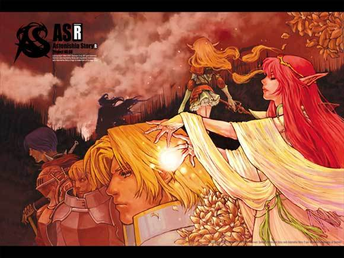

어스토니시아 스토리의 명성은 익히 들어 알고 있고, 현재의 손노리와 엔트리브를 있게한 명작이란 것은 귀에 못이 박히도록 들어 잘 알고 있었다.

어스토를 클리어하지 못한 것은 한창 발매 초기에는 인기있던 시기에 버그에 막히기고 울컥했기 때문이었다.

다크사이드 스토리는 엔딩을 봤고, 초회판을 구매했던 포가튼 사가는 엔딩 직전에서 버그때문에 진행이 안되 (부사를 잡고 싶었다고 부사를!!!) 아직도 원한에 사묻혀 있었다. 비록 엔딩은 못봤지만 포가튼 사가는 여러가지 조합 해본답시고 플레이타임이 200시간이 넘어가는 몇 안되는 RPG였다. (아마 여신전생 말곤 가장 길게한 게임 아닌가 싶다. 파판7도 장시간 플레이하다가 CD3 진입하자마자 세이브 날린 이후로 엄두가 안나서 다시 안했으니까)

악튜러스도 초회판을 샀지만....하다가 초반에 흥미를 못느껴 접었다. 화이트 데이는 무서워서 하다 포기했다.

개인적으로 소프트 맥스보다 손노리를 좋아했고, 포가튼 사가에서의 개그 센스에 박장대소했던 저로썬 어스토를 클리어하지 못했단 사실은 찜찜했다. 

PSP판도 사실 발매 초기에 플레이했었지만 핫타이크 버그 (핫타이크 공격시 찢어지는 소리가 들리는 버그) 가 귀에 너무 거슬려 하다가 말았는데, 이번에는 반드시 깨고자!! 맘을 다잡고 플레이를 하게됐다.

기본 베이스는 GP32판과 PC용 ASR과 크게 다르지 않다. DOS용 어스토가 기억이 잘 않나 비교는 안되지만 아마 이벤트 구성도 거의 비슷할거에요. 핫타이크와 부하들이 동료로 합류시 Out of memory 오류가 났던 것을 이벤트로 삽입한 것이나, 패스맨 만났을 때의 대사, 랜달프 초반 합류 정도가 차이나는 요소지 않나 싶다.

기본적으로 어스토는 필드 이동형 + SRPG식 전투를 채용하고 있고, 이는 이후 포가튼 사가에서도 이어졌다.

전투 하나하나는 꽤 긴편으로 파판이나 드퀘의 전투보다 길기 때문에 조금 지루해 질 수도 있다. 

레벨 디자인은 꽤나 괜찮았는데, 드퀘나 파판보다 레벨 노가다를 덜 해도 클리어하는 데에 전혀 무리가 없었다랄까? 뭐 레벨 노가다를 아예 안할순 없었지만 말이다.

사실 클리어할 때 까지 의아했던건 볼륨이 너무 작다는 점이었다. RPG치고 너무 짧은게 아닌가... 싶은 플레이타임이었기에 좀 아쉽기는 했으나, 대신 지루하게 강제로 늘려놓은 요소가 없다보니, 플레이 도중 지루함은 별로 없었다.

개인적으로 포가튼 사가의 매우 방대한 볼륨이 맘에 들었지만, 어스토의 직선형이나 마찬가지인 진행 + 작은 볼륨도 나름 괜찮은거 같다. 다만 1편과 2편 사이의 간극이 너무 길었고, 2가 모바일 전용으로 출시됐다는 점은 아쉬울 수 밖에 없는 점이었다.

너무나 늦게 클리어했다는게 아쉬울만큼 어스토는 재밌는 RPG였기에 PSP를 가지고 계시다면 한번쯤은 꼭 플레이 해보시길 권하고 싶다.

PS : 핫타이크 버그는 꽤나 거슬림. 주의바람.