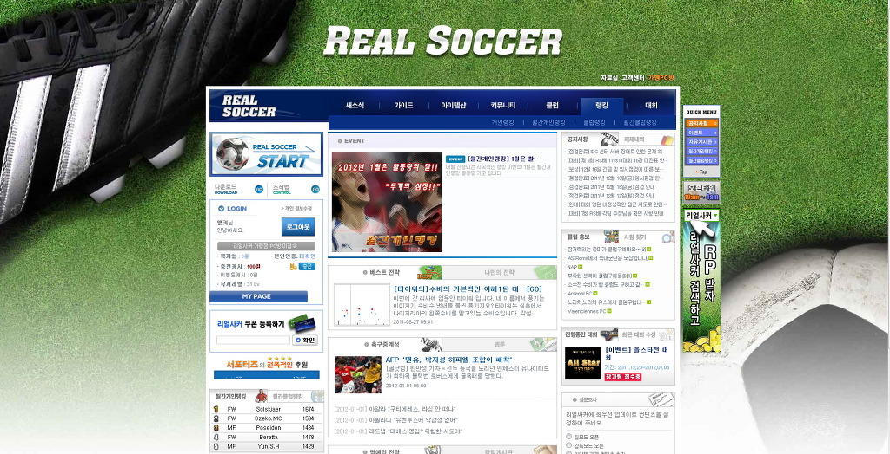
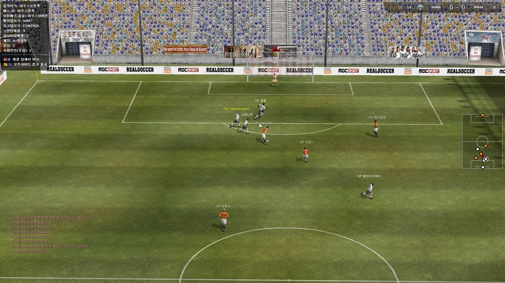
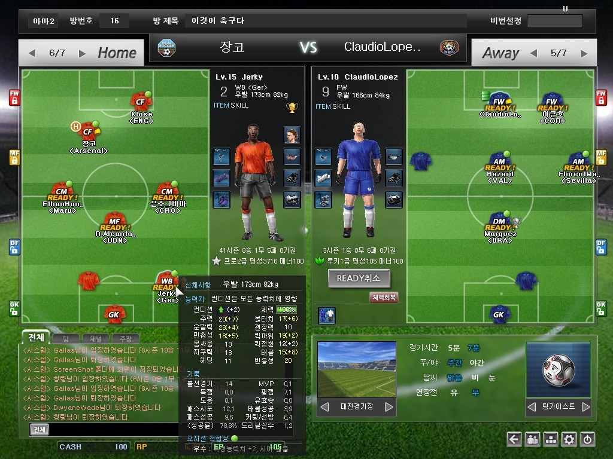

아무리 내가 기본적으로 축빠라고 하지만, 아무 축구 게임이나 오래 붙잡는 편도 아니고 (실제로 위닝이 즐겁던 PS2시절엔 피파는 쳐다도 안봤다. 지금은 위닝을 쳐다도 안보는...) 다른 할 것도 많기에 축구 게임이라고 해도 어느정도 재미있어야 플레이를 하기 마련이다.

리얼사커가 채용한 한 캐릭터만 조작하는 류의 게임은 여럿있어왔다. 게다가 위닝/피파도 1인 모드를 도입한지 몇해 되었기에 딱히 새로울 것이 없었다고 할 수 있다.

다만 마우스로 하는 축구 게임중에 이만한 재미를 준 게임은 처음이지 않나 싶다.

애니메이션도 어색하고, 모델링, 텍스쳐 전부다 로우퀄리티지만, 게임의 재미 하나는 확실했다.

적어도 시각적인 부분을 제외하고 신경쓸 수 있는 부분은 꽤나 신경쓴 게임이었다.

패스나 슛은 마우스 포인팅한 곳으로 쏘게 되어있는데, 앞공간으로 차줘야할때 뒷공간으로 차줘야할때를 잘 맞춰야되기에 미쓰 날 때도 많지만 적응되고 나면 패드나 키보드 조작보다 짜릿한 감이 있다.

또한 패스를 받는 유저, 커팅하려는 상대편까지 고민해야 되기에 더더욱 그렇다. 나에게붙어있는 수비수까지 있으면 원하는 컨트롤을 하기 그리 쉽지 않기에 그나마 실수 여지가 적은 숏패스나 빈공간으로 크로스가 주로 이용되곤한다.

다만 미드필더에겐 역회전 킥이라는 다른 게임엔 없는 사기 패스가 존재해서 로빙 패스가 꽤나 유용하게 이용되고 있다.

당연히 그래야 될 요소지만 포인팅한 곳으로 100% 날라가지 않는다는 점은 축구 같지 않은 게임성을 구현한 일부 게임 (딱히 특정 게임을 언급하진 않겠음...다들 아시리라...) 보다 훨씬 나은 요소들이다.

역시나 능력치에 대한 욕망을 불러일으키게끔 능력치별 차별화가 꽤나 되있어서 고렙 캐릭터 + 파츠를 다양하게 장착한 캐릭터가 여러모로 유리한건 사실이지만 패스 플레이만 잘 된다면 뒤집을 수 있는 것도 축구다운 면이라 할 수 있다. (물론 어렵긴하다)

게임은 매우 단순하나 대쉬, 킥대쉬, 각종 개인기를 통해 상대를 제쳐냈을때의 짜릿함도 있고, 정확하게 맞춰주는 패싱 플레이를 해냈을때의 감흥도 좋아서 여러모로 섬세한 컨트롤을 통한 즐거움이 많았다.

마우스 컨트롤이다보니 패드나 키보드로 할때의 패스 방향 보정같은게 들어가 있지 않다보니 초반 진입장벽은 꽤 높은편이지만 이 마저도 이 게임의 장점이라 할 수 있다. 아무래도 사람이다보니 고수라 불리는 유저들도 종종 실수가 나오다보니 축구답게 보이기도 하기 때문이다. (실제로 나는 공격자가 집중했을 때 거의 실수 없이 패싱 플레이가 가능한 피파나 위닝이 비정상적이다라고 본다.)

2011버전부터는 위닝도 패스에 방향과 강약이 들어가며 원성을 사고 있는데, 리얼사커는 원래 그랬고 마우스를 통한 섬세한 조작과 매우 어울린다고 생각한다.

처음 시작했을땐 불가능했으나 플레잉 키퍼도 생겨나 실제 11:11도 가능해졌다. 하지만, 유저수가 그렇게 폭 넓지 않고, 공격수에 지나치게 편중되어있는 유저수로 인해 11:11은 클럽이 아니면 거의 불가능에 가깝다고 볼 수 있다.

실질적으로 5:5~8:8정도의 경기가 주로 이뤄지는데, 이마저도 포지션 편중 문제가 심각했다.

또한 축구의 특징인 1명이 팀을 망치는 플레이를 하면 (거친 플레이로 인한 퇴장이라던지, 삽질이라던지....) 경기 자체를 말아먹는 경향이 강하단 점이다.

사실상 포기하는 경기가 속출하는데 퇴장 페널티때문에 그렇게 하지도 못하는 상황이 자주 나온다. 차라리 강제 퇴장 요청처럼 투표를 통해 페널티 없는 패배가 가능했으면 어떨까 싶은 경기가 많았다.

실제로 어느정도 이상의 레벨이 되면 클럽에 가입하지 않고선 정상적인 플레이가 불가능한 경우가 너무 많다. 클럽에 가입한다해도 한 게임을 하기위해 30분이상 기다리는 경우가 속출하긴하지만....그래도 게임 시작하고나면 같은 팀 멤버로 인해 속 터지는 일은 거의 없기 때문이다.

현재의 리얼사커는 오픈한지 꽤 됐으나 여유있게 확보하지 못한 유저풀, 포지션 편중으로 인한 매칭 대기시간 증가, 이로 인한 유저 이탈의 악순환을 겪는중이라고 보여지는데 이를 얼마나 잘 극복할 수 있을지가 미지수다. (적어도 아직까지는 제대로된 해결책을 전혀 내놓지 못하고 있다.)

실제로 나도 대기시간때문에 게임을 접은 유저로써, 이를 해결하지 못하는 이상 리얼 사커를 더 플레이하진 않을 예정이다.

게임 본연의 재미는 보장된 만큼, 난제들을 어떻게 극복해 나갈지가 관건이다.
