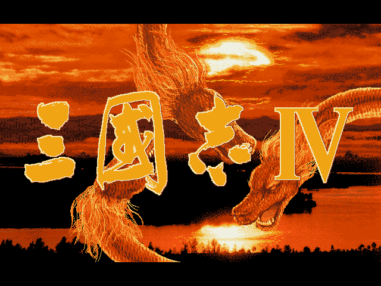
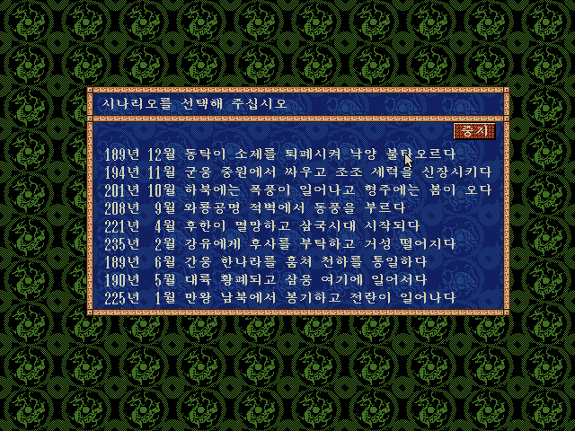
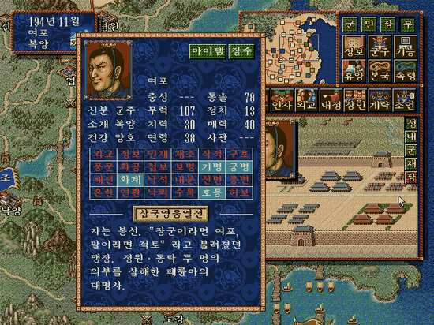
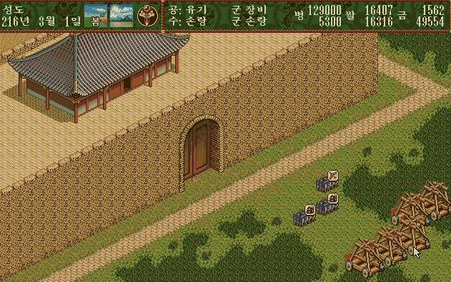
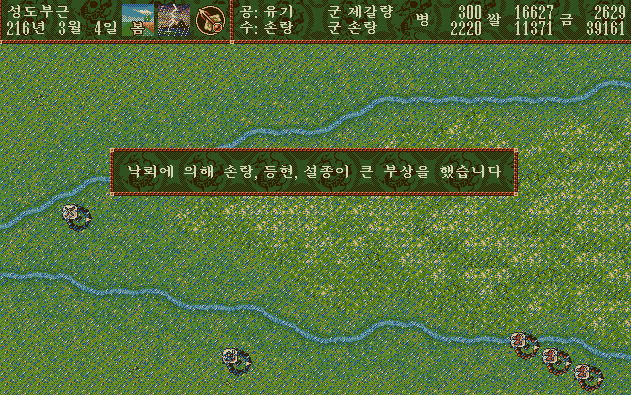
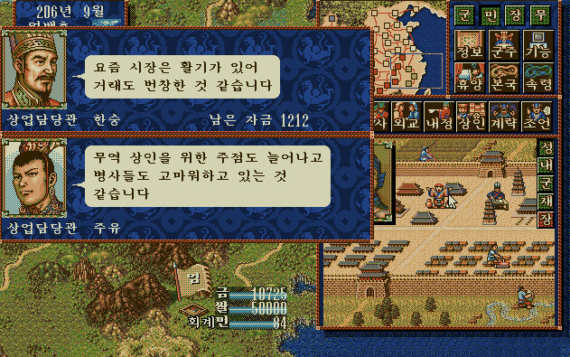
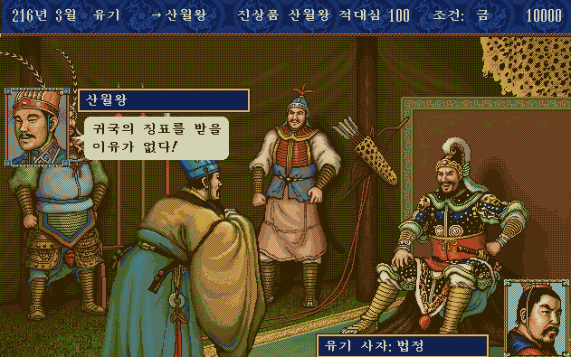
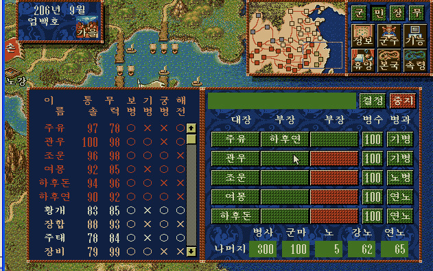
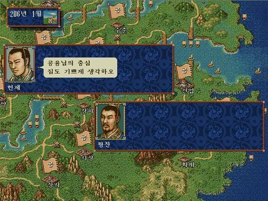

최고의 작품의 기준은 개개인 마다 너무나 다르다.

실제로 삼국지를 1편부터 즐겨오신 분들이 대다수 꼽는 삼국지3편. 혁신이라는 표현을 쓰시며 감탄 감탄 연발이었다. (주로 5까지 나왔던 시기의 PC통신 등에서 많이 접할 수 있는 평가)

그 뒤를 잇는 것이 2편이었으며, 4편은 RPG스럽다는 평가와 함께 최악으로 꼽히곤했다.

특히 낙뢰, 풍변, 천변이 게임성을 깨버리는 요소였으며 할 수 있는 일을 스킬로 등록해둔 시스템 때문에 능력치 + 스킬로 인한 캐릭터간 격차가 지나치게 심하다는 비판이 많았다.

그런데 나는 이런 요소가 즐겁기만 했다. 처음 접할 당시 (1996년) 삼국지 2나 삼국지 3는 너무 오래된 게임이었으며 불편했기 때문이다. (오히려 지금 한다면 삼국지4가 더 불편하더라...마우스 only의 폐해랄까?)

삼국지 4는 기본적으로 손이 많이 가는 게임이다. (사실 내가 보기에 폐인급 게임들 = 문명, FM, HOMM 등이 죄다 그렇다) 그렇다보니 한번 잡으면 몇시간은 훅가기 마련이고, 이렇다보니 몇날 몇일 밤을 새야 전국 통일이 가능한 게임이다. 

사실 삼국지는 시나리오도 여러개이며, 군주도 여러개이다보니 여러가지 상황을 극복하고 전국 통일을 하는 것이 궁극 목적이 되는데, 나는 주로 강한 군주(조조, 손씨 가문)을 선호했으나, 같이 하던 친구 녀석은 유비, 엄백호, 공주, 공융 등을 선호했다.

다만 어떠한 군주를 선택하던지와 관계 없이  어느정도 수준의 병력을 구축하면 난이도가 급 하락하는 점이 이 게임의 단점이었다.

병력차가 일정 규모 이상나면 바로 공성전으로 넘어갔고, 개발력 일정 수준 이상에서 만들어낸 파쇄차와 발석차가 있으면 공성전은 몇턴 이내에 끝났기 때문이다.

오히려 병력이 적은 상태에서 수비하는 재미가 있었는데, 요격 나가서 낙석으로 병력을 크게 줄인다거나, 화계가 유용했으며, 머리 나쁜 장수와 지장이 같은 부대가 아니라면 혼란이나 
내분이 2번에 1번 꼴로 통했기에 이런 상대 부대의 빈틈을 이용하는 재미도 쏠쏠했다.

실제로 내정의 재미, 수색의 재미도 빼놓을 수 없는 요소라 할 수 있다. 병력도 중요하다지만 실제로는 무장의 능력이 크게 영향을 준 삼국지 4에서는 내정을 통해 한 도시만 잘 가꿔놔도 그 도시를 바탕으로 전국 통일을 이뤄내는게 크게 어렵지 않기 때문이다. (위에서 설명한 발석차/파쇄차를 이용해 상대가 도망갈 수 있는 도시가 없을 때 상대 성을 함락 시켰을 경우 일기토를 통한 병력 흡수도 이루어진다.)

수색을 통해 인재를 한 도시에 수십명 모아놓는다면 여러 도시를 함락 시켰을 때 함락 시킨 도시도 쉽게 발전이 가능하므로 인재의 중요성은 여러번 강조해도 모자람이 없다.

이전 작품의 영향인지 외교와 계략의 완성도가 너무 떨어졌는데, 이 점이 좀 아쉬웠다. 실제로 가능한 명령들도 좀 적었고....

애초에 외교와 계략이라는 커맨드가 없는 것처럼 여기고 플레이 해도 될만큼 큰 영향이 없지 않았나 싶다.

또한 삼국지4의 멀티플레이는 같은 PC로 돌아가며 턴을 제어하는 식으로 멀티 플레이가 이뤄졌는데, 이럴 경우 전략이고 뭐고 머리싸움이 제대로 이뤄지지 않는 문제점도 발생했다.

이렇듯 애매한 완성도의 삼국지4였으나..... 적어도 나는 장수의 수집만으로도 즐거웠다.

삼국 시대의 무장들이 등장하며, 각 무장들에 대한 평가가 능력치와 스킬로 이루어져 있고 그 것들이 게임내에서 실제로 영향을 주고 받는 다는 것만으로도 꽤나 가치가 컸다.

내가 이 게임을 처음 접한 나이가 초등학교 6학년에 불과했고 전략성에 대한 고찰없이 플레이하다보니 즐겁게 플레이했던게 아닌가 싶다. 이 당시 읽었던 이문열 삼국지를 보며, 코에이 삼국지에서 구현된 장수와 비교하는 재미도 있었음은 물론이고.

게임에 대한 평가는 개인차가 있기 마련. 적어도 지금껏 발매된 삼국지 시리즈 중에서 내가 즐긴 최고의 삼국지는 4편이다. (두번째는 삼국지5, 세번째는 삼국지6다.)

너무 오래된 게임이라 불편하게 여겨진다면 조금이나마 개선된 삼국지 DS2를 플레이해보는건 어떨까?

