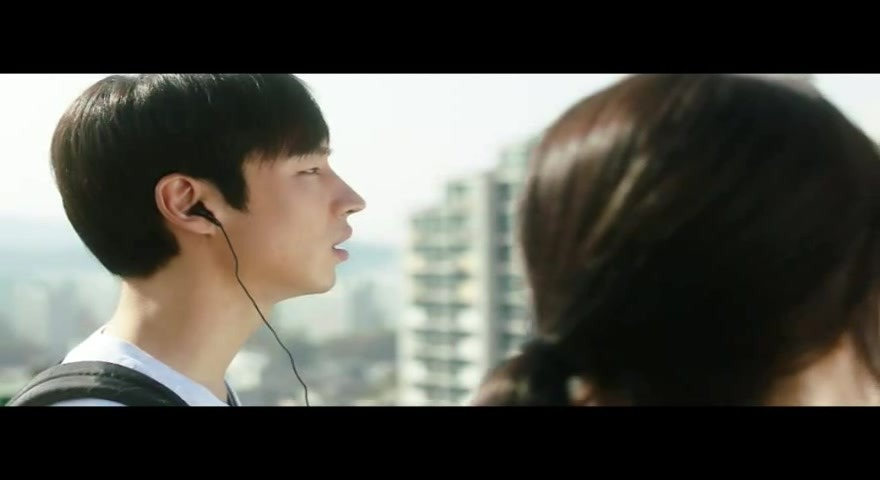

개봉하자 마자 보다 시간이 지날 수록 그렇게도 말이 많던 이 영화를 얼마전에야 보게 됐다.

제목이 너무 쌩뚱맞아서, 스토리를 묻거나 찾아보지 않는 나로썬 왜 건축학개론인지 궁금했는데 조금 보다 보니 바로 감이 오더라.

나에게도 있었던 첫사랑의 기억...

당연히 영화와 많은게 다르지만 하나 둘 떠오르게 해주더라.

그녀의 사진을 찍으려다가 들키고 어설픈 연기로 빠져나가는 이제훈... 참...와닿았다. 어째서 우리는 사랑하는 사람앞에선 이렇게 어설프고 우스울까?

그녀의 질문에 경직되고, 그녀는 말을 놓은지 한참인데도 편하게 말조차 못하는 그런...

그녀가 좋아하던 노래도 가슴에 품고 잊을 수 없다.

어깨에 기대어 잠든 그녀에게... 키스도 하고... 첫눈 내리는 날 만나자는 수줍은 약속도 했지만...

그녀로 인해 가슴아파도 바보처럼 속시원히 울지도 못한.... 아픈거 내색도 못한 나보단.... 영화속 주인공이 더 나아보인다. 차라리 속시원히 울었다면....

더 아파지지 않기 위해 그녀에게 꺼지라고 말하는... (표현이 조금 쎄다 싶었다만...) 그런 마음 알 것도 같다.

서로의 추억이 담긴 물건을 쉽사리 버리지 못하는 마음. 이 장면에서 생각보다 여운이 남았다.

첫사랑의 설레임보다 이뤄지지 못한 가슴 아픈 감정을 그려냈기 때문일까?

그래서 이 영화가 사랑받았나보다.