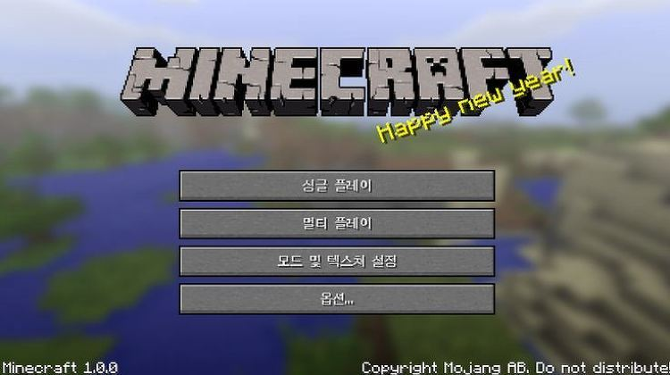

도트의 전설. 악마의 게임이라 불리우는 마인크래프트.

많은 분들 처럼 나도 원사운드 님의 카툰을 보고 접하게 된 게임이었다.

원사운드님 카툰. 하루하루가 주말의 종말. 

이런 류의 게임이 없었던건 아니다. 심즈, 심시티, 롤러코스터 타이쿤등... 비슷한 장르라고 볼 수 있을 것이다.

어찌보면 로스트 인 블루랑 비슷하단 느낌도 들고. (현재 나온 게임중에선 스카이림?)

서바이벌 + 타이쿤 + 모험이라 칭하면 될려나?

그냥 월드에 떨궈놓고 알아서 살아 남아야 하는게 이 게임의 방식이다.

밤에는 몬스터가 출몰하고, 먹을 것은 자급 자족 해야한다. 여기까지는 사실 그리 어려운 목표는 아니다. 하지만 조금씩 욕심이 생겨나고 더 멋지고 좋은 집을 지으려면 재료를 구해야되고 좋은 재료는 주로 몬스터가 출몰하는 탄광이나 던전을 탐험해야 한다.

멀리 나갔다가 해가 저물때의 두려움, 던전 탐사에서 느껴지는 뭐가 튀어 나올지 모르는 긴장감...!!! 

내가 이런 도트 덩어리 그래픽에 몰입될줄이야....!!! 

아니 오히려 도트 덩어리 그래픽이라 몰입되는 거였을 수 도 있겠다.

나도 친구 2명과 함께 이 게임을 즐겼는데, 모두들 적응력이 어찌나 뛰어나던지.... 잠깐 한거 같은데 정신 차려보면 3~4시간 훌쩍가더라.

이렇게 집중한 게임이 요 근래 있었나 싶었을 만큼 재밌게 즐길 수 있었다.

친구 한명은 이미 플레이 경험이 있어 레시피 몇개는 외우고 있어서 설명을 들으며 진행 하는 데에 크게 무리가 없었지만, 그 이외의 만들고 싶은 물건이 있을 때 그 레시피를 상상하는 재미도 있었고, 도저히 생각이 안날 때 레시피 봐가며 그 재료 구하러 여기저기 돌아다니는 맛도 짭잘했다. 그 과정에서 대 참사가 벌어지기도 했고...!

절대 만들어둔... 특히 방금 잠든 침대를 부수지마라...귀찮더라도 여러개 만들어서 들고다니자 -_-;;

스타팅 포인트에서 집을 찾아가는 길이 결코 쉽지 않을지니...!!

또... 집에서 멀리 떠날땐 꼭 뭔가 떨구면서 가자... 헨젤과 그레텔의 교훈을 잊지 말자고~~!! 

사실 이 게임의 단점은 딱히 없다고 본다. 워낙에 잘 만들어졌고, 오픈 월드 (맞나?) 의 재미를 만끽 할 수 있는 뛰어난 완성도를 지녔기 때문이다. 어떤 맵에서 플레이 하냐에 따라서 전혀 다른 게임을 즐기는 느낌이 들기도 하고.

유행은 많이 지났지만, 한번쯤은 꼭 해봐야 될 게임이라고 생각이 든다. (취향도 덜타는 게임이기도 하고)
