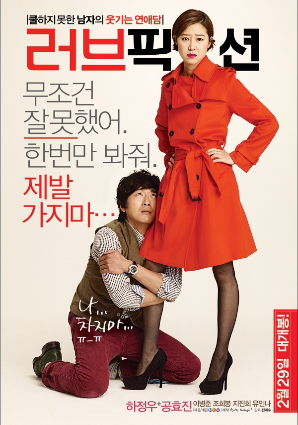

하정우, 공효진 두 배우 모두 나는 딱히 팬이 아니었지만, 로맨틱 코미디를 좋아해서 보게 된 영화라 할 수 있다.

그런데 하정우와 공효진의 사랑이야기가 이토록 재밌을 줄은 몰랐다. 

베를린에서 잠시 스친 그녀에게 보낸 러브레터. 그 센스란!

작가라는 장점을 살린 그 러브레터는 암만 봐도 멋있다.

남자로써 관심 있는 여자에게 그렇게 적극적일 수 있다는 점은 아무리 생각해도 멋지다.

그렇게 로맨틱하고 절실했던 한 남자가, 그녀의 마음을 얻고 조금씩 변해가는 과정을 보며.. 참 씁쓸하더라.

어쩜 이놈의 영화는 이리도 현실적일까...

왜 우리는 처음 그 느낌을 오래 간직하지 못하고 사는걸까..?

씁쓸하면서도 너무나 많은 공감이 됐다.

개인적으로 건축학개론만큼이나 재밌었던 영화였다. 강력추천!