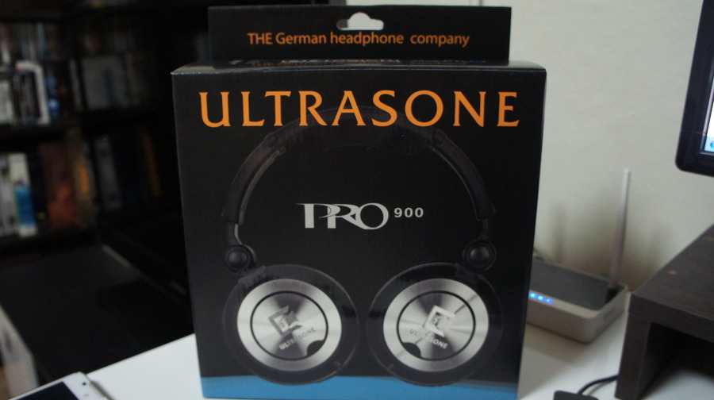
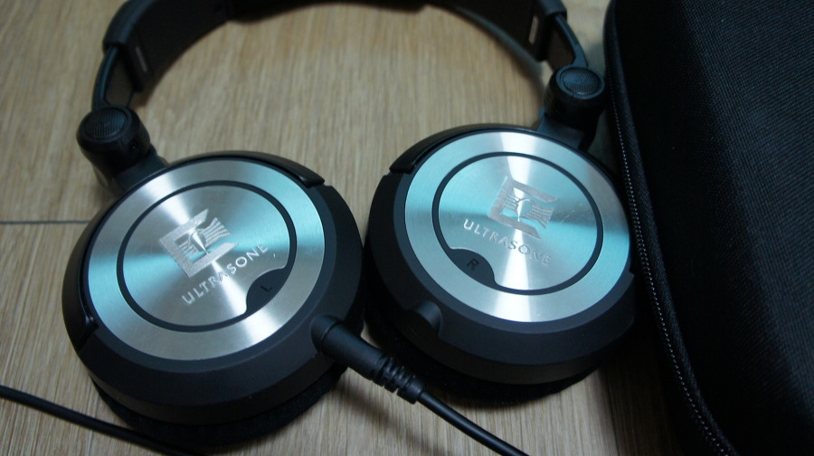
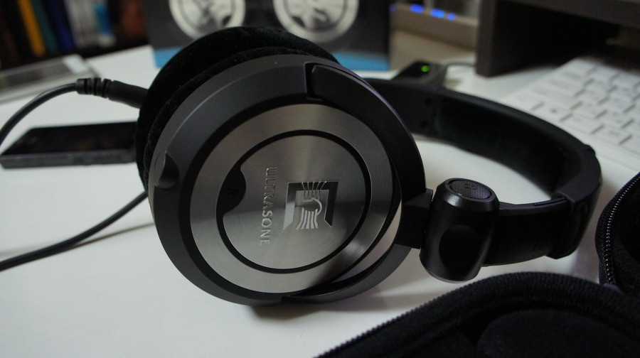

나는 사실 음향기기에 엄청나게 민감하진 않은편이다.

그리 풍족하지 않은 학창 시절에, 없는돈 쪼개가며 게이머 생활을 영위 (?) 하다보니, 또 20대 초반엔 술자리 갈돈도 부족했던 시기에 음향기기는 너무 비쌌다.

회사원이 되고나서 한참이 됐음에도 그때가 습관이 되서 그런지 음향기기는 그리 비싼걸 써오지 않았던게 사실.그러던 작년부터 쓰던게 그나마 비싼 음향기기였던 Somic의 MH463.MH463도 꽤나 괜찮은 모델이고 가격대 성능비가 워낙 좋다보니 만족하고 쓰고 있었지만 사실 여러모로 부족한건 사실이다. 워낙에 무겁기도 하고.

그러던 찰나 옆자리에 계신 분이 AKG-550을 구입하셨다. 들어보니....이게 왠 신세계? 너무 비교되는 MH463이 초라해보이고... 이주간 고민하던 차에 청음샵에 방문해서 AKG-550을 따라 구입하려다, 저항이 높고 출력에 강한 PRO-900으로 급 선회했다.

허나 막상 사고보니 출력이 매우 맘에 들지 않았다. 내 베가 LTE가 이렇게 출력이 허접했었다니..

기왕 돈 쓴거 에라 모르겠다 맘먹고 같이 구입한 소니 NWZ-X1050.와우~!

이제서야 청음샵에서의 느낌에 가까워진걸 느낄 수 있었다

여전히 음향기기는 소니란 말인가? NWZ-X1050과의 조화에 만족하며 2달간 잘 쓰고 있다.

요새 날씨가 추워져서 귀마개용도로도 쓸 수 있고 여러모로 좋다.

특히 케이스가 기본 제공된다는 점이 더더욱 맘에 든다. 벨벳 재질이라 먼지도 잘 묻는데, 케이스가 없이는 관리가 힘든점을 고려해준 것 같다.

디자인도 맘에 들고~개인적으로 공간감이 AKG-550에 밀리지도 않고, 출력도 강해서 우퍼가 좋고 고음이 강하더라모든 음향기기는 청음샵에서 체험해보고 구입을 권장하지만 지방에 산다거나 하는 이유로 청음샵 방문이 어렵다면 PRO-900을 추천해본다.

