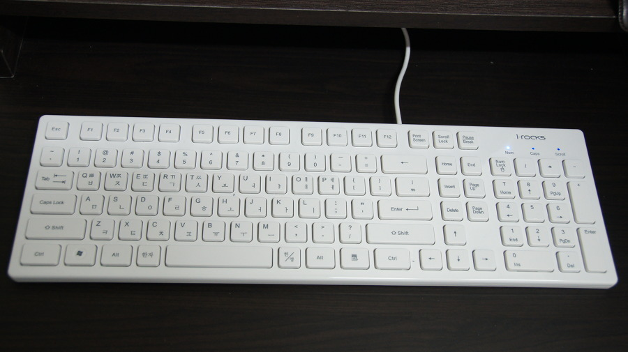
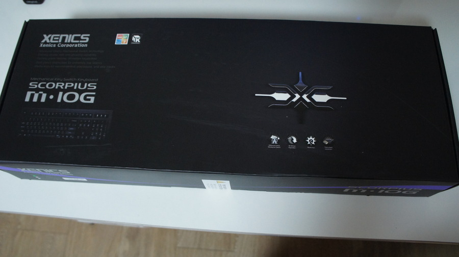
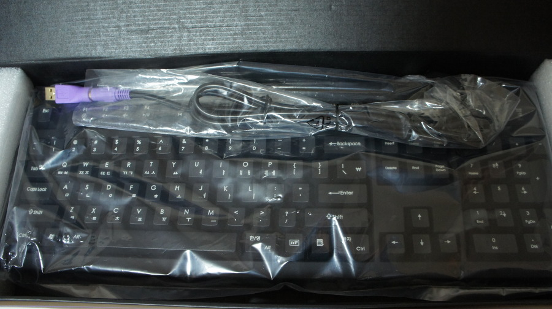
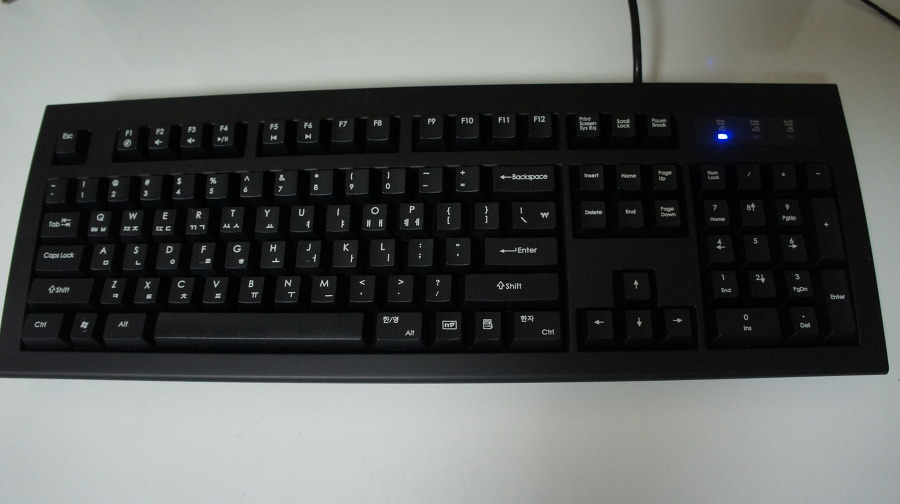

애초에 PC 장비에 그렇게 큰 관심이 없던 나로썬, 키보드 역시 무관심의 대상이었다.

회사에 기계식 키보드를 보유하신 분이 많았음에도 불구하고 평소에 내가 가지던 관심은 무에 가까웠으니 말이다.

실제로 내가 회사에서 사용한 키보드들이 5천원 이하의 제품은 아니었을 지언정 Microsoft 멤브레인 키보드가 주를 이뤘었고, 몇년전부터는 i-rocks 의 멤브레인 or 펜타그래프 키보드를 애용해오곤 했다.

이 제품이 내가 회사에서 사용해오던 멤브레인 아이솔레이션 키보드 KR6401 이다.

실제로 이 제품의 키감은 오묘한데…오타율이 엄청나다 -_-;;; 감안하고 코딩하고 써오는중…손은 편안한편?

오타율과 키 레이아웃이 이상해서, 매우 만족한다 보긴 어려웠지만 워낙에 디자인이 이뻤던지라 이 제품에 이어 후속 제품도 구입했다.

이 제품이 바로 전까지 애용해오던 IRK01W 다. 펜타그래프 방식의 아이솔레이션 키보드로써 KR6401보다 오타율도 현저히 적고 눌렀는지 아닌지 느껴지지 않을 정도의 부드러운 키감은 손의 피로를 줄여준다. 특히 발매 행사 당시 구매했던지라 13000대의 가격대는 이 제품에 대한 만족도를 높여줬다.

아쉽게도 구입한지 1년쯤 됐던 시기에 문제가 생겼었으나 발송 택배비만 냈더니 무상 교환을 해줘서 이에 대한 불만도 누그러들었고.

타이핑을 하고 있는건지 아닌지 느껴지지 않는 것이 컨셉이려나? 여하튼 그런 점 때문에 이 제품은 만족하며 오랜 기간 사용해왔다.

그러던중 회사 동료들이 기계식 키보드를 많이 구입했고, 그로 인해 나도 어느정도 뽐뿌를 받았다.

허나 지난번 헤드폰 + X1000 구매로 인한 출혈이 컸던지라 지나치게 비싼 제품을 구입하는 것은 현실적으로 무리가 좀 있었고, 그래서 구입한 것이 보급형에 해당하는 SCORPIUS M10G라고 할 수 있다.

실제로 키감은 그리 큰 차이가 나지 않는것 처럼 느껴지더라. 백라이트 차이라나? 여하튼 실제로 써보니 감이 매우 좋더라.

예전에 타자기처던 그런 느낌도 나고, 꽤나 시끄럽긴한데 이것도 나름 매력이 있다 ㅋㅋ

집에서 쓸 용도로 구입한 것이니… 어느정도 시끄러운 것도 감안할만하다.

특히나 베이직한 디자인도 맘에 든다. 이런 디자인이 질리지는 않는편이니…

게다가 IRK01W처럼 키 레이아웃도 평범해서 더더욱 맘에 든다. 물론 내 입장에선 스페이스바가 너무 크고 한영 변환키 위치가 너무 오른쪽에 위치하다보니 조금 적응에 시간이 걸릴거 같은 예감은 들더라.

하지만 오타율은 현저히 적었으며, 키를 타이핑하는데에 있는 피로는 거의 안느껴지더라.

이런 점이 기계식 키보드를 쓰는 이유이지 않을까 싶다.

다만 회사에서 쓰려면 조용해야되니 적축을 써야 되겠지?

사실 내가 고민했던 제품은 이 제품외에도

[ZALMAN ZM-K500](http://blog.danawa.com/prod/?section_m=PC&prod_c=1784952&cate_c1=861&cate_c2=881&cate_c3=1005&cate_c4=0)

[I-rocks KR-6251](http://blog.danawa.com/prod/?section_m=PC&prod_c=1458635&cate_c1=861&cate_c2=881&cate_c3=1005&cate_c4=0)

[스카이디지탈 nKEYBOARD 메카닉2 (Red, 리니어)](http://blog.danawa.com/prod/?section_m=PC&prod_c=1711302&cate_c1=861&cate_c2=881&cate_c3=1005&cate_c4=0)

위 세 제품을 포함한 네 제품 사이에서 고민했다.
실제로 최근 사용 제품들이 다 I-rocks 제품이었던지라 KR-6251에 끌렸던게 사실이다. 하지만 무난하다는 평가가 압도적으로 M10G쪽에 많았고, 백라이트까지 있는 TESORO 버전은 가격이 두배정도 나가는지라 구입한 SCORPIUS M10G의 선택은 탁월했던거 같다.
첫 기계식 키보드로 적합한 가격에 적합한 성능이지 않을까 싶다. 다만 누누히 말한대로 청축은 고민좀 해보도록 하자. 많이 시끄럽다.