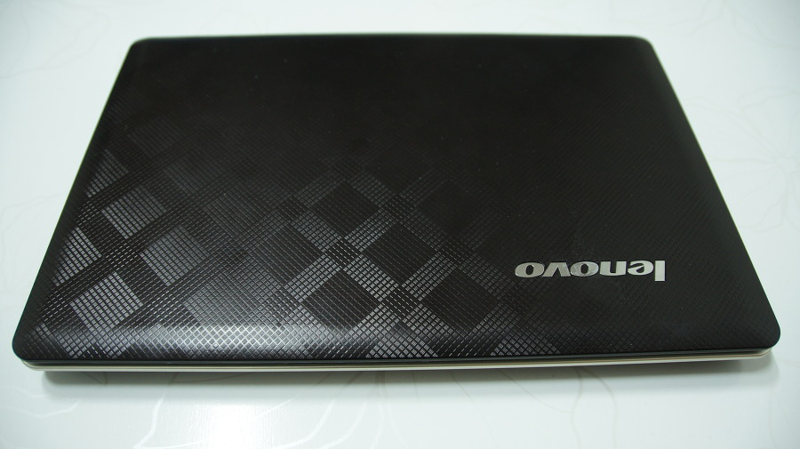
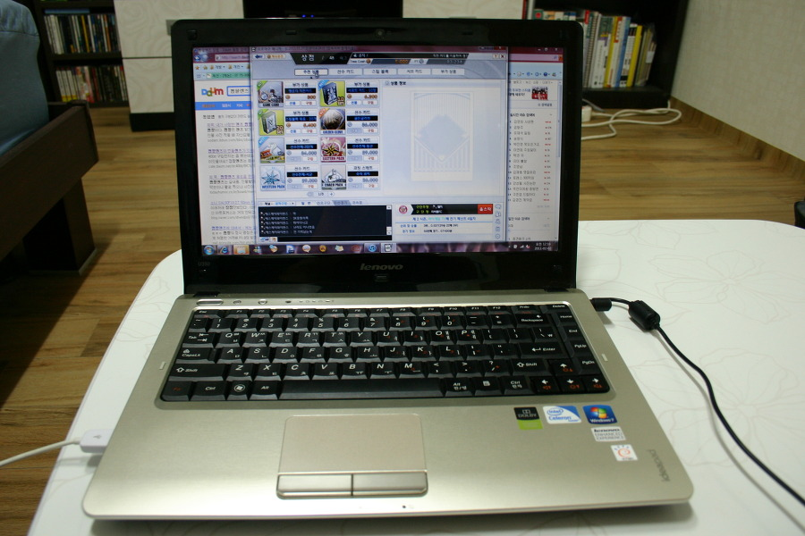

작년까지 사용했던 노트북. 레노버 Idea pad U350-K4K다.

이 노트북보다 이전에 사용했던 노트북들이라고 하자면

[Dell XPS 1210](http://news.naver.com/main/read.nhn?mode=LSD&mid=sec&sid1=105&oid=138&aid=0000009744ASUS)

[EEE-1000](http://www.nowpug.com/review/73528)

[Aspire One 751](hhttp://blog.naver.com/brian94?Redirect=Log&logNo=130068341330)

이외에도 기억도 안나는 한성 컴퓨터 노트북 등이 있다.

꽤 많구나.. 노트북의 로망이 있었던 나로써 여러 노트북을 구입해봤지만~무겁거나, 사양이 별로라거나 하는 등의 문제가 많았다.

디자인에 질린적도 있고, 각종 노트북을 사용해본 뒤 이 노트북을 골랐던 이유는 당시 2010년 말 당시 여타 노트북이 비슷한 사양에 60만원 가량하는 제품이 많았는데 이 제품만 45만원에 구입 가능했기 때문이다.

무게도 적당하고, 특히 디자인이 고급스러웠단 점은 너무나도 만족스러웠다고 할 수 있다. 

레노버를 쓰는 이유란 빨콩아닌가? 찾아본바로는 Think-pad 계열에서만 빨콩 준다더라.그래서 지금 쓰고 있는 노트북이 Think Pad E125임은 그런 맥락이라고 볼 수 있다.

해상도가 1366x768인건 좋았는데, 키 감도 나쁜 편은 아니었는데, 쿨러 소리가 으악스러웠다.

게다가 1.6kg의 무게도 크기 대비 합리적이지 않았다. 

그래도 1년 여간 각종 세미나나 회의실에서 잘 사용했다. 잔 고장도 없었고.

구입하자마자는 비스타 깔려있었는데 귀찮아서 걍 비스타 계속 썼다. 

난 개인적으로 비스타 회사에서도 쓴적이 있었고, 발매 직후 XPS1210을 쓰느라 썼었는데 (2년여간) 그리 나쁘지 않았다.

삼국지6가 제대로 안돌아갔다는 점이 매우 우울했다.

얘기가 좀 샜는데, 여러가지 면에서 참 괜찮은 노트북이었다. 난 늘 가격대 성능비를 생각하니까~ 가격대비 쓸만했다!!