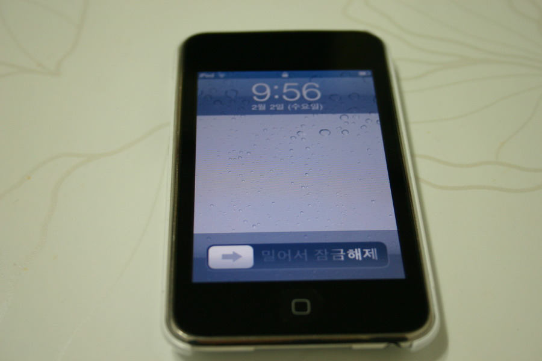
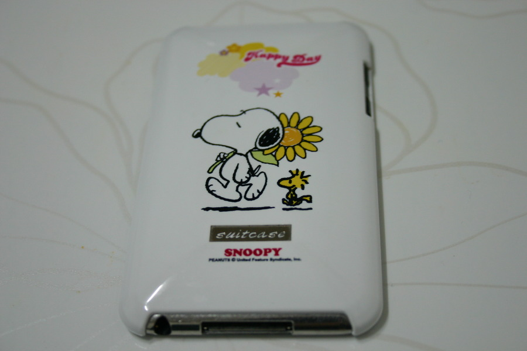

내 지인들은 다들 알듯, 나는 애플을 그리 좋아하지 않는다.

아니 정확히는 iOS와 맥?

뭐... 그렇다고 내가 애플 기기들을 안써본게 아니다.

오히려 빨리 써봤다랄까?

아이팟 터치 1세대 국내 발매전에 직구로 회사에서 단체 선물로 증정해주셨었기 때문에 매우 빨리 접해봤다고 할 수 있다.

근데 난 아이튠즈가 싫다.

아이튠즈를 옹호하는 것은 익숙해졌거나, 애플홀릭에 빠졌거나 둘중 하나로 느껴질 만큼.

특히나 지금은 앱도 많이 나오고  iOS랑 아이튠즈도 많이 업그레이드 된건데, 그 당시에는 참 안습이었다. (물론 내 PC 사양이 안습이었던 것도 포함)

소닉 스테이지보단 나았는데 그래도 거기서 거기였다고 본다.

갖고 있던 아이팟 터치 2세대 사진을 올려본다.

