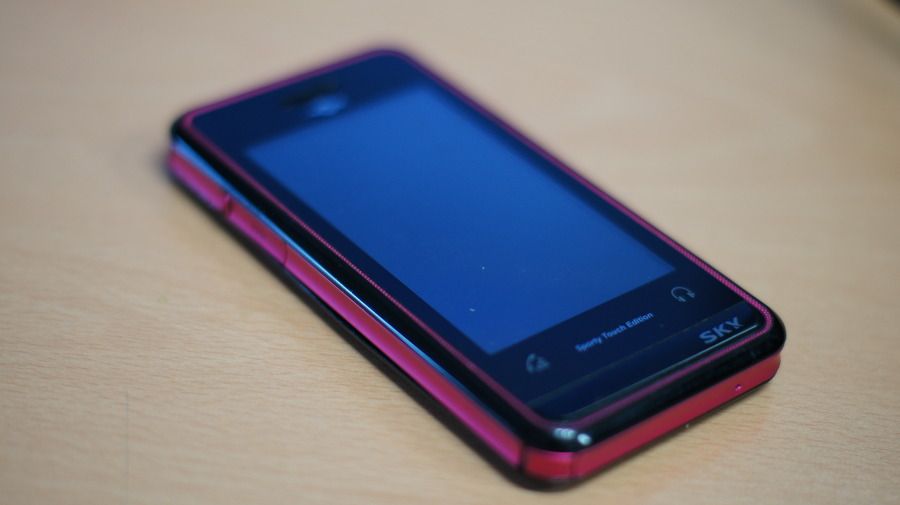
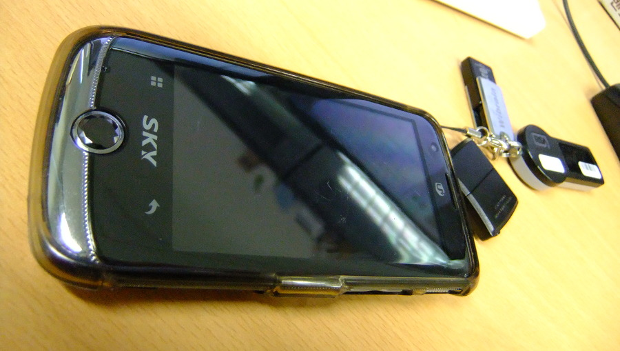
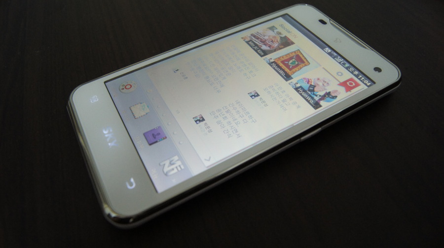

나는 여러번 얘기했듯 마이너 기종을 사랑한다.메이저 기종은 비싸서 손이 잘 가질 않는다.

니메이션이나 영화볼때도 주인공보단 주인공의 라이벌이나 조연 A를 더 좋아하는 비주류 성향이 이런 면에서도 영향을 주는거 같고.

그렇다보니 폰도 마이너한 기종을 엄청나게 자주 사용해왔다.그렇게 사용했던 폰중에 거의 유일한 메이저가 있었으나... 바로 LG의 샤인폰.

샤인폰을 바가지쓰고 산 뒤로, 우울해진 나머지 마이너한 저가 폰만 멤돌았다.

그렇게 사용한 폰이 미러폰과 반딧불폰. 

이 두 폰은 저가에 아주 잘~ 사용했다.

그러다 미러폰이 나쁘지 않았던지라 이어서 구입한폰도 사실상 공짜폰이었던 스포티브 폰.

스포티브폰은 터치폰이었으나 극악의 터치감과 액정이 입력되지 않는 문제가 두번이나 발생해 AS를 받았으나 종종 발생하는 이런 자잘한 문제로 Sky에 대한 이미지는 바닥을 치고 있었다.

도대체 내가 왜 이 폰을 쓰고도 왜 또 다시 Sky 폰을 구입했을까?  이어서 구입한 것이 미라크폰. 

당시 스마트폰이 워낙에 비싸다보니 그냥 저가형에 고르다가 34만원의 할부원금에 10만원 상품권 준다길래 홈쇼핑에서 구입했던폰이다.사실상 24만원이니 뭐 편하게 잘 썼다고 말하기엔 엄청나게 느렸다. 

LG의 2.5G은 인터넷이 되는 곳을 찾는게 더 힘들정도였고, 와이파이존도 없던지라 그냥 집이랑 회사에서 가지고 노는 미니 PMP같은 느낌이었다.

자잘한 문제고 자시고 너무 느려서 커스텀 롬을 올리니까 진저 브레드가 올라오고 그나마 뭐라도 돌아가긴했는데 이미 정나미 다 떨어진 2011년 12월에야 정식 진저 브레드가 올라왔지만 너무 늦었다.

그러다 가장 최근 (2011년 12월 말) 에 구입한 것이 바로 베가 LTE. 

할부원금 34만원이라 여타 폰들보다 매력적인 금액에 혹해서 다시한번 구입한 Sky 폰.

LTE 1세대 모델로써 모션인식으로 유명한 바로 그 폰이다.

이 폰의 문제점은 배터리가 조루다. 심각한 조루라 배터리를 두개 들고 다녀도 모자르다.게다가 6개월이 지난 후부터는 자잘한 문제가 너무 자주 발생 (어플리케이션들이 모두 강제 종료 다이얼로그가 반복해서 뜨는 문제, 폰이 자동 재부팅 되는 문제, 부팅이 되지 않는 문제 등) 으로 인해 공장 초기화를 한달에 한번은 해줘야되더라. 

세팅을 해놓을 수가 없다니? 안드로이드 폰은 꾸미는 맛인데?!?

게다가 초기의 빠른 속도에 비해 공장 초기화를 해도 주기적으로 렉걸려서 제대로 쓸 수가 없다.

워낙에 미라크가 느렸고, LG U+ 2.5G가 느려서, 아무리 LG LTE보단 느리다지만 SK LTE도 수도권내에선 충분히 빨라서 만족스럽긴하지만 6개월 이후 발생한 자잘한 문제는 정말 짜증 지대로다.

마이너 기종을 기피해야 된다는 생각을 크게 갖게 된 계기라고 볼 수 있다.

마이너 기종을 쓸거면 평판이 좋은 (예를 들면 키보드계의 i-rocks같은?) 기종과 회사 제품을 골라야겠다.

내 마이너 성향이 이렇게 고쳐지나보다.