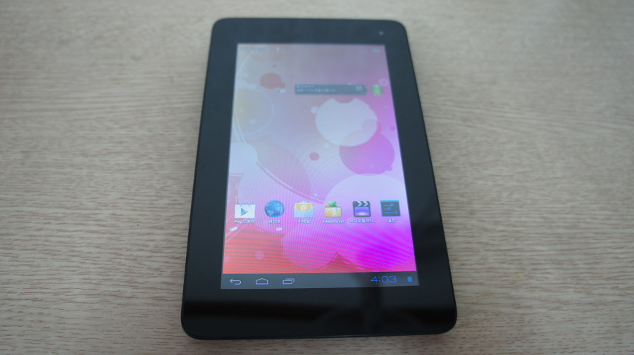
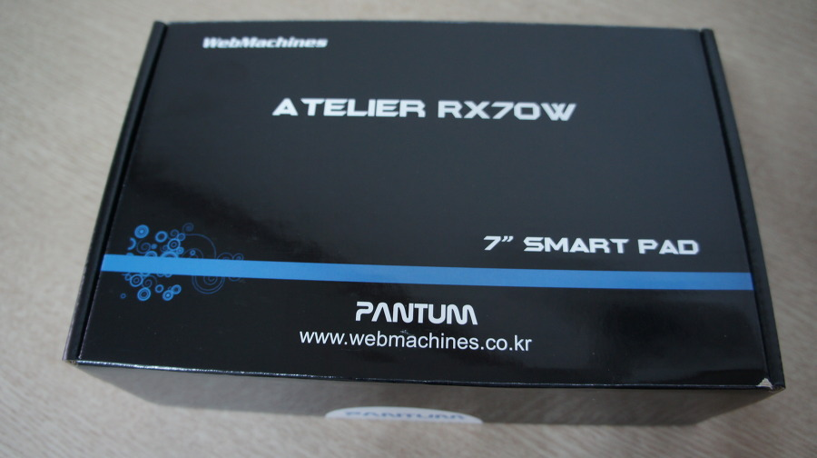

난 원래 좀 마이너 기기를 사보는 도전 심리가 있다.

학창 시절 알바로 사느라 자금적 여유가 없었던 시기도 영향이 있는건지, 자금적으로 여유가 되는 지금도 마이너 기기를 구입하곤 한다.

워낙에~ 마이너한 기기를 많이 찾다보니 이상한거만 보면 링크를 던져 주시는 전 회사 동료분들도 계셨지.

여하튼 그렇다보니 안드로이드 기기도 아주 마이너한 웹 머신즈의 RX70W를 구입했다.

5개월의 사용기.

* 마이너한 회사꺼 왠간하면 사지마라
* 액정 시야각 최악이다.
* 배젤 태평양은 참을 수 있었음
* 기본적으로 같은 안드로이드 임에도 호환되지 않는 어플 넘쳐남

이래서 메이저 기종을 써야함

안드로이드를 선호하는 나지만, 안드로이드 중에서도 마이너 기종은 안사는게 좋겠단 생각을 해준 것들중 하나였음!

