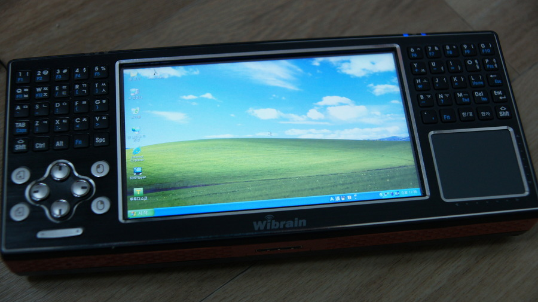

내 마이너한 취향의 결정체중에 하나였던 Wibrain B1

요놈을 UMPC라 불러야되나 뭐라 불러야되나 잘 모르겠는데

여하튼 터치도 되고, 키보드도 있고 터치 패드도 있다.

VIA C7M CPU여서 매우 느렸던게 단점이긴한데 간단한 작업은 얼추 얼추 되더라.

반응성이 떨어지다보니 요놈을 자주 키기도 뭐하고…하여간 애물단지 스러웠는데, 동영상 플레이어로써 나름 잘 썼다.

서버 프로그래머다보니 원격 대응을 하기 위해서 들고 다니기도 했었고~

이거 말고도 PMP랑 이것저것 희안한거 좀 샀던거 같은데… 사진이 별로 안남아있는게 흠이네.

여하튼 이 기기의 단점은

* 은근 조루 배터리
* 매우 떨어지는 반응성
* 애매한 그립감

이 기기의 장점은

* 높은 휴대성
* 다양한 조작 방식
* 어쨋거나 있는 qwerty 키보드

여하튼 DOS게임하면서 즐겁게 놀기도 했었고… 원격 대응용도로 재미도 봤었으니 나는 좋았다!

요론 기기 사양 높아진 버전으로 다시 안나올려나? 판매량이 별로라서 안될려나? 궁금해진다.