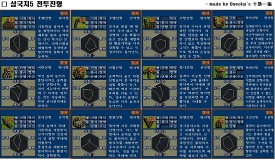

삼국지4를 제외하면 6와 함께 손꼽히게 오랫동안, 자주 플레이했던 바로 삼국지5다.

삼국지5의 핵심 시스템이라 하면 바로 명성.

턴제다보니 실질적인 시간 제한은 없었으나, 명성에 따라 가능한 명령 수가 달라졌기에 명성이란 꽤나 중요한 요소였고, 이전 버전처럼 특정 도시 인구가 50000 (최소 징병 가능 인구)이 될 때 까지 징병을 한다거나, 민심을 낮춰놓고 도시를 버리는 판단이 어려워졌다.

게다가 보급선이라는 것이 존재해서 고립된 도시에는 지원이 불가능해졌으며, 근처 도시끼리의 원군과 공격이 가능했던 이전 버전에 비해 25일 내에 도착가능한 도시에 있다면 어디에서건 출정 가능하다는 점에서 여러모로 편해졌다. (전쟁을 위해 머나먼 도시 이동로 원정 가야 했던 문제가 사라졌다는 것이다)

또한 물자 관리도 수도 중심적 관리가 가능해짐으로써, 많은 도시를 점령했을 때 손이 너무 많이 가던 문제는 해소되었다고 볼 수 있다.

일기토도 횡에서 쿼터뷰로 변경되어 좀 더 다이나믹 해졌다고 볼 수 있고, 같은 256 컬러지만 아트 퀄리티가 전반적으로 크게 향상 된걸 느낄 수 있었다.

전장은 여전히 타일 기반의 턴제 전투다. 허나 진형이 상성에 매우 큰 영향을 주기 때문에 적절한 진형과 배치가 중요해졌다.

게다가 실제로는 6각 타일에서 사각타일로 변경된점이 큰 차이점중 하나라고 볼 수 있다.

위에서 얘기했듯 수도 단위로 관리가 되기 때문에, 여러모로 편해진 점이 많다.

다만 이로 인해 게임이 조금 더 쉬워진 느낌이다. 위나라 후기처럼 크지 않은 이상에야 원군이 오기전에 함락시킨다거나, 전멸 시킨다는게 매우 어려워졌기 때문이다.

실제로 삼국지5는 삼국지4에 비해 전국 통일이 꽤나 빠른시간에 자주 나왔음이 이를 증명하지 않았나 싶다.

게다가 진형 상성을 넘어서는 장수의 능력치 적용은, 방원진을 하고 무쌍하는 여포를 볼 수 있었다.

물론 나는 그런 요소마저 즐겁게 했기에, 삼국지5가 내 기억에 남는 게임이 된 것 같지만, PC통신에서 당시 삼국지5에 대한 평가는 그리 호의적이지만은 않았던걸로, 아니 비판적인 평가가 많았던걸로 기억한다. 

여하튼 내 글을 보시고 한분이라도 다시금 추억에 잠기실 분이 있다면, 한번쯤 다시 플레이 해보는건 어떨까 싶다.