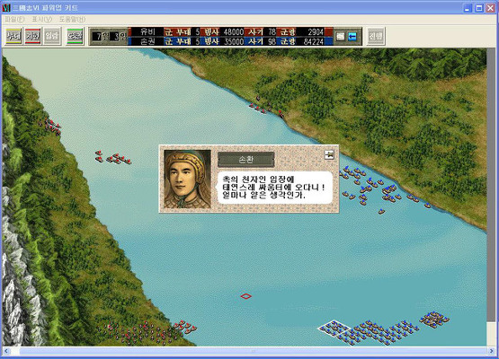
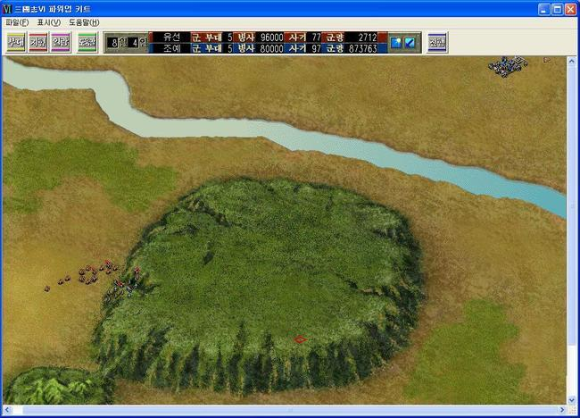
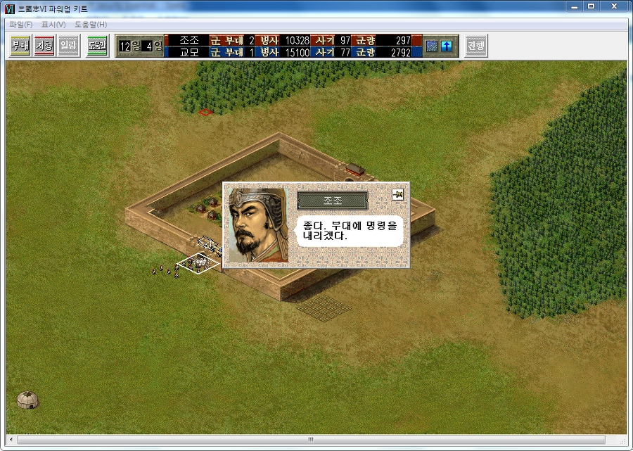
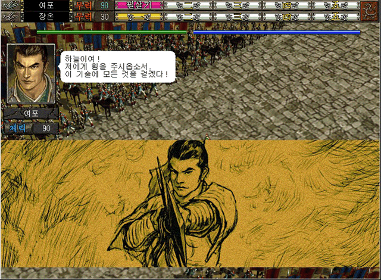
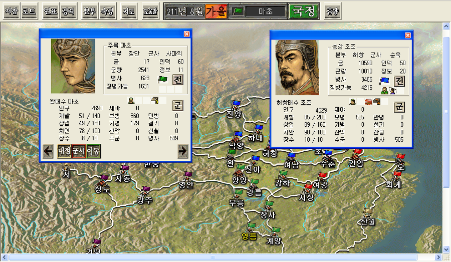
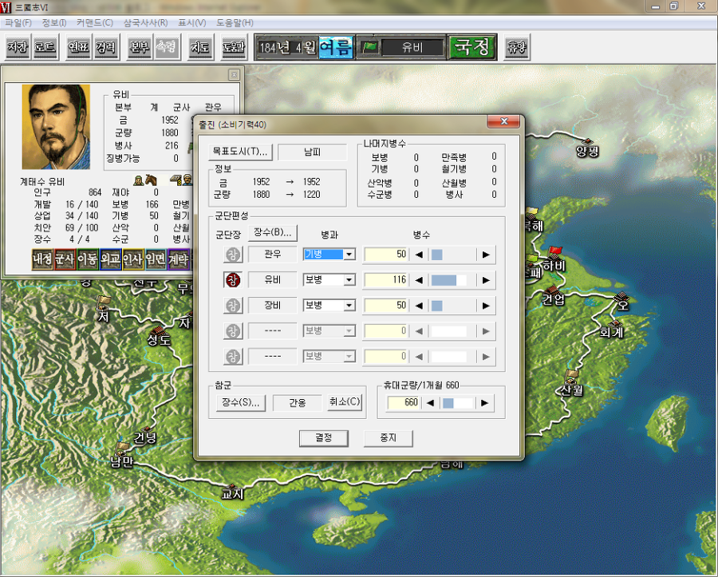

코에이의 삼국지의 한계라 지적받던 점은 다인 플레이 (턴제라는 점을 이용한 다인 플레이)가 가능했지만 실질적으로는 대다수의 전투가 극단적인 수비 전술에 치우쳐있는 데다가, 보면서 맞춰가기로 인해 실질적인 대인전은 불가능에 가까웠기 때문이다.

이를 극복하려 시도한 세미 리얼타임이라는 전투 방식을 적용했던 삼국지6의 시도는 놀라움 그자체였고 나름 괜찮은 퀄리티의 전투를 보여줬다는 점에서 개인적으로 높이 평가하는 작품이다.

세미 리얼타임 전투가 무엇이냐하면, 방침 + 상세 명령 구조인데, 상세 명령이 방침에 우선하고, 명령을 수행 완료시 방침에 따른 행동을 하는 구조이다.

실제로 이 구조가 의미가 있는 이유는 삼국지6는 이전 작들과 다르게 3턴치 명령을 한번에 내리는 구조인데, 1~2턴 내에 목적 완료시에 남은 1턴에 해야 할 행동이 없기에 방침이 의미가 있는 것이다.

물론 이렇게 만들어졌지만 실제로 내가 예상한 만큼의 대인전은 어려웠다.

애초에 삼국지에서의 전투는 수성하는 측이 절대적으로 유리하기에 비슷한 전력이라면 수성하는 측이 절대적으로 유리하기 때문이다.

허나 삼국지5에서의 단점, 30일이 지나면 전투 자체가 종료된다는 점은 다시 예전처럼 변경되었다. 전투가 길어지면 다음달로 이어지는 구조로 다시 변경되었으며, 이로 인해 공성측도 충분히 많은 병력을 보유하고 있다면 뚫어낼 여지가 있긴했으나...

그럼에도 불구하고 아주 다이나믹한 전투는 볼 수 없었다. 아무래도 턴제라는 단점이 가진 판단 내리는 시간에 제한이 없고, 판단을 보정하는 과정에 상대의 대응을 고려하고, 대응하는 데에 시간제한이 없다는 점은 긴박하고 다이나믹한 대인전을 그려낼 수 없음을 증명하는걸로 느껴졌다.

물론 예전 시리즈에서 느꼈던 전투보다는 다이나믹해졌지만 이정도론 안된다라고 느꼈다랄까?

당시 RTS로 C&C나 스타크래프트, 다크 레인, KKND, 토털 애니헐레이션 등이 있었지만.... 그런 게임들은 국가 경영에 대한 요소가 약했으므로...

이 두가지를 모두 만족시킬 완벽한 결정체를 보고 싶었던 것인데 이를 볼 수 없었던 아쉬움은 여전했다랄까?

일기토가 재밌어졌다는 점은 이 작품의 큰 장점이다.

전술 설정의 가위바위보는 분명히 삼국지6의 일기토에 유저가 개입할 여지가 많아졌음을 의미하기 때문이다.

허나 장수의 기본 스탯을 뛰어넘기란 불가능에 가까웠다는 점은 여전했다. (실제로 삼국지라는 시대적 몰입이 게임의 핵심이었던 것에 대한 반증이지 않았나 싶다)

이러쿵 저러쿵했지만 삼국지6는 이전 작들에 비해서 많은 것이 발전한 게임이다.

보병위주로 구성되어있던 게임에서, 보병, 기병, 산악, 수군, 만병, 철기, 산월로 구분되어 지형별 강점을 둔 병사를 유지했고, 궁병을 별도로 구분하지 않아 수성시 기병을 제외한 모든 병과가 활을 쏠 수 있었다.

실제로 오나라 침공시 수군이 없이는 어머어마한 병력을 소모해야 됐다는 점은 이전 작에 비해서 크나큰 대륙에서 벌어지는 전투에 다양성을 부여하기에 충분하지 않았나 싶다.

이후에 발매된 장수제 삼국지는 내가 바라던 삼국지의 노선과 너무 달라서 논외로 치고도, 이후에 발매된 삼국지들이 아직 내 마음에 쏙 드는 느낌을 주지 못했는데, 그래서인지 여전히 삼국지6에서 리얼타임화를 적절히 이뤄낸 삼국지를 보고 싶다.

삼국지 인터넷은... 내 기준에서 망작이고...

한국에도 서비스 되었던 삼국지 온라인을 좀 더 발전시켜 서비스를 다시 해준다면 좋을것 같다.