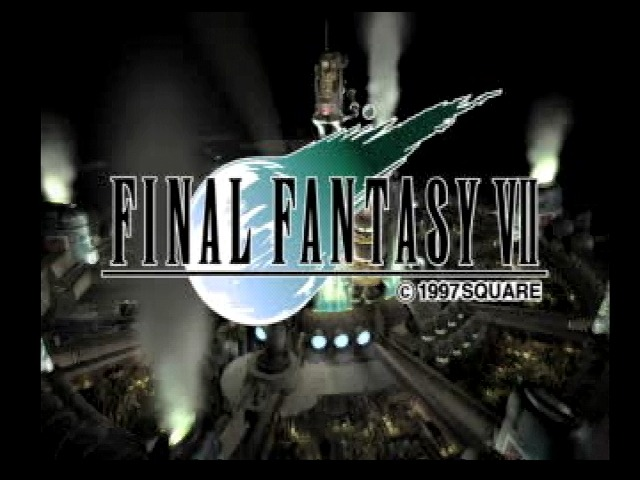
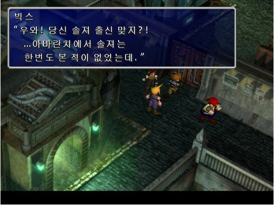

PS1 당시 시장을 보아오던 사람마다 평가는 달랐겠지만, 적어도 내가 보기엔 당시 새턴의 추격을 압도적으로 따돌리게 해준 PS1 신화의 1등 공신은 누가 뭐래도 파이날 판타지7 이었다.

파판1~3는 패미컴, 파판4~6는 슈퍼 패미컴으로 발매됐다보니 당연히 닌텐도 64로 발매될 줄 알았던 파이날 판타지7이 PS1으로 발매됐고 실제로 그 작품의 퀄리티는 지금 보기에는 모자란 감이 있지만 당시엔 아주 센세이션 했다.

배경은 2D, 캐릭터는 3D 모델 (물론 폴리곤 덩어리가 너무 티가 나는 허접한 캐릭터였지만)로 구성된 파판7은 분명히 시대를 앞서간 게임이었다.

많은 부분을 동영상으로 처리하다보니 롬매체로는 한계가 있었고, 그래서 PS1으로 발매된 것이 사실상 최고의 선택에 최고의 퀄리티로 이어졌고, 사상 유례없을 판매량으로 아주 좋은 결과를 얻었다고 볼 수 있었다.

그런 파판7을 친구 집에서 멀뚱히 구경만 하던 시기에, PC판으로 발매된다는 소식을 접했고, 얼마 지나지 않아 PC로 발매된 파판7을 구입하게 됐다.

물론 나는 그 당시 3D 그래픽 카드도 없이 플레이했지만.... 말로 표현하기 힘들만큼 좋았다. 실질적으로 PC가 더 멋진 기기였지만, 당시만해도 게임 퀄리티는 콘솔 > PC였기 때문이다.

어쨋건 그렇게 고대하던 게임을 구입한 후 기대하고 고대하던 게임을 설치하고... 오프닝을 봤던 그 때의 감동은 지금도 새록새록하다. 물론 CRT 15인치 모니터에서도 도트가 눈에 보일만큼 낮은 퀄리티의 동영상이었지만... 그것마저도 감동이었다면 믿겨 지겠는가?

나는 RPG를 공략본 없이 여유롭게 플레이하는 것을 즐기는지라, 아무리 맘에 드는 작품도 일본어로만 발매된 게임은 안한다. 다행히 영문판이었던 파이날 판타지7은 그래도 어느정도 문맥 이해는 가능했고... 종종 잘못알아듣거나 놓친 문장 때문에 CD2까지 클리어하는 데에만 100시간이 넘게 됐고, 결국 CD3 초반부에... 하드가 날라갔다...-_-

도저히 엄두가 안나 결국 100시간 플레이로 파판7을 멈췄고, 그렇게 보고 싶던 엔딩은 친구 녀석이 클리어하는 것을 보는 것만으로 만족하게 됐음은 물론이고.

시간이 지나, 나처럼 파판7의 팬들이 많기 때문인걸까?

nVidia 패치, 고해상도 패치, 한글 패치, 8등신 패치 등이 나왔고...

꽤나 좋은 퀄리티로 PC판으로 다시금 즐길 수 있게 되었다.

PS1용을 기준으로 평점을 매겨야하는가, PC용 기준으로 매겨야하는가 고민이 됐으나... 어느 기종을 기준으로 하던 내 평가 점수는 얼추 비슷하게 나올꺼란 생각이 든다.

파판7 8등신 한글 패치판의 퀄리티는 꽤나 뛰어나므로 지금 플레이해도 할만한 수준이라고 생각한다.

아직 파판7을 즐겨보시지 못한 유저라면 일본식 RPG의 양대산맥, 파판7을 지금이라도 플레이해보시길 권한다.