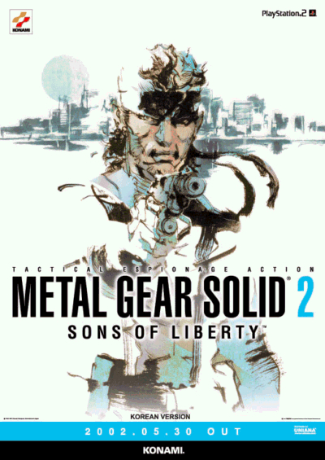

PS1으로 발매된 1편도 크게 좋은 평가를 받고, 이미 내가 플레이하기전에 주변에선 극찬만 가득했던 메탈 기어 솔리드 2.

2003년 연말에 PS2를 구입하며 철권4와 함께 구입하게 됐었다.

여하튼 그렇게 구입하고 나서 철권4는 무난~하게 접대용 + 올 캐릭터 엔딩을 보는동안 메기솔2는 초반부 진행에서 멈췄었다.

그래도 꾹 참고 어쨋건 샀으니까 플레이 해봤다.

분명 난이도도 적당했는데 세간의 평가 만큼 즐겁지는 못했다. 

잠입 액션이나 비겁자 모드 때문은 아닌 것 같다. 사실 따지고 보면 기어즈 오브 워도 나는 은닉사격으로 클리어했다.신중히 플레이 해야 되는 게임을 무작정 싫어하지 않았다는 의미다. 

딱히 메기솔처럼 신중히 진행해야 되는 게임 안해본 것도 아니고, 게임 오버 횟수로 따지면 진 여신전생이나, 록맨같은 게임이 훨씬 심하지 않았나?

중간 중간 센스 있는 아이디어는 칭찬할만하다. (박스로 위장한다거나, 발자국 소리를 내지 않고 천천히 뒤로 다가간다거나, 캐비넷에 숨어서 경보가 멈출때까지 기다린다거나...)

또 보스의 패턴을 학습하고 반응하는 것도 여타 게임과 마찬가지였는데, 애매한 타격감과 조작감이 아쉬웠던걸까?

개인적으로 잠입 액션, 보스전의 레벨 디자인, 섬세하게 설계된 구성 등 완성도가 괜찮긴했으나, 수많은 사람이 극찬 하는 수준의 명작이라는 느낌은 받지 못했다.