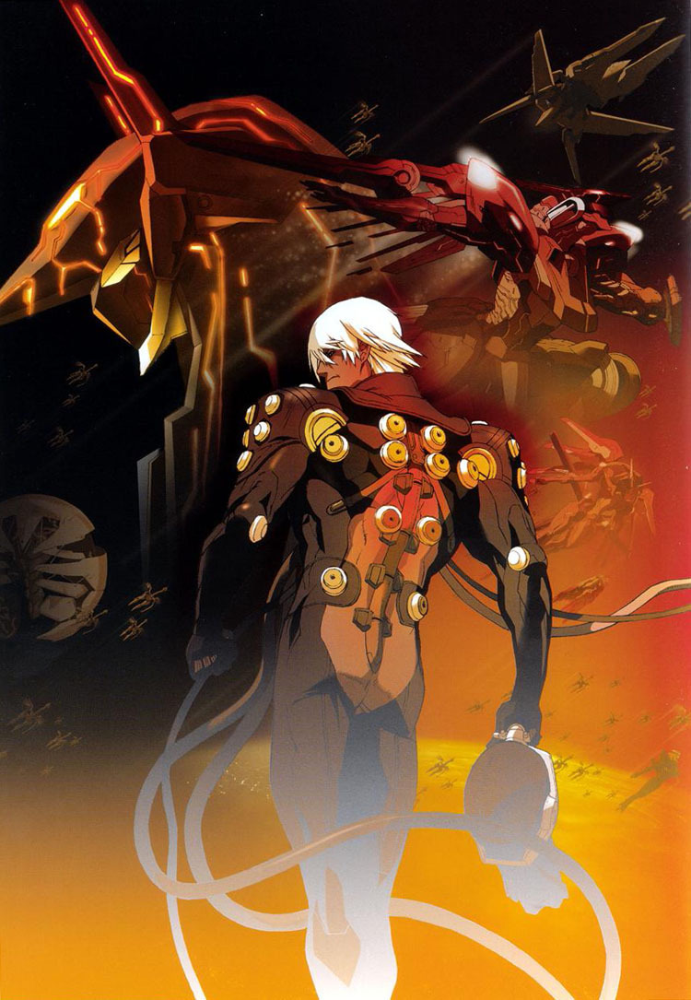

메기솔2를 만든 코지마 히데오의 또다른 작품.

아누비스는 13000으로 덤핑이 되고나서 진 여신전생과 함께 떨이로 구입한 소프트였다.

분명 메기솔2는 재미가 없었는데.... 난 아누비스는 아주 즐겁게 플레이 했다.

초반에 지게로봇 비슷한 녀석으로 굼뜬 플레이를 참고 나니, 아주 아주 화려하고 화끈한 아누비스를 맛볼 수 있었다.

너무나도 화끈한 액션은 딱 내 스타일이었고, 보스전에서의 패턴화된 플레이 (보스의 패턴을 외워서 맞대응 하면 쉽게 클리어가 가능한) 는 여러 게임에서 많이 봤던 어찌보면 정석이라 불리는 레벨 디자인인데, 내 맘에 드는 메카닉을 조종하기 때문인걸까?

분명 지루하기 그지없던 메기솔2와는 달리 아누비스는 빠른 속도로 플레이 했으니 말이다.

게다가 이런 스피드한 진행에 적절한 컨트롤 방식은 화끈한 컨트롤을, 스피디한 전투 전개에도 원하는 컨트롤을 하기에 용이한 구조였다.

실제로 어느정도 손에 익으면 원하는 타이밍에 회피와 공격이 모두 가능한 꽤나 직관적인 조작 방식이었음도 한몫했을 것.

메기솔2의 조작방식이나 귀무자2, 바이오 해저드 등의 조작 방식은 난 아무리 해도 적응이 어려웠으니 말이다.

어쨋거나 직관적인 조작과 화끈한 진행으로 스토리에도 쉽게 몰입되 꽤나 즐겁게 즐겼던 게임.