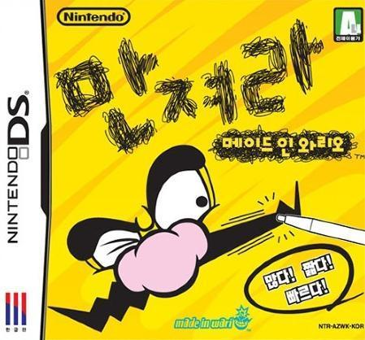

이 작품도 NDS 초기에 구입해서 아주 즐겁게 플레이했던 게임.

너 죽어와는 다르게, 아주 다이나믹한 미니 게임들로 연결되어있는데, 그 게임들이 어느정도 컨셉이 있는 게임들끼리 묶여 있다보니, 한 스테이지를 플레이하는 데에 집중만 한다면 능숙하게 클리어가 가능한 게임이다.

스테이지는 하나씩 (혹은 두개씩) 개방 되는 구조이며, 개방된 스테이지를 처음 진행할 때 마다 스토리를 프롤로그처럼 보여준다.

그리고 한 스테이지의 말미엔 보스 스테이지를 클리어해야 되는 구조.

다 클리어하고나면 기록 갱신형으로 즐길 수 있는데, 스테이지가 오래 진행 될 수록 난이도가 계속 높아지는 방식으로 만들어져 있다.

미니 게임의 수가 워낙 많다보니 이 많은 게임을 끊김 없이 다이나믹하게 즐기는 것만으로도 시간 가는 줄 몰랐고, 다이나믹 하다보니 단순 기록 갱신 형임에도 반복 플레이에도 쉽사리 질리지 않았다.

사실 와리오라는 캐릭터가 국내에서는 그리 메이저하지 않은데, 와리오 월드 시리즈만해도 판매량이 적지 않은 수준.

이 작품에 이어, WII용 미니 게임 모음으로 춤춰라! 메이드 인 와리오도 만들어 낸걸 보면, 미니 게임 모음 시리즈의 상징은 와리오 시리즈로 갈건가보더라.

이 작품을 플레이하면서 든 생각은 분명 아이디어를 모으고, 그 많은 미니 게임을 만드는 과정이 그리 쉽지 않았을텐데.... 마리오 파티나 메이드 인 와리오 시리즈나...

닌텐도의 퀄리티를 위한 욕심은 존경스럽다.

분명 미니 게임의 조합을 이렇게 완성도 있게 해낸 회사는 닌텐도를 제외하곤 어디에도 없기 때문.

3DS XL마저 나온 마당이지만, 어떤 앱스토어나 안드로이드 마켓에도 이 만한 완성도의 미니 게임 모음은 없다.

타임 킬링용 미니 게임 모음집을 찾고 있다면 이 게임을 추천한다.