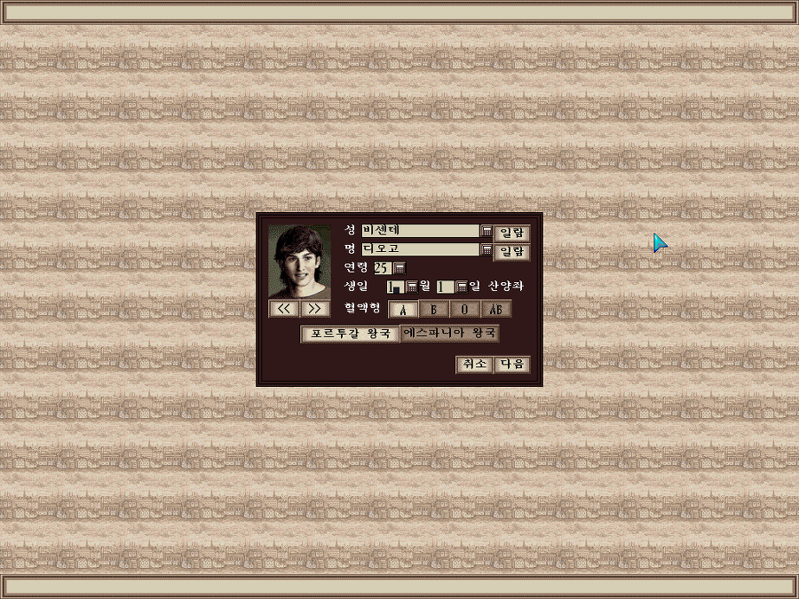
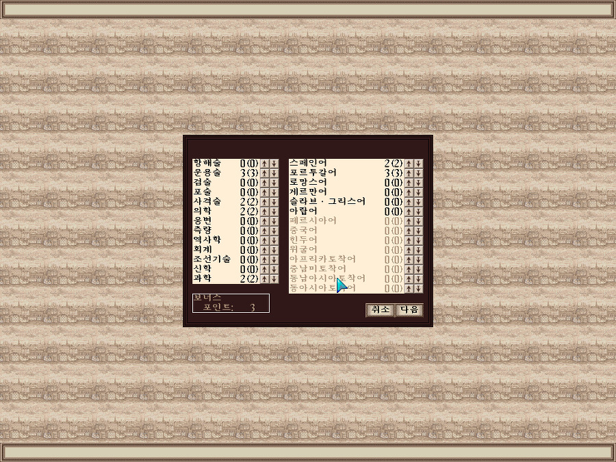
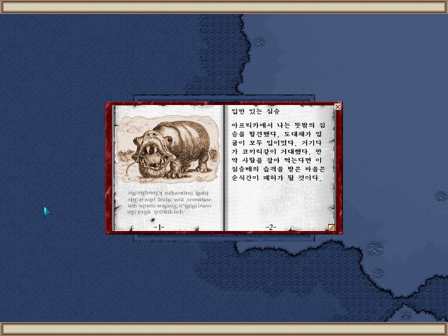
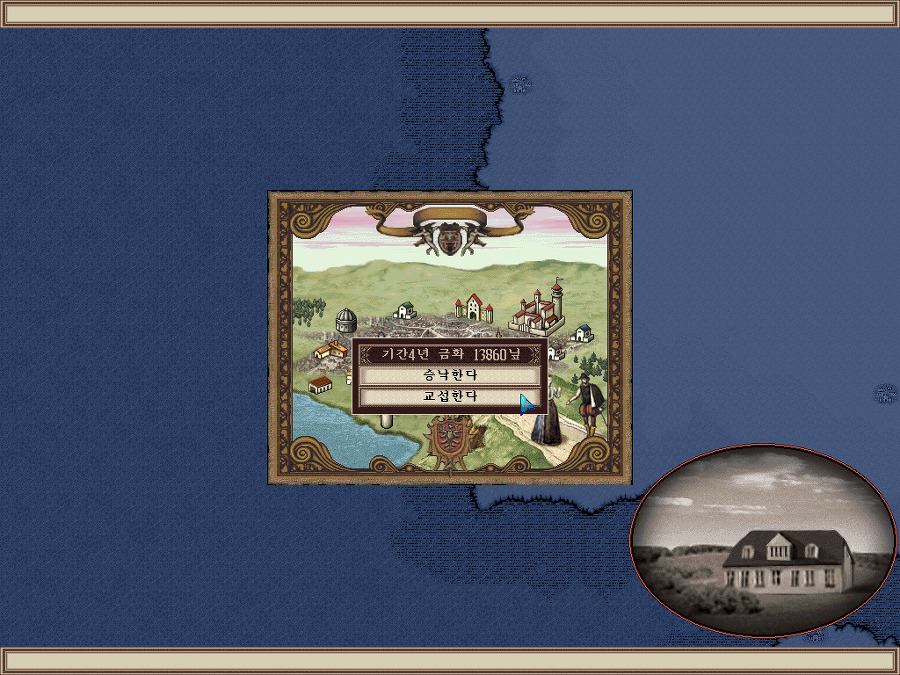
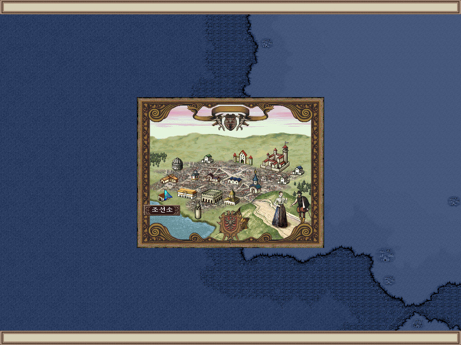
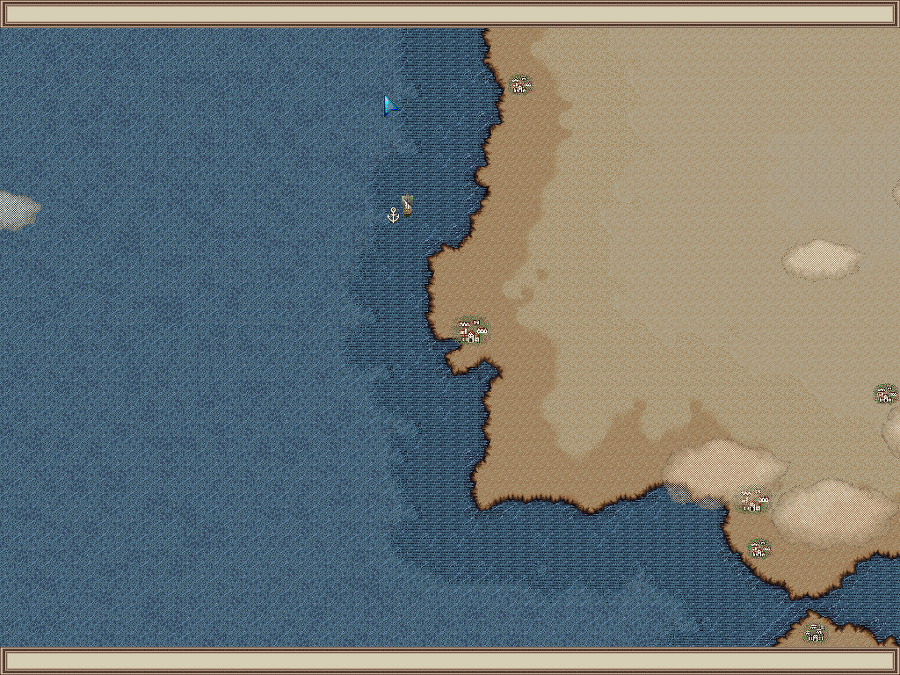
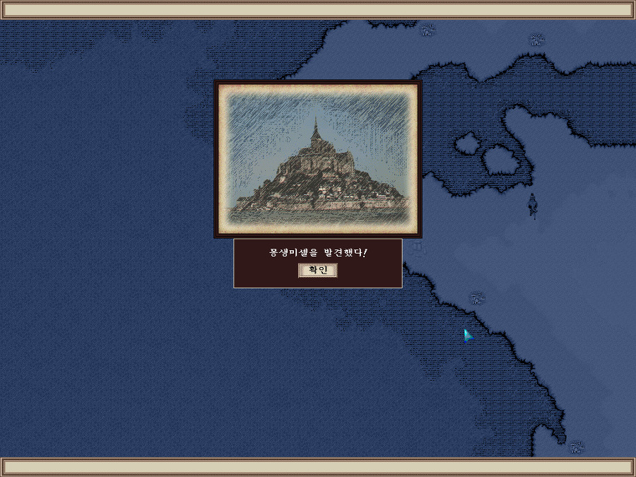
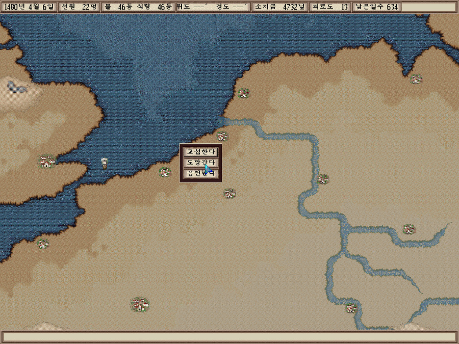
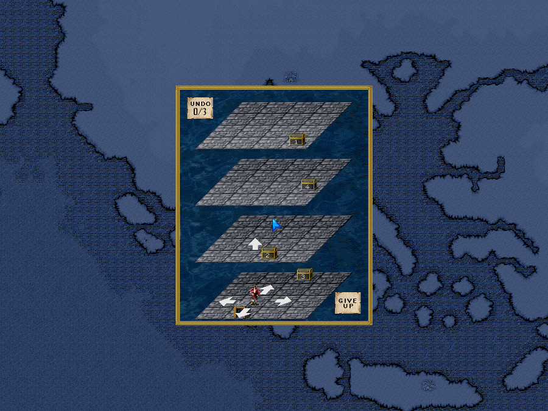
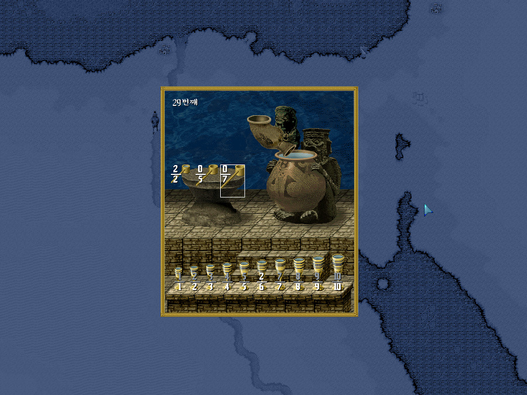

대항해시대3는 분명 대항해시대2와는 꽤나 다른 노선을 탄 게임이었다.

대항해시대2의 캐릭터별로 어느정도 정해진 스토리텔링이 아닌, 진짜 항해를 하며 세계의 유적과 보물을 발견하는 데에 초점이 맞춰져 있기 때문이다.

당시 내 기준에선 루나틱 던이, 울티마, 신검의 전설2 라이어 같은 게임이 떠올랐다.

실제로 특정 언어를 모르면 대화가 통하지 않고, 책을 발견해도 읽을 수 없는 등의 요소마저 굉장히 현실적인 게임이 됐다고 볼 수 있다.

캐릭터를 새로 생성하는 화면입니다.

당시 바다의 패권을 다투던 포르투갈과 에스파냐중에서 선택 할 수 있다.

캐릭터의 재능에 포인트를 지정할 수 있는데, 모든 기술을 올릴 수 없는 만큼 자신의 의도하는 컨셉에 맞게 설정해야 한다.

이 책은 읽을 수 있는 책이었기에 내용이 나오지만, 만약 자신이 익숙하지 않은 언어로 되어있는 책이라면, XXX XXX로 표기된다.

목표를 정하고 (대륙 발견, 보물 발견, 유적 발견 등의 목표를 두고 조율하게 됩니다.) 기간과 지원금을 결정하게 된다.
기간이 짧을 수록 금화는 더 많이 받을 수 있지만, 공략본을 보지 않는 이상 4년도 짧다고 느껴 질 수 밖에 없다

도시 내를 필드처럼 이동하던 대항해시대2와는 다르게, 한 화면내에 모든 건물이 나오고 들어가려는 건물을 선택해서 입장하는 방식으로 변경됐다.

분명히 편한점은 있지만, 도시내에 숨겨진 요소가 있나 뒤져보고, 큰 도시에 들어 갔을 때 감탄하던 그런 로망은 없어진거 같아 아쉽기도 했다.

항해 화면도 좀 더 사실적인 그래픽으로 구현 됐는데, 대륙을 베이지, 갈색톤을 써서 좀 밋밋해진 감도 없지 않나 싶었어요.

물론 도시를 발견 했을 때 눈에 확실히 들어오기도 했지만...좀 아쉬웠다랄까?

유적의 위치 주변으로 가게되면 이 처럼 유적을 발견하게 됩니다. 유적의 위치에 대한 힌트는 도서관에서 주로 획득하게 된다. 미리 획득한 힌트를 바탕으로, 교섭을 해야지 정보도 없는 상황에서 찾아내겠단 교섭을 했다간 기간이 초과되기 쉽상이다.

해적을 만난 상황인데...좀 밋밋하죠? 해상에서 상대 해선도 보이지 않고... 전투 연출도 미약하다.

교전이 밋밋했단 것도, 게임 자체가 유적탐사쪽에 집중되었단 느낌이 많이 나는 부분이었다랄까?

유적에 따라 미니 게임을 클리어해야만 얻을 수 있는 경우가 많다.

난이도는 어느정도 할만은 한데...그래도 좀 어렵다 싶은 미니 게임이 많았다.

실제로 대항해시대2보다 이런 요소는 신경 많이 썼구나라는 것을 많이 느꼈다.

사실 코에이에서 발매됐다는 점을 제하고나면, 미국식 게임의 느낌이 물씬났다.

위에서 언급한대로 울티마나 루나틱돈의 느낌도 난게 사실이고...

대항해시대2와 너무나도 다른 길을 걷다보니, 대항해시대3는 좋은 평가보다 악평이 더 많았던 작품으로 기억한다.

하지만 아이러니하게도, 전 대항해시대3에서, 2편과는 다른 또 다른 재미를 느꼈고, 잦은 게임 오버에도 아주 신나게 플레이했다.

항해와 유적 탐사의 느낌을 좀 더 현실적으로 살려냈다라는 점에서 가산점을 줬다.

유적 발견시 클리어해야 되는 미니게임에 쏟은 시간만해도 엄청날텐데, 어째서 해전이 이렇게 빈약한가에 대한 궁금증은 분명히 있었다.

이런 부분이 아쉽긴 했으나 사실 게임 자체의 완성도나, 의도한 바를 게이머에게 잘 전달했는 가에 있어서는 높은 점수를 주기에 충분한 게임이었다.
