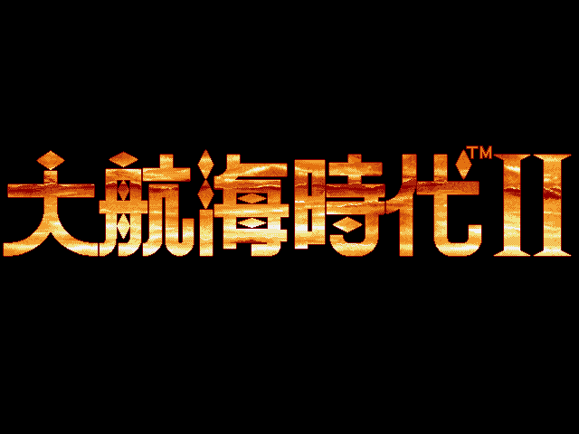
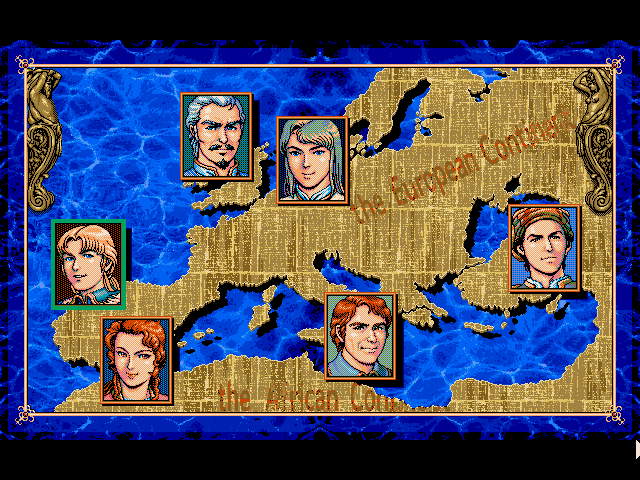
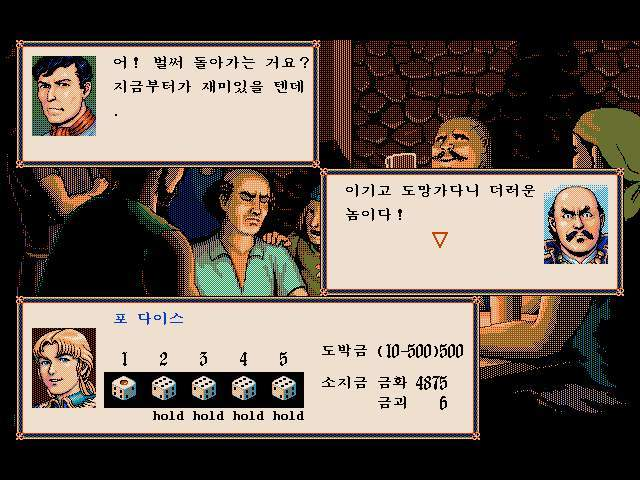
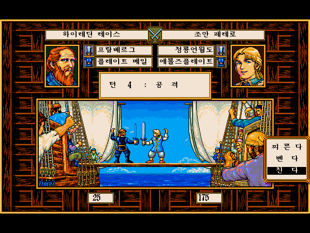
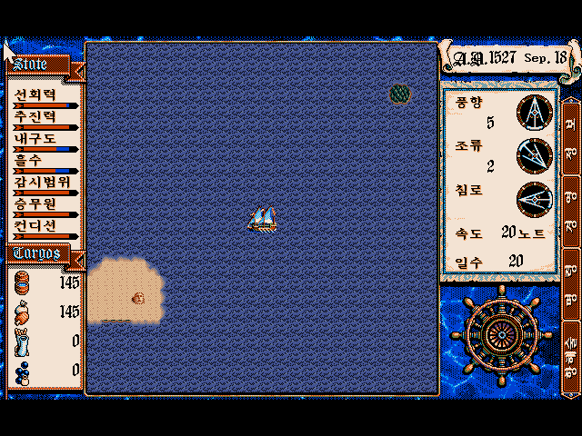
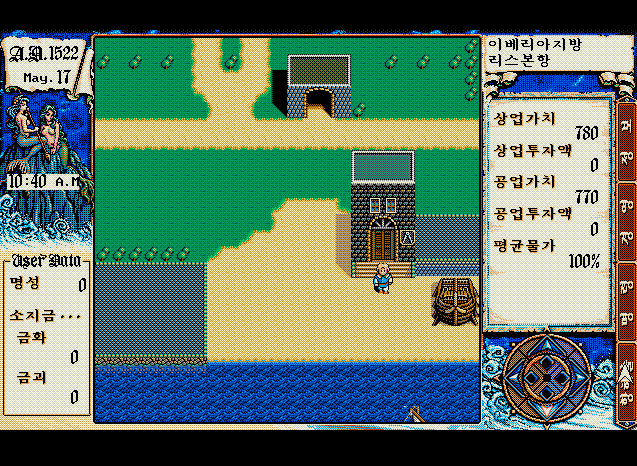
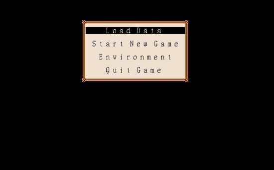

90년대 중반은 적어도 내 기준에선 아케이드의 시대이자 코에이의 시대였다.

그 중에서도 원조비사라던가, 수호지, 징기스칸같은 역사 시뮬레이션은 내 기준에선 그다지 흥미를 못 끓었다.

그러나...!! 대항해시대2는 달랐다.

얼핏보면 전형적인 일본식 RPG인가? 싶었는데...

아주 완벽한 자유도는 아니지만, 강제 진행형 액션게임이나, 당시 일본식 RPG보다 자유도 높은 진행이 돋보였기 때문이다.

선택 할 수 있는 주인공은 6명이다.
그렇다보니 더더욱 RPG처럼 보여진게 사실. (어느정도 RPG스러운 요소가 많은 것도 사실이고)
그러나 어느 캐릭터를 고르던 전 세계를 돌아다니며 새로운 도시를 발견하고, 도시마다 구현된 특징 (밤에만 잠입할 수 있는 도시라던가?)은 얼마나 더 많은 요소가 숨겨져 있을까를 기대하며 즐기기에 충분했다.

게다가 도박을 통해서 돈을 벌 수도 있는데, 세이브 로드 신공을 통한 무한 자금 증식이 가능했다.

실제로 포 다이스나 블랙잭 자체의 완성도도 꽤나 좋아, 이 것만으로도 한동안 재밌게 즐겼던 기억이 난다.

비슷한 시기에 발매된 삼국지4에서는 없었던 커맨드 선택형 대결은, 스탯에 크게 영향을 받는건 사실이지만 그래도 상성으로 인한 변수를 주고 자신이 대결을 승리로 이끌었다는 느낌을 받기에 적절하지 않았나 싶다. (삼국지 시리즈에서는 6편에서야 도입되었지...)

좋은 배를 사면 살수록 해상 전투에서 강해지지만, 그만큼 많은 식량과 물이 필요하고, 결국 항구에 정착하지 않고 이동 할 수 있는 거리는 초반이나 후반이나 아주 크게 다르지 않다.
오히려 해상 전투를 배제한다면 작은 배를 구입해 최소의 식량과 물로 무역 최단 거리를 왕복 (이스탄불 <-> 리스본 등등)하는 것이 주요 팁이기도 했다.

이렇게 초반부에는 명성도 없고 돈도 없는 상황....
실제로 이 상황은 배도 없기 때문에, 강제 이벤트에 가까운 지원을 받고나서 풍족한 상태에서 시작하는 캐릭터지만... 
만약 이 상황이 다른 도시에서였다면 게임 오버라고 볼 수 있는 상황이다. 
이 게임에서의 게임 오버는 전투중에 죽는 것도 있지만 무역에 실패해서 마을에서 나갈 돈도 못버는 상황도 마찬가지다.



내가 이 화면을 왜 마지막으로 뒀느냐 하면!!

대항해시대하면 이 화면에서 흘러나오던 배경음악이 아직도 기억에 남는다.

칸노 요코씨가 만든 대항해시대2 전반의 음악은 지금 들어도 아주 감미로운 선율과 지역의 분위기를 잘 살려준 게임이었기 때문이다.

실제로 전세계를 항해하고 있다는 느낌에서 OST의 뛰어난 완성도가 영향이 매우 컸다고 생각한다.
그 중에서도 가장 감명 깊었던 음악은 메인 메뉴 테마로, 예전부터 이 음악이 너무 좋아서 게임 플레이는 뒷전이고 메인 메뉴 틀어놓고 한참을 이 음악만 들을 정도로 빠졌었기 때문이다.

사실 대항해 시대3 리뷰도 곧 하겠지만... 대항해시대3야 말로 자유도의 극한이다. 실제 탐험의 느낌은 대항해시대3가 훨~씬 컸다라고 볼 수 있다.
대항해시대2를 그럼에도 10점 만점을 준 이유는 자유도의 극한이 재미를 보장해주지 않기 때문. 

실제로 루나틱돈이나, 심즈, 심시티 같은 게임을 모두 재밌게 즐기지 못했다.
사실 오블리비언이나 스카이림 마저도 나는 아주 고 평점을 주기엔 아쉽다고 느꼈다.

플레이에는 자유도가 있지만 메인 스트림을 적절히 따라 갈 수 있었던 대항해시대2는 음악, 아기자기한 그래픽, 항해의 느낌, 자잘한 미니게임 스러운 요소, 지역마다의 특색 등 이 게임의 컨셉에 맞는 퀄리티를 냈다.

플레이 시간에 비해 항해하며 노느라 엔딩은 별로 못봤지만 이만큼 재밌던 게임은 손에 꼽기에 과감하게 만점을 준다.
