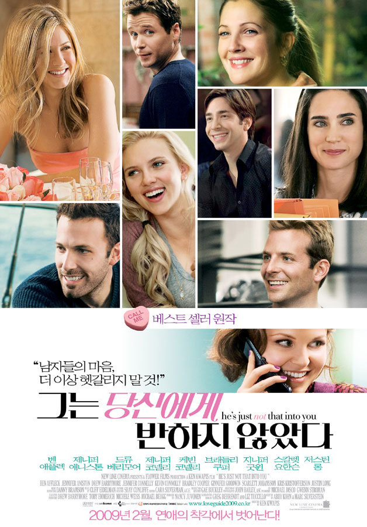

꽤나 오랜 시간이 지난 작품이지만~ 추천이 많았던 영화라 개봉한지 4년여가 지난 영화를 이제서야 봤다.

그가 먼저 당신에게 전화하지 않는다면 그는 당신에게 반하지 않았다는 이야기부터 시작되는 이 영화는, 사랑에 상처받고, 소중한 사랑을 깨닳는 흔한 로맨틱 코미디와 비슷한 느낌도 분명히 있다.

근데... 뭐랄까 꽤나 이런 정도도 모르는 몇몇 친구들이 있다보니, 오히려 보고 나서 추천해주고 싶은 친구들이 생각나더라.

지나치게 겁이 많아 다가오는 사람을 밀어내는 사람, 지나치게 쉽게 호감을 가져 상처 받는 사람... 많잖은가?

또한 새로운 사랑에 설레여, 오랫동안 지켜온 사랑을 놓치는 일도 있고, 상대방에 배려가 부족해지는 상황? 권태기?

이런 것들이 전반적으로 잘 버무려진 영화가 아니었나 싶다.

물론 조금 깊이는 부족한 감도 있고, 약간 쌩뚱맞은 감도 없지 않아 있는데...

한 친구의 말이 기억이 난다.

사랑 만큼은, 비상식적인 것이라고..

그렇게 생각하니 많은 걸 이해할 수 있다. 이 영화의 쌩뚱맞음도 사실, 나 답지 않은 모습을 보인적이 많기에.. 그러려니 할 수 있다랄까?

전반적으로 해피엔딩이라 맘에 든 면도 있고!