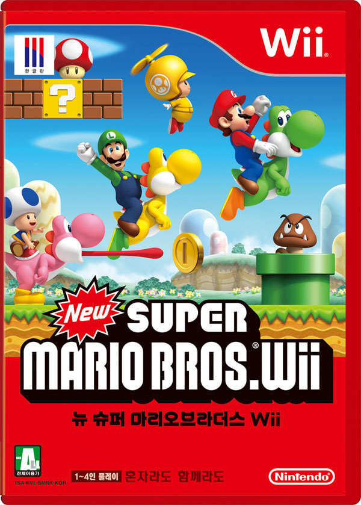

누구나 다 안다고 말해도 무리가 아닐 정도로 유명한 마리오 시리즈.

허나 닌텐도 64로 발매된 슈퍼 마리오 64라던지, 게임 큐브로 발매된 슈퍼 마리오 선샤인은 매우 잘 만든 게임이긴하지만, 사실 저 연령층에 어울린다고 하기엔 난이도가 좀 많이 높은 게임이었다.

페이퍼 마리오마저도 3D로 발매되면서, 요시 아일랜드 이후에 정통 마리오 시리즈는 죽은 것인가라고 생각하던 찰나에 발매된 뉴 슈퍼 마리오 브라더스! (이하 뉴슈마)

모든 면에서 기대 이상이었다.

NDS 자체가 그래픽적으로 특출난 기기가 아니었지만, 깔끔한 그래픽에 3D로 표현했지만 2D 방식의 진행 (횡스크롤 액션은 죽지 않았다!!!), 적절한 레벨 디자인! (이 것이 정말 닌텐도의 놀라운 점이다) 무엇하나 빠지지 않는 수작 아닌가?

사실 내가 굳이 칭찬하지 않아도 칭찬하는 사람 넘쳐나고, 이미 다들 즐겨본 뉴 슈마를 굳이 극찬하는 것이 진부할지 몰라도...

횡스크롤 액션의 표본이라 볼 만큼 좋았다. 물론 새로운 요소가 넘쳐났다 보기 어렵고, 어찌보면 슈퍼 마리오 월드의 확장판 정도의 발전이라고 볼 수도 있지만...

3D 기능을 살린 커진 마리오, 작아진 마리오 등을 활용한 레벨 디자인은 기술의 발전을 적절히 녹여냈다고 볼 수 있었다.

그저...놀랍고 부러울뿐. 닌텐도의 게임 철학. 특히 마리오의 아버지이자 젤다 등... 닌텐도의 수많은 명작의 아버지 "미야모토 시게루"를 다시한번 극찬하게 된 게임이었다.
