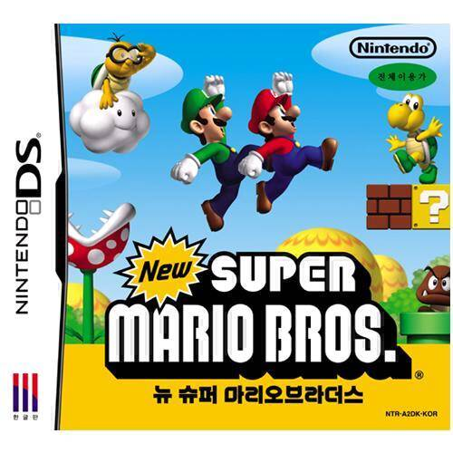

뉴 슈마와 다른 점이 그리 많지 않아, 뉴 슈마의 WII 컨버전 정도라고 하려 생각 했었으나 아이스 마리오와 4인 플레이의 메리트는 꽤나 컸다.

실제로 닌텐도 게임들의 장점은 루이지 멘션이나 피크민, 동물의 숲, 닌텐독스 같은 참신함도 있고, 슈퍼 마리오 64와 같은 새로운 경험, 포켓몬과 같은 수집욕 자극 등도 있으나...

내가 나열한 모든 닌텐도 게임에서 적절한 레벨 디자인을 느낄 수 있다.

뉴 슈마 WII의 4인 플레이의 밸런스는 오묘했다. 너~~무 못하면 업어 갈 수 없는 협동 플레이에, 심지어 잘하는 플레이어 마저도 늪으로 빠뜨리기까지 한다.

실제로 한 화면에서의 협력 플레이다보니, 살리려다 같이 죽는 경우도 부지기수고, 화면 스크롤로 인해 팀킬이나 방해되기도 쉽상이다.

그런 요소가 적절히 재미를 주다보니, 다인 플레이와 1인 플레이가 또 다른 게임처럼 느껴질만큼 잘 녹아들었다고 생각한다.

그리고 왠지 닌텐도라면 이런 요소를 다 계산 했을꺼라는 믿음도 있고.

꽤나 많은 게임이 혼자 즐길땐 좋으나 같이 즐길땐 너무 쉬워진다거나, 너무 어려워 포기하게 된다거나, 분쟁의 소지를 많이 갖게 된다.

물론~ 뉴슈마 WII 역시 같이 즐기며 안싸운건 아니지만 모두가 즐기는 온가족의 WII를 지향한 것을 반증하듯, 협력 플레이시에는 혼자 즐길 때만큼 빠르게 진행하진 못했지만, 기다려주고 맞춰가는 과정이 뉴 슈마 WII의 또다른 재미였다랄까?

이런 점이 내가 NDS로 협력 플레이를 안해서인지 몰라도, 뉴 슈마WII와 뉴 슈마가 크게 다르지 않았음에도 뉴 슈마 WII를 더 높게 평가하는 이유고, 온가족이 함께 즐기는 WII에 적절한 게임이지 않았나 싶다. (마리오 파티도 추천!)