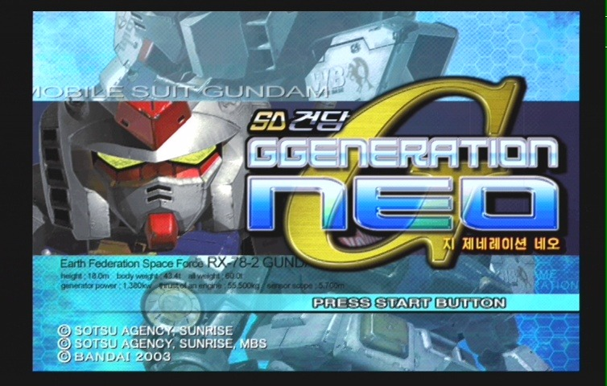
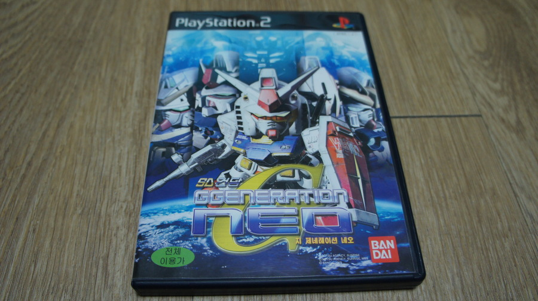
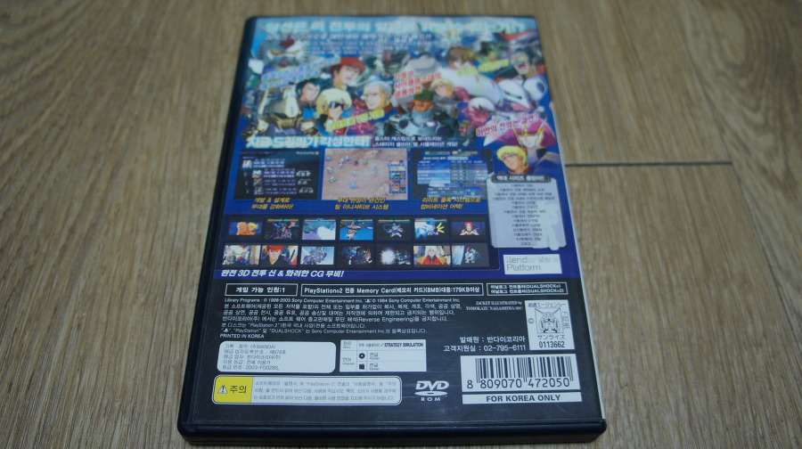
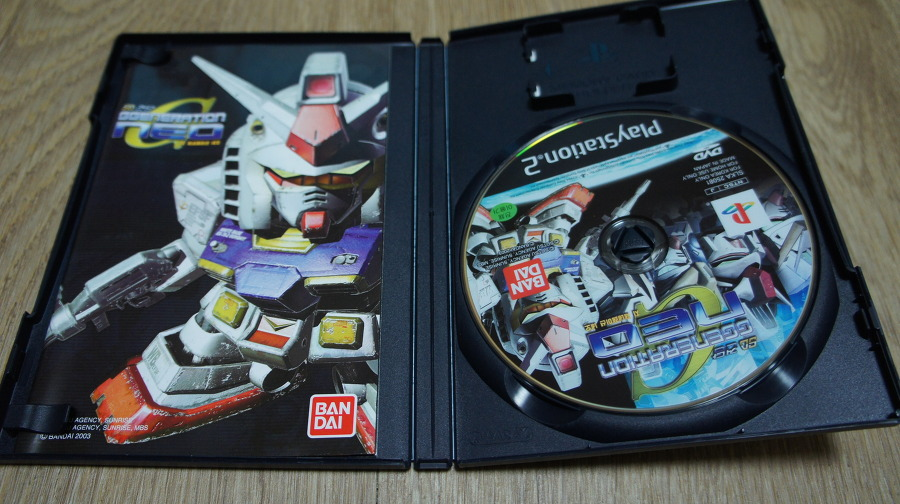

여러 글에서 밝혔듯 나는 골수 건담 매니아가 아니다. 특히 25살 때에야 비로소 건담을 처음 봤으니...많이 늦었지?

애초에 우주세기파니 SEED파니 뭐니 할 거 없이 건담 자체에 관심이 없었다.

슈로대에서도 일부러 슈퍼로봇 계열만 키우고 건담 계열은 박대(?)했던 나로선, 캡파를 접하고 갖게된 건담에 대한 관심이 이어진 것 중 하나가 건프라와 함께, SD 건담 G-Generation NEO (이하 지제네 네오) 였다.

이전에 슈로대는 즐기던 당시에도 지제네 시리즈의 인기가 많았던 것은 알고 있었으나... 물론 건담 골수팬들의 지지도도 알고 있었으나...

딱히 메카닉 매니아도 아닌 지라... 건담에 대한 관심이 생기게 되고 나서 접한 지 제네 네오는 분명히 괜찮은 게임이었다.

SRPG가 갖춰야 될 요소를 적절히 갖추고 있었다랄까?

복수 사격이나, 지원 사격이라던가, 육성을 통한 ACE 유닛 시스템이라던지, 유니트 개발 등의 플레이 집중력을 높여줄만한 요소가 가득했다.

특히 미션중 파괴된 기체는, 진짜 파괴된 걸로 처리되는 (슈로대는 수리 비용만 지불하면 다시 쓸 수 있음) 악마같은 시스템은 나를 세이브/로드 신공의 마수에 빠뜨렸다.

캡파가 워낙에 많은 기체가 나와서, 왠만한 기체는 알게됐지만~ SRPG식의 연출로 플레이하는 건담은 또 다른 매력이 있었다.

실제로 슈로대와 얼추 비슷한 시스템을 갖추고 있지만, 기체의 밸런스는 슈로대의 그것과는 꽤나 큰 차이가 있다는 점도 또 다른 매력포인트랄까?

슈로대에서의 건담 계열 기체들은 뛰어난 회피력과 높은 사거리로 승부하는 느낌이었다면, 지 제네는 모두 건담 계열의 기체인지라 조금 더 평범한 밸런싱을 취했다고 볼 수 있다.

게다가 슈로대의 스토리텔링은 솔직히 뒤죽박죽 스럽고, 킹오파 같은 올스타즈 같은 느낌이 난다면, 지 제네는 이에 비해 조금은 유연하다. 물론 지 제네가 우주세기 스토리텔링에 집중해서 조금 더 자연스러운 감도 있었을꺼란 생각이 든다. (지 제네 시드는 안즐겨봐서 모르겠으나... 어떨려나?)

여하튼 꽤나 괜찮은 SRPG라 할 수 있다. 물론 몇가지 요소가 거슬리고 (난이도도 높고, 전투에 리스크도 있으며, 성장을 잘 시켜놔도 쫌만 관리 못해주면 폭파...읔!!), 건담 팬이 아니라면 흥미를 끌기 어려울 수도 있는 스토리지만... 사실 건담 팬이 꽤나 다수고, 지 제네 네오를 즐기다가 건담에 매력에 빠질 수도 있을 만한 좋은 작품이란 생각이 든다.

