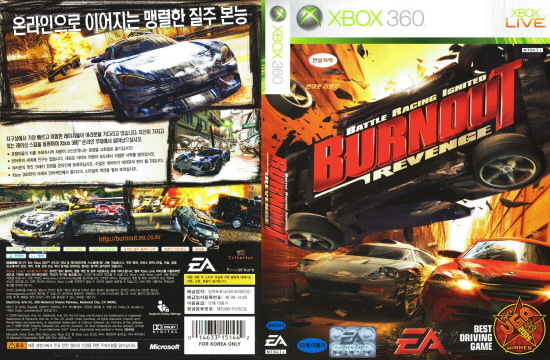

아무 생각없이 화끈하게 즐길 수 있는 레이싱 게임의 대표 주자.

바로 번아웃 시리즈의 차세대기 (이젠 구세대기가 될려나요?) 첫 작품, 번아웃 리벤지입니다.

멀티로 발매됐다보니, XBOX360에서만 HD로 발매됐지만, 그 퀄리티가 워낙 괜찮았고, 한글에 온라인도 지원했다보니 여러모로 만족스러운 작품이었습니다.

도로를 질주하며 라이벌을 밀쳐내며 질주하지만 그나마 평범하다 볼 수 있는 레이스 모드, 시간 제한이 있어 제한 시간 이내에 계속 라이벌을 밀쳐내야 되는 트래픽 어택 모드, 제한된 시간마다 꼴찌 차량을 탈락시키는 타임 어택 모드, 

그 중에서도 최고는 한번의 크래쉬로 최대한 많은 골드를 획득 (멈춰있거나 달려오는 차들과 추돌을 일으키는 것을 골드로 측정) 해야 되는크래시모드라 할 수 있다.

월드 투어 모드에서 이렇게 다양한 모드를 번갈아 즐기다보면, 지루함 따위는 느끼기 어렵다랄까?

주말 아침 일어나서 번아웃 한게임 즐기고 나서야, 다른 게임을 하던, 밖으로 나가던 했던 나로썬~

번아웃 파라다이스가 플레이 타임을 늘리는 데에는 성공했으나... 꽤나 번거로웠던 게임이었던지라, 번아웃 리벤지가 가볍게 원하는 미션만 골라서 즐기기에 적당했다보니, 번아웃 파라다이스가 발매된 이후에도 번아웃 리벤지를 더 많이 플레이했다는 것은 번아웃 파라다이스에는 없는 크래시 모드에 대한 그리움이 있지 않았나 싶다.

번아웃 파라다이스 얼티밋박스가 발매된지도 한참이 지났는데 후속작 소식이 아직 없다. 사실 번아웃3에서 어느정도 게임이 완성됐다라고 볼 수 있었으나, 그래도 후속작이 보고 싶다. 

반드시 번아웃 파라다이스와는 다른 방향으로 발전한 후속작이 나왔으면하는 바램이다.