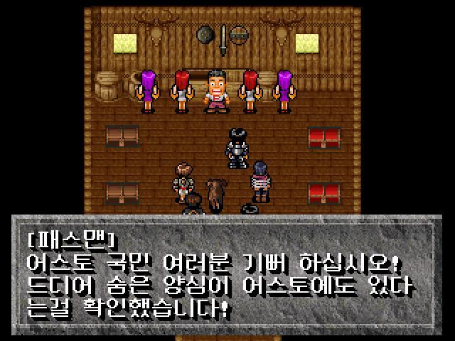
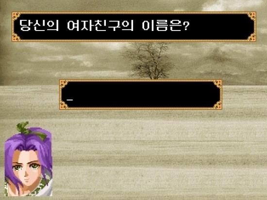

97년초였던 걸로 기억한다. 손노리에서 RPG가 발매된다는 소식을 들었고, 예약 판매 소식이 들리자 고민하게 된다.

양장판으로 판매된 이스 이터널을 구입하느냐, 96년 발매된 파랜드 택틱스를 구입하느냐, 아니면 창세기전2를 구입하느냐?

조금 망설였지만 어스토를 비록 엔딩은 못봤지만, 손노리 특유의 개그감을 좋아했던 나로썬 예약 구매를 신청하게 되는데...!!

그리고, 그 해 겨울까지 발매가 되지 않을 거란 사실을 꿈에도 몰랐다.

지속된 연기로 지쳐갈 쯤 우여 곡절 끝에 발매가 된다. 아직도 기억난다. PC게임 잡지마다 연기 소식이 실렸던 포가튼 사가!!

발매 후 받아본 포가튼 사가는 사실 아주 뛰어난 퀄리티는 아니었따.

비록 320x240의 저해상도 였지만 일러스트는 내 취향이 아니었지만. 좋았다! 기다리며 애착을 가졌고, 상상의 나래를 펼치고 있었기 때문일까?

아무것도 모른채 플레이하다, 히로인 (여주인공)에게 몽땅 털리고 맨손으로 몇시간씩 노가다해야 했어도 좋았다.

비록 기본 스탯으론 명중률이 지나치게 낮아 난이도도 어렵게 느껴졌고,  전투시간도 길어졌다. 

또한 어스토 시리즈에서 적을 교묘하게 피해다니면 발생하지 않던 것과는 다르게 불시에 전투가 벌어지는 시스템이다보니 전투 횟수도 길게 느껴졌고.

이렇게 불편한 점도 많은 게임이었지만 포가튼 사가는 분명 손노리 특유의 센스로 구현한 유쾌하고, 기대감 넘치는 게임이었다.

이 집 저집 돌아다니며 내가 모르는 이벤트 없나, 뭔가 재미난 이벤트가 있지 않을까? 기대하며 마을을 돌아다니는 재미, 던젼을 탐사하는 재미, 오지를 돌아다니는 재미는 분명 최고였다고 생각한다.

분명 오픈 월드 게임이라 부르기엔 그 스케일도 작고, 정해진 트리거 단위로 동작하는 시스템이지만, 손노리 스타일의 오픈 월드 게임이었다라고 여기고 있다.

아주 넓은 월드도 아니고, 정해진 큰 스토리 라인이 분명히 존재하고, 엔딩도 정해져있고, 강제 진행 이벤트도 있지만 말이다.

어느정도 타협을 본 느낌이었다랄까?

또 랑그릿사나, 또 다른 지식의 성전에서 볼 수 있던 캐릭터 생성 시스템도 꽤나 흥미로웠다.

단순한 심리테스트 결과와 주사위 굴리기로 정해지는 능력치지만 나름 TRPG에서 느낄 수 있는 캐릭터 만들기의 재미를 어느정도 느낄 수 있었다.

사실 포가튼 사가는 재미가 없어서 분노했던 게임은 아니다. 지나친 버그 때문이지.

초회판을 구입했던 나로썬 시도 때도 없는 오류로 진행이 어려웠고, 특히나 별도로 판매된 공략본에 첨부된 완성판 CD로 패치를 했음에도.

부사 바로 앞에서 (바로 앞인건 나중에 공략본 펼쳐보고 나서야 알았지만) 오류로 진행을 못했던 (내가 못찾는 줄 알았는데, 오류로 진행 안됐단 것도 공략본 보고 알았음) 사건은 너무나도 충격적이었다.

결국 200시간 넘게 플레이하고도 아직도 엔딩 못본 RPG로 포가튼 사가는 화자되고 있다.

특히나 매 패치때마다 연동되지 않은 세이브 파일로 중반부까지 6번이나 플레이 했던 일은 아직도 안타까울 뿐.

프로그래머를 업으로 삼고 살고 있는 지금, 버전 업에 따른 세이브 파일 연동이 쉬운 일이 아니란건 모르는건 아니지만, 국내 양대 산맥이라 불리던 두 회사 중 한 회사였던 손노리의 게임이 매 패치마다 세이브 파일을 날려야 했던 (그것도 초회판에 버그가 너무 많아서 제대로 진행도 힘들었는데) 일은 흑역사라고 밖에 할 수 없겠지?

여하튼 재밌다는 칭찬과 버그에 대한 한탄을 동시에 했지만, 그렇게 자주 초기화 됐음에도, 200시간이나 플레이 했던 게임이란 것은 그만큼 재밌었다는 반증이 아닐까 싶다.

도트가 너무 튀는 저해상도 그래픽이지만, 지금도 가끔씩 노트북으로 플레이하곤하는 게임이다.
